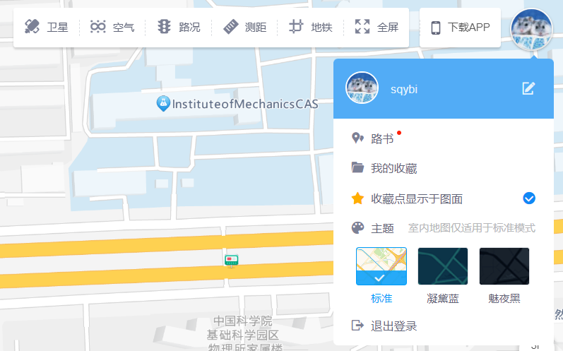

每次出门旅行之前，我们必然都会进行一些旅行规划。

对于我来说，旅行规划中最重要的一环，就是准备一份旅行的路书，里面包括了各种旅行的路线和时间安排。

除非体力不允许，通常来说我们的旅行都会按照路书上记载的大体方向进行，当然也会根据实际情况有各式各样的微调。而无论是希望方便地查看后续路线，记录已经走过的景点，还是随时微调路线，一个好用的路书软件自然必不可少。

我希望在这篇文章中根据自己的经验，推荐一些国内外旅行时好用的路书软件。希望它们在大家的下一次旅行规划中能够有所帮助。

这里先给出一个我推荐的软件和简单的关键词总结，但是我相信大部分读者应该更关心我在体验它们的过程中都遇到了什么。

| 软件           | 适用范围 | 优缺点                                                                                     |
|:-------------- |:-------- |:------------------------------------------------------------------------------------------ |
| Google My Maps | 国外旅行 | 优秀的基础功能；几乎没有额外功能，手机端易用性一般                                         |
| 高德路书       | 国内旅行 | 够用的基础功能，认真的产品和开发团队；功能略显简陋，缺少步行导航                           |
| exping         | 国内旅行 | 优秀的基础和附加功能，社区等额外功能不会强行引流，手机端极其好用；网页端体验较差，问题很多 |

<!--truncate-->

## 什么是路书

“路书”是一个很神奇的词。在中文互联网语境中，这个词似乎能广泛地被人接受，且在不同场景下自然地代表了不同的含义。但是在英文语境中，这个词会在不同场合对应到完全不同的英文单词。

我并不是很熟悉这个词具体的来源，所以本来不应该班门弄斧的。但是为了对后面要聊的概念进行一些基本的解释，我也只能根据我自己掌握的知识和搜索的结果来推测这个词的来源了。

### 拉力赛或许是起源：Pacenotes 和 Roadbook

不知道有多少人和我一样——我自己第一次听说“路书”这个词，是在拉力赛中。

当年人们的主要娱乐活动还是电视节目，我家自然也不例外。在 CCTV-5 转播的达喀尔拉力赛中，我第一次知道了这种赛车比赛原来还需要一个领航员，对着一份叫做“路书”的东西告诉车手应该怎么开。

简单来说，车手在正式比赛之前一般都会把路线开上两次。第一次用于记录路书，第二次用于和领航员核对路书并进行修正（来源：[拉力赛车手和领航员是如何配合的？](https://www.zhihu.com/question/24806202/answer/379193213)）。而这里路书的叫法，似乎有 [pacenotes](https://en.wikipedia.org/wiki/Pacenotes) 和 [roadbook](https://en.wikipedia.org/wiki/Roadbook) 两种。

关于两个单词的用法，一说是官方的全程路书叫 roadbook，领航员的赛段路书叫 pacenotes；另一说是两者没有什么太大区别。我并非要进行拉力赛的入门介绍，也没有这个能力，所以这里也就不展开讨论了。

其实不光是拉力赛，其它赛车比赛也可能有领航员和路书。大部分情况下，路书至少承担了标记各种地形和弯道的作用。特别是在很长的路线中，车手的记忆力不足以支持他们像 F1 跑圈那样可以记住所有路线中的弯道和特殊地形特点，这时允许一个领航员使用路书进行提醒，车手就可以更专注于驾驶技巧，这是可以增加比赛观赏性的。

而对于野外定向拉力赛，路书还有一个额外的功能，那就是配合导航信息（电子罗盘）进行定位和导航，避免“开错路”的尴尬局面。可不要认为这是闹着玩的——野外特别是沙漠中的救援不会像公路上那么及时，甚至对于部分比赛（比如达喀尔拉力赛），路线可能还会穿越战争中遗留的雷区，万一走错了可是要踩地雷的。

:::note[电子路书]

记得当年看比赛的时候，领航员或者手里会拿着一个本子，写着手记的路书；或者会打印一份长长的纸条。

但是这次我搜索资料的时候，发现路书似乎也电子化了，和电子罗盘导航系统合并在了一起。不过很久不开比赛了，我也不确定这个技术是不是已经广泛地被使用，或者说还有很多车手和领航员依旧坚持使用自己更习惯的传统路书？

不知道评论里有没有了解拉力赛的同学可以帮忙解惑。

:::

### 自行车骑行的路书：Cue Sheet

近些年来，自行车公路和越野骑行已经从一个小众运动，慢慢壮大并进入人们的视野。自行车骑行需要的“路书”，是圈子里常见的讨论内容。

而当我使用 bicycle + pacenotes 作为关键词搜索的时候，却发现并不能找到什么有用的信息。经过一番搜索，我发现似乎自行车领域使用的“路书”应该叫做 cue sheet，例如 [Just The Tip: Cue Sheets](https://lifeisabeautifuldetail.com/blog/cue-sheets) 和 [How to Read a Cue Sheet](https://www.ridestudiocafe.com/connect-communicate/clinics/how-to-read-a-cue-sheet) 所提到的。

而自行车比赛和赛车的最大区别就在于，自行车比赛是不可能有领航员的，所以也很难通过选手自己勘察路线记录路书。取而代之的是对于类似环法这种大型的比赛，会由官方统一发布路书。

而受限于自行车的结构，这种路书也都不会很大，通常是一些小纸条，可以直接贴在车把上。

对于骑行爱好者，应该也有不少人在规划路线的时候会准备一个类似的路书。所以在中文语境中搜索“路书软件”的时候，你会发现有很多路书软件其实是为了自行车骑行准备的。虽然也有类似的功能，但是相比旅游中看重的各类观光景点的信息和交通信息，这类软件可能更关注于公路和地标的数据收集。同时，它们普遍还会整合一些计速、配速之类的功能，这也是旅行中用不到的。

后面也会提到，在寻找合适的旅行路书软件时，这部分软件反而是最大的干扰项。

### 旅行路书：Travel Map

我有足够的信心认为旅行中的“路书”这个词，是借鉴了上述两个“路书”而产生的。

同样地，我也只能通过搜索来尝试找到正确的英文关键词。经过一番折腾，我找到了一个可能正确的词汇：travel map。

相比上述偏专业性的路书，旅行的路书更加贴近实际。相比使用一些专业标记法来记录路线的细节，旅行路书一般更关注的点有：

- 景点的信息记录和攻略
- 基于多种交通形式的路线规划
- 交通时间计算
- 其它个性化定制和功能整合，如票务服务、机酒推荐和预订、租车服务等

而考虑到我个人的需求，我在这篇文章中会主要关注景点标记、路线规划、交通方式选择、时间计算这几个功能，以及尽可能完善的备注功能（包括景点和路线的备注）。我认为这些功能已经足够我完成一份完整的旅行规划了，其它的整合服务应该由更专业的软件实现。

关于这件事你可以有自己的想法，但这不会影响我接下来的推荐都是基于上面这些原则的。

## 旅行路书的工具推荐

### Google My Maps 国外旅行的首选

说到 Google Map，在国外旅行过的朋友应该都不陌生。

除了中国大陆这片比较特殊的土地，Google Map 在绝大部分国家和地区都有着非常不错的覆盖。同时，Google Map 的产品功能也像 Google 的大部分产品一样优秀，在日本换乘地铁的时候帮了我不小的忙——虽说最后我还是错误地坐上了一班去机场的快车，并因为身上并没有现金而尴尬地被带到了下车站的警卫室补刷了卡，只能说日本地铁的复杂程度是真的没救了。

但是这里提到的 Google My Maps 则并不是 Google Map，而是 Google 的另一个产品。你可以通过 [Google My Maps](https://www.google.com/maps/d/) 访问到它。

这个工具似乎并不是为路书而生的，它更像是一个 Google 内部通用的地图编辑器，被公开释放了出来。这个工具提供了一些看起来相当基础的功能：

- 添加图层
- 添加位置点，并修改位置点的颜色等属性
- 添加位置之间的路线，包括直线和各种交通方式的规划路线
- 以各种格式导入和导处图层数据
- 多用户协作编辑

虽然只有这些功能，但 Google My Maps 可以说是将这些功能做到了极致。没有任何花里胡哨的附加功能，反而让这个产品在旅行路书这件事情上极其好用：为旅程分段建立图层，在图层上标记你要去的所有地点，在地点之间连线，为它们写上一些备注——好了，你已经获得了一份足够可用的路书。

或者说，不光是路书，只要你自己足够 geeky，就很难不被这么一个简单但有用的产品打动。在我进入自动驾驶行业的这七年，我看到无数开发者将 Google My Maps 当作 KML（这也是一种 Google 定义的地理数据格式）或其它格式的地理数据编辑器。不得不说，在通用的场景下，这绝对比大部分我们内部开发的编辑器要好用。

唯一比较明显的缺点，可能是它的手机端依赖 Google Map，且入口极深，手机端的操作也很难说得上好用，比较适合只用来查看地图。

因为我的国外旅行大多都是和几个在 Google 就职的朋友一起进行的，所以也没有再考虑过其它工具了。不过在搜索的过程中，我也看到了一些其它的在线工具，例如 [TravelMap](https://travelmap.net/)。至少从 [它的 Demo](https://clem.travelmap.net/cycling-around-australia) 来看，这个工具还是蛮好用的，说不定下次出行的时候可以试一下。

### 被旅行社占据的国内路书市场

可能是因为中国人没有旅行前编写路书规划的习惯，也可能是自驾游市场在这一代年轻人才刚刚兴起，寻找国内路书产品的过程可谓举步维艰。

在国内，你可以看到很多打着“路书”旗号的产品。但是每当点进这些产品，你都会发现它们的首页挂着“定制师”“营销”“旅行社”的产品，或者是为开车自驾游、骑行等场景极端定制化的产品。

在这些产品中，后者因为定制化过于深入而很难适配各类旅行需求。而前者虽然一定程度上可以进行路线规划，但使用一段时间就会发现它们都有着比较一致的问题，例如只包含热门景点、按照 to B 的模式收费、更关注于如何向客户介绍景点而非规划路线等。

至少在我的实际体验中，我觉得这些路书软件都远远没有达到“可用”的级别。此时，我将目光重新投向了国内的地图软件，试图找到一个包含类似于 Google My Maps 功能的国内地图软件。

### 擦身而过的高德路书

国内几款主要的地图软件中，有很多都有自定义地图的功能（找不到的可以去对应的云平台找一找）。但是绝大部分的此类功能都限制颇多，且更倾向于制作定制化地图而非规划路线，在一些关键功能例如导航上总会有所缺失。同时，因为很多类似功能其实都是云平台的一部分，所以在出门使用的时候也没有很好的手机应用支持。

好在查找的过程中，我发现高德地图在它的网页版上有一个名字就叫“路书”的功能：

而这个功能也正如它的名字，的的确确是单纯的路书。除了不支持步行导航，其它的基本功能已经几乎齐全了，我甚至在旅行开始之前已经用它创建了一份完整的路书。

但是就当我准备再微调一下这份路书，为里面的地点根据分类标上不同的颜色时，我突然发现自己遇到了一个非常诡异的 bug。在调整了某些地点的颜色或者图标后，整个路书的地图页面都会开始自动抽搐，且所有在页面上的操作都会没有响应。

简单地打开控制台 debug 了一下，我将问题定位到了路线的显示上。进一步排查之后，我发现了复现问题的方法：只要创建两个非常近的地点，在它们之间连一条路线，使得路线的驾车时间小于 1 分钟，这个问题就会出现。而且出现问题的时候，从这条路线开始，后续所有路线的预期时间都不会再显示。这也进一步印证了我的猜测，就是显示预期时间的时候出现了问题。

继续排查，可以发现出现问题的代码中检查了一个接口返回的预期时间，并基于“分”这个字进行了分割。那么问题的 root cause 就显而易见了：这个接口返回小于一分钟的时间时，很可能单位是“秒”而不是“分”。这时前端没有正确处理这个返回值，所以会导致某个代码直接进入死循环，地图开始无限缩放，且占用前端线程（虽然 JavaScript 没有线程吧，但大概就是这个意思）导致所有操作失效。

问题是发现了，但我自己也没办法修复啊。只好点开界面右上角的“反馈”按钮，想碰碰运气。

好消息是，这个反馈功能并不是那种自动回复的机器人，而是直接打开了 [一个论坛](https://lbsbbs.amap.com/forum.php?mod=forumdisplay&fid=60)；坏消息是，这个论坛最新的帖子已经是 2018 年的了，看起来已经很久没有人维护了。

不过当我继续顺藤摸瓜下去的时候，发现了 [这样一个帖子](https://lbsbbs.amap.com/forum.php?mod=viewthread&tid=46620&extra=page%3D1)：

> 亲爱的高德开发者论坛用户您好：
>
> 自2018年10月18日起，高德开发者论坛除车机板块外，其他板块将停止发帖与维护，如您有使用问题请 [提交工单](https://lbs.amap.com/dev/ticket/type) 联系我们，感谢您的理解。
>
> 感谢您对高德开发者论坛的关注，祝您生活愉快。

只要有地方提工单那就好说，于是我点开链接，提了一个工单，详细描述了上面发生的问题。

结果客服的回复倒是很快，告诉我工单已经转给了工程师。但是坏消息是，我是十一出行之前使用的这个路书功能，但他们的工程师要等到十一假期结束之后才能给我反馈。

这期间也有高德的产品经理和我联络。首先是第一个产品经理表示虽然我的工单提在了开放平台，但是路书其实是 app 的功能，需要转到 app 那边。后面 app 的产品经理也和我取得了联系，但是也表示要十一之后才能安排 debug 和修复。

已经规划了出门旅游的我自然是等不了的，只能寻找下一个替代品了。

### 好用但不完全好用的 exping

几经周折，我从少数派上的 [一篇文章](https://sspai.com/post/73855) 中发现了一款国产路书产品 [exping](https://exping.world/)。

这款产品可以说是我使用下来最好用的路书产品了。除了上面提到过很多次的基本功能以外，它至少还提供这样一些额外的功能：

- 协作编辑
- Emoji 自定义图标
- 按日期和路线的分组
- Emoji 打卡
- 地点评分
- 社区

此外，因为我是在今年十一期间使用的，所以还有一些后来推出但我还没有用过的功能，比如自由绘制两点间的路线。

虽然我前面一直强调 Google My Maps 的优势在于没有添加很多花里胡哨的功能，但 exping 的这些功能其实并没有引起我的反感。究其原因，可能是因为他们的产品设计真的很克制——比如我并不关心社区功能，而这个产品也能做到在我使用的过程中，几乎不会强制插入任何社区功能的入口。

而这个产品因为一开始就是一个手机端产品，所以它们的手机应用交互也是相当好用的。旅行的过程中，免不了要因为各种原因修改一些原先制定的规划，而这次十一的旅行，我顺畅地在 exping 的手机 app 中完成了大量的修改，甚至可以一边走一边改（如果你也想这么做，请务必注意交通安全！），丝毫不感到费力。

虽然有着这么多优点，但这个产品还是存在它自己的问题的。

最明显的问题，就是它的免费版本功能限制过多。虽然我自己是愿意为优秀产品付费的类型，但是不得不说在试用的过程中，诸如分组数量上限这样的限制，属实让我用得不太开心。我不确定有多少人能为了一次旅行开通一个月的付费会员，虽说价格不贵，但是我很担忧国人的付费习惯能否支撑起这个软件的收入。

我自己大概会在每次旅行需要使用它的时候都开一个月会员，算是最低程度地支持一下吧。

另外一个比较难以忍受的问题，就是这个软件的网页版过于简陋了，bug 也太多了。

例如分组显示的逻辑，在手机上和网页版就很不一致，甚至网页版自己似乎都很不一致。举个例子，看起来路线分组是和日期绑定的，但是网页端的 UI 又会将所有路线分组和所有日期平铺地展示出来，且不显示它们之间的联系——这使得网页端对分组和日期的增删操作都存在非常大的困难。

当然，在我开始使用这个软件的时候，网页端应该也是刚刚上线不久。我也能看到网页端上有一个比较详尽的问卷，在调查各种使用中可能出现的问题，所以对这点我也暂时是可以容忍的。

但整个路书都用手机端完成，体验确实不太好。希望下次出行之前，这些问题都可以被解决吧。

最后，我其实对这个产品的社区功能抱有一些怀疑的态度。在用户量如此至少的情况下，社区中很难出现高质量的路书，所以我不是很能理解这个时间点推出社区功能的必要性。不过看在开发者对这个功能的入口如此克制的情况下，我就暂且当作是他们一个小小的试验吧。

## 后日谈：高德路书的 bug 修复

在我的旅行即将结束的时候，高德的程序员也回来上班了。

不考虑我已经给出了详细的复现手段，甚至帮他们定位了代码错误位置这些背景情况，总之他们还算比较快的定位了这个问题，并在大概几周之后通知我已经完成了修复上线。我也验证了一下，发现问题确实不存在了。

其实对于这个结果我还是蛮惊讶的，毕竟从论坛来看这已经是一个过气的产品了，而这么基础的 bug 一直没有人提出，也很可能是因为这个产品真的没有什么用户。

通常来说这样的问题随便打发一下用户或者慢慢排期修也是 OK 的，我甚至在他们沟通的时候感觉这些程序员和产品经理已经很不了解路书产品了，他们甚至不知道产品的入口在哪里。但是他们还是认真地记录了问题并完成了修复，这里也感谢这个过程中认真参与的产品经理和程序员。

下次有机会的话，我会再试一次用这个产品规划我完整的旅行——虽然可能它只会被 exping 这类创业公司的产品落下得越来越远，但那也是公司决策的问题了。

认真的人值得认真的对待。
