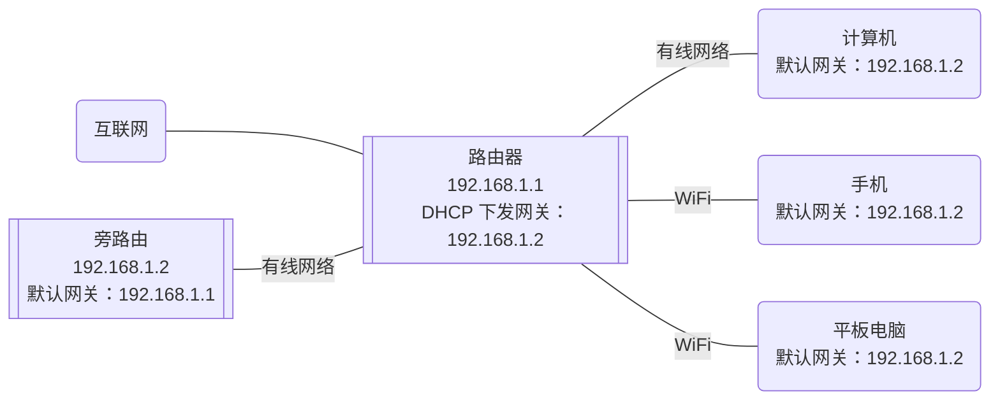
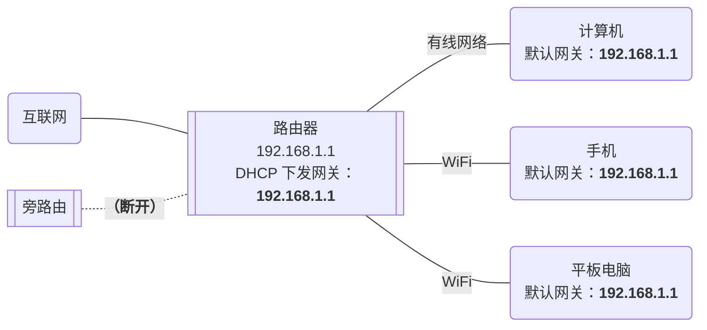

TL;DR: 在一个有旁路由的网络环境中使用 Linksys VELOP 路由器作为主路由，可能会导致旁路由搭建困难或损失网络性能，请优先考虑其它路由器。

前几天因为忍受不了华硕路由器无线 Mesh 的频繁断连，我准备把家里的无线 Mesh 网络整体升级一波。在经过一些简单的调研之后，我选择了口碑是“功能和可定制性少，但是稳定”的 Linksys VELOP 系列路由器，型号是 MX4200。

:::note[Linksys 神奇的起名方案]

Linksys 路由器的起名逻辑是这样的：

- MX4200 是三频路由器，三个频段的总带宽有 4200M，所以叫做 MX4200。
- 购买两个 MX4200 的套装时，因为里面有两个带宽是 4200M 的路由器，所以总带宽是 8400M（注：实际上带宽不能这么计算！），这个套装就叫 MX8400。
- 同理，三个 MX4200 的套装就叫 MX12600。

第一条还情有可原，毕竟很多路由器也都会用类似的方式标识型号。但是后面两条，对于不懂的人来说，都快可以叫欺诈了吧……

:::

在配置好几台路由器的无线 Mesh 网络之后，我开始尝试向路由器接入旁路由。

所谓旁路由，看起来更正确的说法应该是“旁路网关”，因为大部分情况下这台设备并不承担很多路由功能，而是作为默认网关使用以达到全局流量转发和分流的目的。旁路由的出现主要是因为国内特殊的网络环境对“全局代理”的需求，国外很少会在家庭网络中部署这样的网络架构，所以这个名词几乎只会在国内被使用，也很难找到对应的英文概念。我自己并没有什么命名洁癖，所以这篇文章里还是会使用“旁路由”这个更广为人知的名字。

因为之前的华硕路由器本身就接入了一个旁路由，所以我想当然地以为只要同样简单配置一下就可以搞定了。

结果实际情况和想象中大相径庭，各种问题陆陆续续地打了我的脸。不光是简单配置一下解决不了问题，即使我最终梳理清楚了所有问题，最终还是发现只能用一个不太完美的方案完成旁路由的接入。

这也是为什么我一上来就给了结论：Linksys VELOP 不适合作为旁路由网络环境中的主路由。

下面我会仔细分析一下接入过程中遇到的所有问题和它们的原因，以及临时解决方案和它的原理。

<!--truncate-->

## 无线 Mesh 技术和旁路由

### 简单的家庭网络结构

在常见的家庭网络环境中，一般只会存在一台路由器，或者带有路由器功能的光猫。当同时有路由器和光猫的时候，我们也会考虑将其中的一个置为桥接模式，这样依旧还是只有一个设备在发挥路由器的功能。

我们的个人电脑和手机平板等设备则会直接通过网线或 WiFi 接入路由器，或者经过若干二层交换机后通过网线接入路由器。这里我就不展开介绍二层和三层设备的区别了，总之可以认为这样一种简单的网络环境下，所有设备等同于直接接入了这台路由器。

而这样简单的网络结构在一些复杂的需求下，也会遇到各式各样的瓶颈。对于中国大陆的家用网络而言，最常碰到的两个问题应该就是 WiFi 信号覆盖不全和不能全局代理。

Mesh 技术和旁路由，就是为了解决这两个问题而产生的。

### 无线 Mesh

首先说一下无线 Mesh，这是一种为了解决 WiFi 信号覆盖甚至有线信号覆盖问题而产生的技术。

其实在无线 Mesh 出现之前，就有很多类似的技术能够解决这类问题。例如家庭和办公室使用比较多的，其实是 AC + AP 的技术：在墙内预埋网线，通过网线将很多 AP 连接到同一个 AC。可以认为 AP 这时是 AC 的扩展，可以将 AC 设备的网络以 WiFi 的方式扩展到它们所在的位置，避免了一个 AC 或路由器设备不能覆盖全屋无线信号的情况。同时，AC + AP 方案会通过一系列协议处理信号切换的问题，也就是在移动设备从一台 AP 的信号范围移入另一台 AP 的信号范围时，它可以在合适的时机通知设备切换连接信号发射源，并通过各种手段保证切换的无感，例如你正在打的游戏理论上在这个切换过程中也不会掉线。

但是对于出租屋这类场景，显然预埋网线是不太现实的。即使可以走明线，无论是从走线难度、美观度，还是从搬家时拆卸重装的复杂度来看，这也都不是一个很好的选择。

而无线 Mesh 技术恰好可以解决这个问题：它可以通过无线信号连接多个路由器，使得它们之间不再需要通过网线通信的情况下也能达到 AC + AP 的效果，也就是把之前预埋的网线用无线代替了。更进一步，各家的无线 Mesh 技术也有不同的优化，有一些甚至可以保证不再依赖一个中心结点（也就是之前的 AC），即使任何一台 Mesh 设备挂了，只要剩下设备之间的网络信号足够好，依旧可以组成一个无线 Mesh 网络。

:::note[无线 Mesh 技术的混乱命名]

每个品牌也都会给自己的无线 Mesh 技术起一些奇奇怪怪的名字，比如本文中提到的 VELOP，就是 Linksys 的无线 Mesh 技术代号。再例如，华硕的技术叫做 AiMesh，TP-Link 的叫做“易展”（国外版本叫 Deco Mesh，但是并不和国内通用），小米则相对低调地叫“小米自研 Mesh”。

Linksys 的命名在各家的命名中尤其混乱，例如它们的 Atlas 路由器其实也是类似的无线 Mesh 技术，但这款路由器的名称却没有 VELOP 的名字——不过它们把这款路由器使用的 Linksys Intelligent Mesh 技术改名叫做 Velop Intelligent Mesh 了，也算是保留了这个品牌形象吧。（来源：[VELOP 改名又變細咗 !? Linksys Atlas Pro 6 Mesh Wi-Fi 系統](https://www.hkepc.com/20766/VELOP_%E6%94%B9%E5%90%8D%E5%8F%88%E8%AE%8A%E7%B4%B0%E5%92%97__Linksys_Atlas_Pro_6_Mesh_Wi-Fi_%E7%B3%BB%E7%B5%B1)）。

:::

总之，部署了无线 Mesh 网络之后，可以认为无线信号就被简单地扩展到了更广的范围。而用户也不需要关心具体接入到了哪个无线信号，反正都可以看作直接接入了路由器的无线网卡。

一个更特殊的用法是：使用 Mesh 路由器扩展网络，之后将扩展的路由器 LAN 口接到电脑上。这样设置的网络中，电脑虽然看起来是通过扩展路由器的网线接入，但实际上数据是通过无线 Mesh 传输的，所以其实这台电脑也是接入了主路由器的无线网卡——很重要，一会儿要考。

### 早期的全局代理方案

让我们暂且抛开刚刚介绍的的无线 Mesh，旁路由是一个和它没有直接关系的技术。这个技术的作用简单来说就是为网络接入第二个网关，通过将终端设备（电脑、手机、平板等等）的默认网关指向旁路由设备，达到所有网络流量都先经过旁路由设备处理，再转发给主路由，最终发送到互联网的效果。

而想要知道为什么会出现这种技术，还要从早期的全局代理方案说起。

众所周知，在搭建代理服务器的过程中，代理软件通常可以处理当前设备上的部分或所有流量，通过分流的方式让其中一部分流量发送到代理服务器，而另一部分流量走正常途径发出。如果想要把一个设备的代理软件分享给另一个设备，通常要通过局域网 SOCKS 代理之类的形式。

SOCKS 代理能用是能用，但是一个一个设置起来很麻烦。而且碰到一些不支持 SOCKS 代理或者不方便设置 SOCKS 代理的软件，事情就会更加复杂。

但是换一种想法，在上面提到的网络结构中，局域网的所有流量不是都会经过主路由器吗。而代理软件通常可以代理本机的所有流量，那只要我让代理软件跑在主路由器上，不就可以直接在路由器上代理所有流量并分流了吗？

幸运的是，绝大部分路由器的底层系统其实都是 UNIX 内核，把 Linux 上的代理软件迁移到上面不算难事。特别是有一些路由器厂商比如华硕，对这个方面也比较开放，默认提供了 SSH 功能，甚至允许更新自定义固件。

所以，可以看到早期的全局代理很多时候都会依赖魔改的华硕固件，甚至直接在支持的路由器上刷 OpenWrt 这种开源路由器系统来实现。

但是慢慢地，大家发现这种方案有时不太能满足需求。一方面，魔改系统的稳定性不一定有原版系统那么高，万一出现问题的话，整个家中的网络都会瘫痪；另一方面，这样魔改对主路由的性能要求很高，而高性能路由器毕竟也会伴随着比较高的价格。

为了解决上面的问题，新的方案就陆续被提出。

一类方案考虑直接用一台普通的 ARM / x86 设备加上开源路由器系统，在设备本身不支持路由的情况下，从软件层面实现路由功能，也被称之为“软路由”。但是这个方案只能一定程度解决价格和性能的问题，并不能很好地解决稳定性问题。

而另一个方案则对设备的功能做了拆分，将一个低价的 ARM 设备接入网络，在这个设备上安装代理软件，并让流出的网络流量都先通过这个设备，这样主路由设备就只需要支持正常的路由器功能，而不需要支持全局代理了。这个额外的设备，就是我们常说的“旁路由”。

### 全局代理的改进方案：旁路由

说到这里，相比大家也都明白为什么我一开始说这台设备更应该被称作“旁路网关”了。

实际上，这个新增加的设备并不需要任何路由功能（或者更严谨一些，可能在一些场景下有一点点的路由功能，一般是 NAT）。它的作用是将流经的数据一部分分流到代理服务器，一部分直接传出，所有流量都会流经它的默认网关。与其说它在做的事情是路由，其实更像是一个独立的网关，唯一特殊的是它的流量来源和出口都是同一台设备，也就是主路由。

这样做带来的好处是显而易见的：主路由此时只需要支持一个正常路由器应该有的功能就可以了，绝大部分路由器的原版系统都可以支持这个场景，主路由稳定性会大大提升，对主路由的性能需求也会大幅下降。

而更进一步，当旁路由出现问题的时候，我们也只需要将它从网络上直接拔掉，再把网络中所有机器的默认网关从旁路由修改回主路由，这个网络就依然可以正常使用除了全局代理以外的所有其它功能。

因为有 DHCP 技术的存在，修改默认网关这件事也很简单，那就是直接在主路由的 DHCP 设置中修改一下默认网关地址。DHCP 服务会自动将这个默认网关下发给网络中的所有设备。

总结一下，在旁路由正常的时候，网络环境是这样的：

而当旁路由失效的时候，我们只需要改成这样：

看起来一切都很美好……真的吗？

## Linksys 路由器的功能缺失

### 缺少 DHCP 设置

### 使用旁路由 DHCP 服务替代

## 不同设备的不同结果

### WiFi 不能工作

### 网桥和 iptables

### 临时解决方案
