TL;DR: 在一个有旁路由的网络环境中使用 Linksys VELOP 路由器作为主路由，可能会导致旁路由搭建困难或损失网络性能，请优先考虑其它路由器。

:::danger[听我一言]

不要折腾网络，会变得不幸。

:::

前几天因为忍受不了华硕路由器无线 Mesh 的频繁断连，我准备把家里的无线 Mesh 网络整体升级一波。在经过一些简单的调研之后，我选择了口碑是“功能和可定制性少，但是稳定”的 Linksys VELOP 系列路由器，型号是 MX4200。

在配置好几台路由器的无线 Mesh 网络之后，我开始尝试向路由器接入旁路由。

因为之前的华硕路由器本身就接入了一个旁路由，所以我想当然地以为只要同样简单配置一下就可以搞定了。

结果实际情况和想象中大相径庭，各种问题陆陆续续地打了我的脸。不光是简单配置一下解决不了问题，即使我最终梳理清楚了所有问题，最终还是发现只能用一个不太完美的方案完成旁路由的接入。

这也是为什么我一上来就给了结论：Linksys VELOP 不适合作为旁路由网络环境中的主路由。

下面我会仔细分析一下接入过程中遇到的所有问题和它们的原因，以及临时解决方案和它的原理。

文章比较长，技术名词也比较多。如果一口气读完有困难的话，可以考虑分段阅读。当然假使你真的一口气读完了，也请务必通过评论告诉我——我会敬你是条汉子的，或者是条妹子也行。

<!--truncate-->

:::note[Linksys 神奇的起名方案]

Linksys 路由器的起名逻辑是这样的：

- MX4200 是三频路由器，三个频段的总带宽有 4200M，所以叫做 MX4200。
- 购买两个 MX4200 的套装时，因为里面有两个带宽是 4200M 的路由器，所以总带宽是 8400M（注：实际上带宽不能这么计算！），这个套装就叫 MX8400。
- 同理，三个 MX4200 的套装就叫 MX12600。

第一条还情有可原，毕竟很多路由器也都会用类似的方式标识型号。但是后面两条，对于不懂的人来说，实在是有点过于难以理解了。

:::

:::note[旁路由？旁路网关？]

所谓旁路由，看起来更正确的说法应该是“旁路网关”，因为大部分情况下这台设备并不承担很多路由功能，而是作为默认网关使用以达到全局流量转发和分流的目的。旁路由的出现主要是因为国内特殊的网络环境对“全局代理”的需求，国外很少会在家庭网络中部署这样的网络架构，所以这个名词几乎只会在国内被使用，也很难找到对应的英文概念。

我自己并没有什么命名洁癖，所以这篇文章里还是会使用“旁路由”这个更广为人知的名字。

:::

## 无线 Mesh 技术和旁路由

在开始回顾网络部署的过程之前，先简单介绍一下后面会频繁提到的一些技术名词。

### 简单的家庭网络结构

在常见的家庭网络环境中，一般只会存在一台路由器，或者带有路由器功能的光猫。当同时有路由器和光猫的时候，我们也会考虑将其中的一个置为桥接模式，这样依旧还是只有一个设备在发挥路由器的功能。

我们的个人电脑和手机平板等设备则会直接通过网线或 WiFi 接入路由器，或者经过若干二层交换机后通过网线接入路由器。这里我就不展开介绍二层和三层设备的区别了，总之可以认为这样一种简单的网络环境下，所有设备等同于直接接入了这台路由器。

而这样简单的网络结构在一些复杂的需求下，也会遇到各式各样的瓶颈。对于中国大陆的家用网络而言，最常碰到的两个问题应该就是 WiFi 信号覆盖不全和不能全局代理。

Mesh 技术和旁路由，就是为了解决这两个问题而产生的。

### 无线 Mesh

首先说一下无线 Mesh，这是一种为了解决 WiFi 信号覆盖甚至有线信号覆盖问题而产生的技术。

其实在无线 Mesh 出现之前，就有很多类似的技术能够解决这类问题。例如家庭和办公室使用比较多的，其实是 AC + AP 的技术：在墙内预埋网线，通过网线将很多 AP 连接到同一个 AC。可以认为 AP 这时是 AC 的扩展，可以将 AC 设备的网络以 WiFi 的方式扩展到它们所在的位置，避免了一个 AC 或路由器设备不能覆盖全屋无线信号的情况。同时，AC + AP 方案会通过一系列协议处理信号切换的问题，也就是在移动设备从一台 AP 的信号范围移入另一台 AP 的信号范围时，它可以在合适的时机通知设备切换连接信号发射源，并通过各种手段保证切换的无感，例如你正在打的游戏理论上在这个切换过程中也不会掉线。

但是对于出租屋这类场景，显然预埋网线是不太现实的。即使可以走明线，无论是从走线难度、美观度，还是从搬家时拆卸重装的复杂度来看，这也都不是一个很好的选择。

而无线 Mesh 技术恰好可以解决这个问题：它可以通过无线信号连接多个路由器，使得它们之间不再需要通过网线通信的情况下也能达到 AC + AP 的效果，也就是把之前预埋的网线用无线代替了。更进一步，各家的无线 Mesh 技术也有不同的优化，有一些甚至可以保证不再依赖一个中心结点（也就是之前的 AC），即使任何一台 Mesh 设备挂了，只要剩下设备之间的网络信号足够好，依旧可以组成一个无线 Mesh 网络。

:::note[无线 Mesh 技术的混乱命名]

每个品牌也都会给自己的无线 Mesh 技术起一些奇奇怪怪的名字，比如本文中提到的 VELOP，就是 Linksys 的无线 Mesh 技术代号。再例如，华硕的技术叫做 AiMesh，TP-Link 的叫做“易展”（国外版本叫 Deco Mesh，但是并不和国内通用），小米则相对低调地叫“小米自研 Mesh”。

Linksys 的命名在各家的命名中尤其混乱，例如它们的 Atlas 路由器其实也是类似的无线 Mesh 技术，但这款路由器的名称却没有 VELOP 的名字——不过它们把这款路由器使用的 Linksys Intelligent Mesh 技术改名叫做 Velop Intelligent Mesh 了，也算是保留了这个品牌形象吧。（来源：[VELOP 改名又變細咗 !? Linksys Atlas Pro 6 Mesh Wi-Fi 系統](https://www.hkepc.com/20766/VELOP_%E6%94%B9%E5%90%8D%E5%8F%88%E8%AE%8A%E7%B4%B0%E5%92%97__Linksys_Atlas_Pro_6_Mesh_Wi-Fi_%E7%B3%BB%E7%B5%B1)）。

:::

总之，部署了无线 Mesh 网络之后，可以认为无线信号就被简单地扩展到了更广的范围。而用户也不需要关心具体接入到了哪个无线信号，反正都可以看作直接接入了路由器的无线网卡。

一个更特殊的用法是：使用 Mesh 路由器扩展网络，之后将扩展的路由器 LAN 口接到电脑上。这样设置的网络中，电脑虽然看起来是通过扩展路由器的网线接入，但实际上数据是通过无线 Mesh 传输的，所以其实这台电脑也是接入了主路由器的无线网卡——很重要，一会儿要考。

### 早期的全局代理方案

让我们暂且抛开刚刚介绍的的无线 Mesh，旁路由是一个和它没有直接关系的技术。这个技术的作用简单来说就是为网络接入第二个网关，通过将终端设备（电脑、手机、平板等等）的默认网关指向旁路由设备，达到所有网络流量都先经过旁路由设备处理，再转发给主路由，最终发送到互联网的效果。

而想要知道为什么会出现这种技术，还要从早期的全局代理方案说起。

众所周知，在搭建代理服务器的过程中，代理软件通常可以处理当前设备上的部分或所有流量，通过分流的方式让其中一部分流量发送到代理服务器，而另一部分流量走正常途径发出。如果想要把一个设备的代理软件分享给另一个设备，通常要通过局域网 SOCKS 代理之类的形式。

SOCKS 代理能用是能用，但是一个一个设置起来很麻烦。而且碰到一些不支持 SOCKS 代理或者不方便设置 SOCKS 代理的软件，事情就会更加复杂。

但是换一种想法，在上面提到的网络结构中，局域网的所有流量不是都会经过主路由器吗。而代理软件通常可以代理本机的所有流量，那只要我让代理软件跑在主路由器上，不就可以直接在路由器上代理所有流量并分流了吗？

幸运的是，绝大部分路由器的底层系统其实都是 UNIX 内核，把 Linux 上的代理软件迁移到上面不算难事。特别是有一些路由器厂商比如华硕，对这个方面也比较开放，默认提供了 SSH 功能，甚至允许更新自定义固件。

所以，可以看到早期的全局代理很多时候都会依赖魔改的华硕固件，甚至直接在支持的路由器上刷 OpenWrt 这种开源路由器系统来实现。

但是慢慢地，大家发现这种方案有时不太能满足需求。一方面，魔改系统的稳定性不一定有原版系统那么高，万一出现问题的话，整个家中的网络都会瘫痪；另一方面，这样魔改对主路由的性能要求很高，而高性能路由器毕竟也会伴随着比较高的价格。

为了解决上面的问题，新的方案就陆续被提出。

一类方案考虑直接用一台普通的 ARM / x86 设备加上开源路由器系统，在设备本身不支持路由的情况下，从软件层面实现路由功能，也被称之为“软路由”。但是这个方案只能一定程度解决价格和性能的问题，并不能很好地解决稳定性问题，甚至为了在软件模拟下也有足够的性能，反而会引入能耗之类的新问题。

而另一个方案则对设备的功能做了拆分，将一个低价的 ARM 设备接入网络，在这个设备上安装代理软件，并让流出的网络流量都先通过这个设备。这样主路由设备就只需要支持正常的路由器功能，而不需要支持全局代理了。

这个额外的设备，就是我们常说的“旁路由”。

### 全局代理的改进方案：旁路由

说到这里，相比大家也都明白为什么我一开始说这台设备更应该被称作“旁路网关”了。

实际上，这个新增加的设备并不需要任何路由功能（或者更严谨一些，可能在一些场景下有一点点的路由功能，一般是 NAT）。它的作用是将流经的数据一部分分流到代理服务器，一部分直接传出，所有流量都会流经它的默认网关。与其说它在做的事情是路由，其实更像是一个独立的网关，唯一特殊的是它的流量来源和出口都是同一台设备，也就是主路由。

这样做带来的好处是显而易见的：主路由此时只需要支持一个正常路由器应该有的功能就可以了，绝大部分路由器的原版系统都可以支持这个场景，主路由稳定性会大大提升，对主路由的性能需求也会大幅下降。

而更进一步，当旁路由出现问题的时候，我们也只需要将它从网络上直接拔掉，再把网络中所有机器的默认网关从旁路由修改回主路由，这个网络就依然可以正常使用除了全局代理以外的所有其它功能。

因为有 DHCP 技术的存在，修改默认网关这件事通常也很简单，那就是直接在主路由的 DHCP 设置中修改一下默认网关地址。DHCP 服务会自动将这个默认网关下发给网络中的所有设备，不需要一台一台去设置。有些人希望指定家中的某几台设备走代理，对于他们来说这个配置是不必要的。但是我并不希望给家里几十台 IoT 设备和老婆的每个电子产品都配置一遍网关地址，所以我很需要这个能够自动下发默认网关的功能。

总结一下，按照上面的配置方式，在旁路由正常的时候，网络环境是这样的：

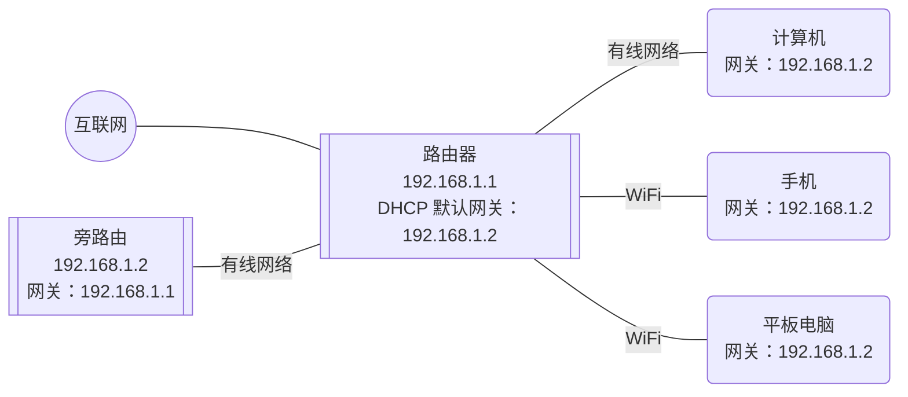

而当旁路由失效的时候，我们只需要改成这样就可以上网：

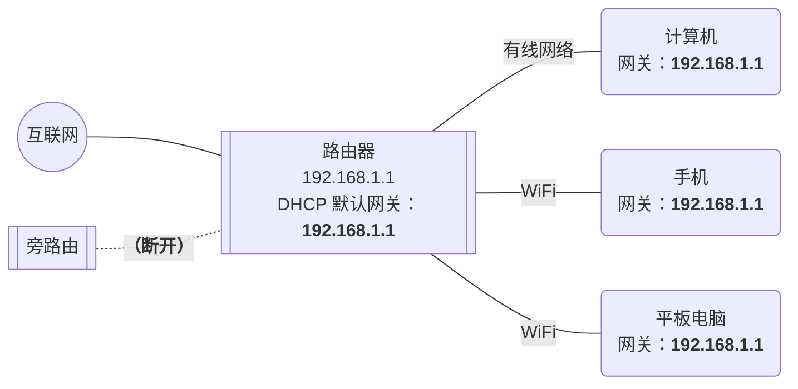

看起来一切都很美好……吗？

## 稳定，或者死板

在购买 Linksys 的路由器之前，我就听说过他们的路由器以稳定著称。这不仅体现在很久都不更新一次的固件上，也体现在 Linksys 的固件几乎不支持任何 SSH 之类的扩展功能，前端界面的可配置项也很有限。当然或许也正是因为这样，这款路由器才能有如此的稳定性。

而当时的我正身受华硕路由器 AiMesh 不稳定的问题困扰，我的某两台华硕路由器之间的连接有时会从 5G 掉到 2.5G，有时甚至会直接断连，要重启两台路由器才能解决。

这种情况下，我自然很愿意牺牲一些扩展性，来换取路由器本身的稳定性。毕竟看起来需要扩展的功能都可以在旁路由上实现，主路由就不需要那么灵活了。

但直到开始部署路由器的时候，我才发现了情况有些不对。

### DHCP 无法修改默认网关

通常来说，将主路由配置好之后，我们只需要做这么几件事：

1. 把旁路由接入主路由的 LAN 口；
2. 为旁路由设备固定一个 IP；
3. 把主路由 DHCP 的默认网关地址改为刚刚固定的旁路由 IP；
4. 重新连接各种设备或重启路由，使得设备可以重新从 DHCP 获取网关信息。

但当我进行到第三步的时候，我惊讶地发现，Linksys 的 DHCP 配置页面上竟然没有配置默认网关地址的地方！

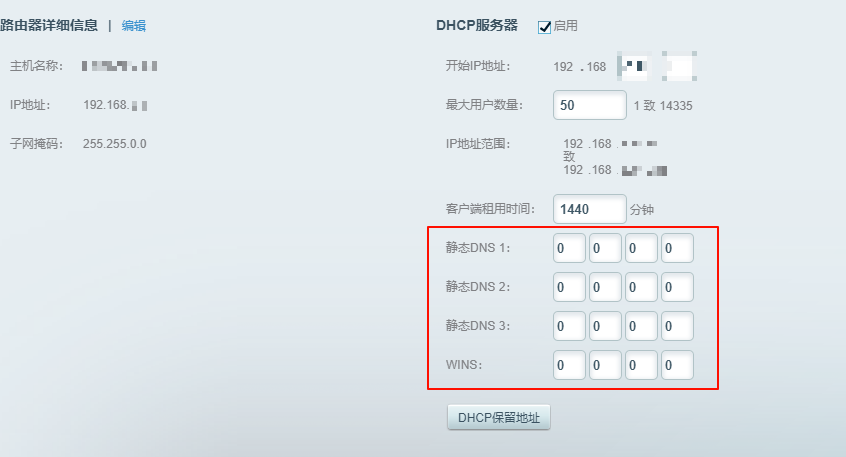

我带着满脑子的“不可能”，开始到处查阅资料。但是查的资料越多，我就越感觉情况不对。

不管是中文网页还是英文网页，都能看到一些类似的问题。但是所有问题的结果，都指向了同一个答案：Linksys 根本不支持在 DHCP 中设置自身 IP 以外的网关。

甚至有人提到他去问了客服，但是客服也在答非所问，回答一直都是可以通过修改路由器本身的 IP 来更改默认网关地址，本质上还是只能将地址指向主路由。

我自己也抱着最后一丝希望问了一下 GPT，结果 GPT 倒是很笃定：抱歉，就是没有这个设置！

连这样常用的配置都没有，这已经不是单纯的稳定，更可以说是一种死板了。

### 我旁路由也是可以 DHCP 哒！

多处查找未果后，我也基本放弃了在 Linksys 的系统中修改 DHCP 默认网关配置的可能性。虽然不知道禁止修改默认网关能不能真的提升路由器的稳定性，但至少我先提前支付了稳定的代价。

不过没有关系，虽然主路由的 DHCP 缺斤短两，但我们还有旁路由。

理论上来说，因为我的旁路由也安装了 OpenWrt 系统而非普通 Linux，所以系统中已经自带了一个 DHCP 服务器。只要关闭主路由的 DHCP 服务，并在旁路由开启服务，也可以达到完全一样的效果。

之所以没有一开始就使用这个方案，主要还是因为这个方案在旁路由出现问题的时候，切换成本稍微大一些：原先只需要修改一个默认网关，现在还需要重新开启主路由的 DHCP 服务。另外，因为同一个网络里同时存在两个 DHCP 服务器会产生冲突，所以在恢复旁路由的时候，也需要先关闭主路由的 DHCP 服务，再开启旁路由的 DHCP 服务才可以。

但是在没有选择的情况下，其实这个方案也麻烦不了多少。于是我快速进行了一些配置，调整到了旁路由 DHCP 的方案。

全部配置完成后，我在自己的电脑上测试了一下，无论是网络访问还是代理都工作得很正常。我以为所有事情都已经做完了，于是告诉老婆网可以用了，然后——

原神，启动！

结果游戏还没加载完，就收到了老婆的投诉。

家里除了我这台电脑之外所有的终端设备，似乎都没有网络了。

### IPv4 和 IPv6

这里需要介绍一个背景，那就是老婆那台台式机的网络接入。因为这台台式机在书房，而屋子的结构不太方便走线，所以我采用的组网方式是在屋里放置了一个 Mesh 节点，并将这台台式机用有线的方式连入了这个节点的 LAN 口。

简单画一下，网络结构大概是这样的：

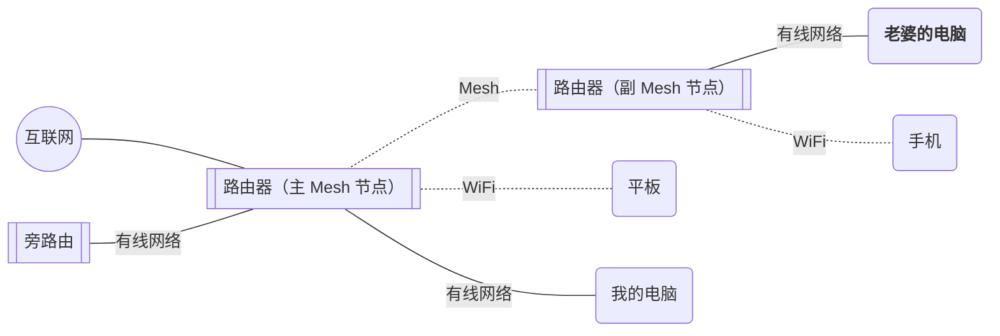

一开始我还以为是 WiFi 设置的问题，但听说这台台式机也不能连网了，这问题就变得很诡异了。

虽然接入了一台 Mesh 设备，但是电脑本身还是用有线的方式和设备相连的，而 Mesh 协议也只是走了 WiFi 的通道，本身的连接并不会受 WiFi 的影响。更何况，看起来不能访问的只有互联网，局域网还是可以访问——也就是说，Mesh 的通路本身是没有问题的。

之前配置网络的时候我曾经遇到过旁路由上的 DNS 在某些设备，特别是 Windows 上通过 IPv6 连接时，可能会出现 IPv6 DNS 地址获取错误的情况。所以我当时也是不慌的：不管怎么样，先把 IPv6 关了试一下。

但是不试不知道，一试吓一跳：原来上次配置网络的时候我已经把网卡的 IPv6 协议关上了，也就是说，现在无法访问互联网的问题是出现在纯 IPv4 网络下的。

更诡异的是，当我打开 IPv6 协议之后，很多网站又突然可以访问了。虽然有一些应用依旧有问题，比如 QQ 还是不能登录，但这样推测很大概率是 IPv4 的网络出现了问题，而 QQ 这些应用只能走 IPv4，所以才不能使用。

其实到这里我是放心了一些的，毕竟相比复杂的 IPv6，IPv4 相对来说还是我熟悉的领域。上网搜一搜，总能找到一些答案的嘛。

原神，关闭。

Google，启动！

## 突如其来的解决方案

经过一番搜索，我发现这个问题比想象中的更加复杂。

### 知其然不知其所以然

网上有不少人遇到了类似的问题，但是大部分场景都不和我这个场景完全一样。同时，可能是关注 IPv6 的人比较少，我也并没有看到过汇报 IPv6 可用但 IPv4 可用的情况。

不过我还是发现了一些端倪，一些讨论中经常会提到，在接入了旁路由之后，出现了有线上网可用，但是 WiFi 不可用的场景。

如果忽略我老婆的那台通过 Mesh 有线连接的电脑，那么其它的设备正好体现出上述的这种特性。

考虑到电脑通过有线连接到 Mesh 节点应该也不是一种很常见的网络结构，所以很可能这就是同一个问题。而部分问题下面也给出了解决方案，只需要在旁路由中设置一下 iptables：

```shell
iptables -t nat -I POSTROUTING -j MASQUERADE
```

就可以让所有设备正常上网了！

而我尝试了一下这个方案，发现确实可以解决问题。不光是所有的无线设备，此时就连我老婆那台电脑，都可以正常上网了。

虽然问题暂时是解决了，但是作为一个程序员，显然不能满意这样一个答案。既不知道发生了什么，也不知道这个改动有没有副作用。

好在因为之前研究过 [ps4broadcast](https://github.com/Tilerphy/ps4broadcast/) 这个项目，也进行过一些二次开发，所以我对 iptables 还是有一些了解的。很显然，上面的命令是尝试在旁路由上进行 DNAT 地址转换。

通常来说，因为路由器的 IPv4 子网地址是私有地址，所以路由器必然会在私网地址和公网地址之间进行一次 NAT 转换。既然主路由已经有了这个功能，为什么需要在旁路由上再进行一次 DNAT，才能正常访问网络呢？

更进一步讲，如果是主路由的 NAT 转换出了问题，那为什么有线网络不会受到影响，单单是无线网络和 Mesh 受到了影响呢？WiFi 的连接和 Mesh 的连接，它们之间又有什么共同之处？

### 间章：iptables

在继续讲故事之前，为了让你们能够听懂我在说什么，这里也讲一下 iptables 是什么。

有一些网络经验的小伙伴都能说出，iptables，不就是 Linux 的防火墙吗？

对，也不对。

iptables 的功能看起来是对于所有流经内核的网络包，指定一些规则进行过滤和修改，之后再将网络包发出。将这样的功能称作“防火墙”，似乎也没什么不妥，甚至连 [netfilter](https://www.netfilter.org/) 项目的主页都是这样写的：

> iptables is a generic **firewalling software** that allows you to define rulesets. Each rule within an IP table consists of a number of classifiers (iptables matches) and one connected action (iptables target).

等一下，为什么 iptables 的介绍在一个叫“netfilter”的网站上？

这就是“也不对”的部分了：事实上，真正执行这些规则的，是 Linux 内核中一个叫做 netfilter 的框架。上面的网站上也有介绍：

> The netfilter hooks are a framework inside the Linux kernel that allows kernel modules to register callback functions at different locations of the Linux network stack. The registered callback function is then called back for every packet that traverses the respective hook within the Linux network stack.

所以打一个比方，iptables 就像是 netfilter 框架的一个前端工具，用于更简便地配置防火墙的条目。

不过对于大多数用户来说，倒也没有必要区分得这么清楚。知道 iptables 可以配置 Linux 内核的防火墙，已经足够理解大部分内容了。

而这里的“防火墙”，其实也不能单纯当作杀毒软件中的防火墙来理解。很多杀毒软件的防火墙只能控制数据包的通过与否，而 iptables 不仅可以控制数据包的通过，还可以修改 IP 协议数据包头部的内容。

而这，也就是 iptables 可以实现 NAT 的原理。

### 间章：NAT

讲到实现 NAT，就不得不说一下 NAT 是什么。这里跳过 TCP/IP 四层模型和 OSI 七层模型的基础知识，因为它们不太会影响后续的理解。想仔细理解的同学，请自行翻出《计算机网络》开始恶补。

根据 [IPv4 Header](https://en.wikipedia.org/wiki/IPv4_header) 中的介绍，IP 数据包的头部包含了一些路由和数据传输过程中需要的信息。而为了理解 NAT，我们需要关注的是“Source IP Address”和“Destination IP Address”两条信息，下面简称为 saddr / daddr。

从 IP 层的数据传输角度，一个数据包从一个内网地址的机器发送到互联网，通常经历了这样几个流程：

1. 从内网机器发送到默认网关，也就是路由器。此时数据包的包头中，saddr 地址是内网机器的地址，而 daddr 则是公网的目标地址。
2. 默认网关也就是路由器收到数据包后，需要判断它将要发到的地址，并对应进行转发。这里先考虑没有旁路由的简单网络环境，此时默认网关发现目标地址是互联网上的地址，于是需要将数据包转发给互联网上的下一级路由器，这个路由器会通过你的运营商网线和若干交换机，与你的路由器相连。
3. 之后经过互联网上路由器的多次转发，这个数据包到达了服务器。而服务器大概率也要给你一个回复，此时它会使用原先数据包中的 saddr 作为回复数据包的 daddr，并通过互联网上的路由器传回你的路由器。
4. 你的路由器再根据 daddr 的信息，将响应发回给你的内网机器。这样，就完成了一次通信。

完美吗？并不是，只要有一些网络常识的小伙伴都能看出来，这里有一个非常明显的问题。

在 IPv4 协议中，内网机器的地址通常是一个私有地址，也就是 `192.168.1.123` 这样的地址（当然也有一些其它的地址段，这里用最常见的 C 类地址举例）。而私有地址的特点就是：你家的局域网是这个地址，我家的局域网也是这个地址。稍微搞过家里的网络就会知道，大部分路由器的默认地址都是一样的 `192.168.0.1` 或者 `192.168.1.1`，并不会因为放在不同的屋子里而有所区别。

如果 saddr 的地址是 `192.168.1.123`，在上述步骤中的第一和第二步都是没有任何问题的。但是到了第三步的时候，服务器会将收到数据包的 saddr 作为回复数据包的 daddr，再发出去的时候问题就来了：互联网上的路由器根本不认识这个地址是谁家的 `192.168.1.123`！

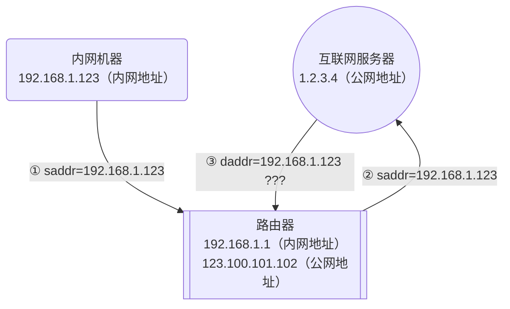

这样的话，这个数据包，你显然就收不到了。

对于 IPv6，因为地址空间非常充足，所以采取了一种很奢侈的办法：别用私有地址了，所有的地址都是公有地址，地址全部是唯一的，这样我不就能通过地址直接找到设备了吗。

但是对于 IPv4，私有地址的划分本来就是因为公有地址不够用了，让我给每个人分一个公有地址，臣妾做不到啊。于是，就只能用 NAT 这样的办法，来解决数据如何传回来的问题。

NAT，全称是“Network Address Translation”，网络地址转换。它的功能和名称基本一致，就是一个把公有地址和私有地址（其实也包括私有地址之间，原理是类似的，这里不展开说了）来回转换的技术。

回顾一下上述的四个步骤，第三步中因为操作完全在服务器端，所以使用 saddr 作为回复的 daddr 这件事是不能更改的。那么如果我们想让 daddr 能够正确地指向家里路由器的公网地址，就只能提前修改 saddr 了。

而路由器的 NAT 正是在第二步的时候，提前替换 saddr 为公网地址。这样，服务器端就可以在回复的时候，填写正确的 daddr 了，如下：

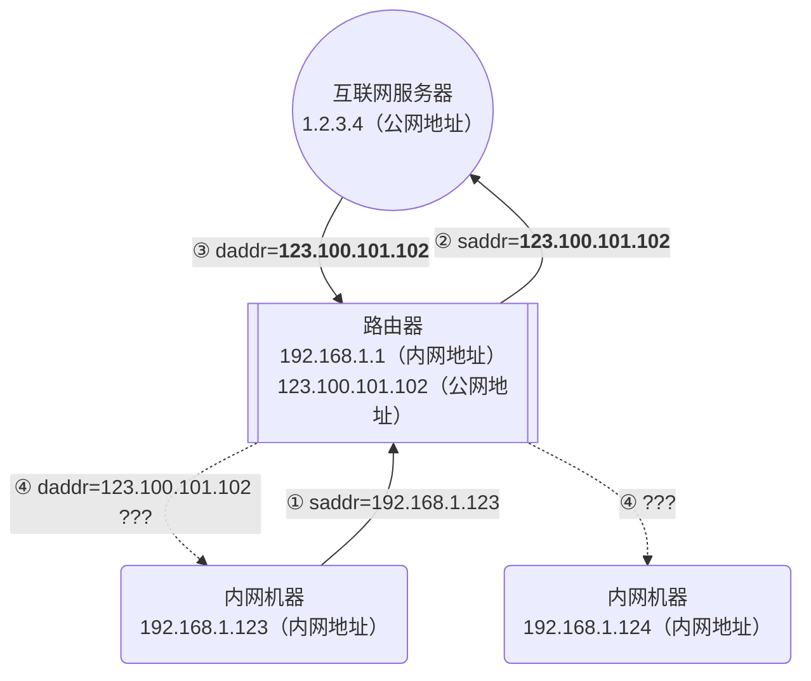

但这里也引入了一个新的问题，那就是回程时的 daddr 变成了一个固定的公网地址。那么假设内网中还有另外一台机器，我们怎么区分应该将回复转发给哪台机器呢？

好在除了 IP 地址，数据头中还有很多其它可以使用的信息，例如端口。路由器可以将自己向外发送请求时的端口绑定到发送时的内网 IP，这样等到数据包从同一个端口回来的时候，路由器就可以查询当时发送的内网 IP 地址，并正确转发回这台机器了。

将发送请求和收取回复这两个步骤拆分开的话，我们将前者称作 SNAT，即 Source Network Address Translation；而后者称作 DNAT，即 Destination Network Address Translation。这两个名字也与实际的过程吻合：SNAT 修改了 source address，而 DNAT 修改（判断）了 destination address。

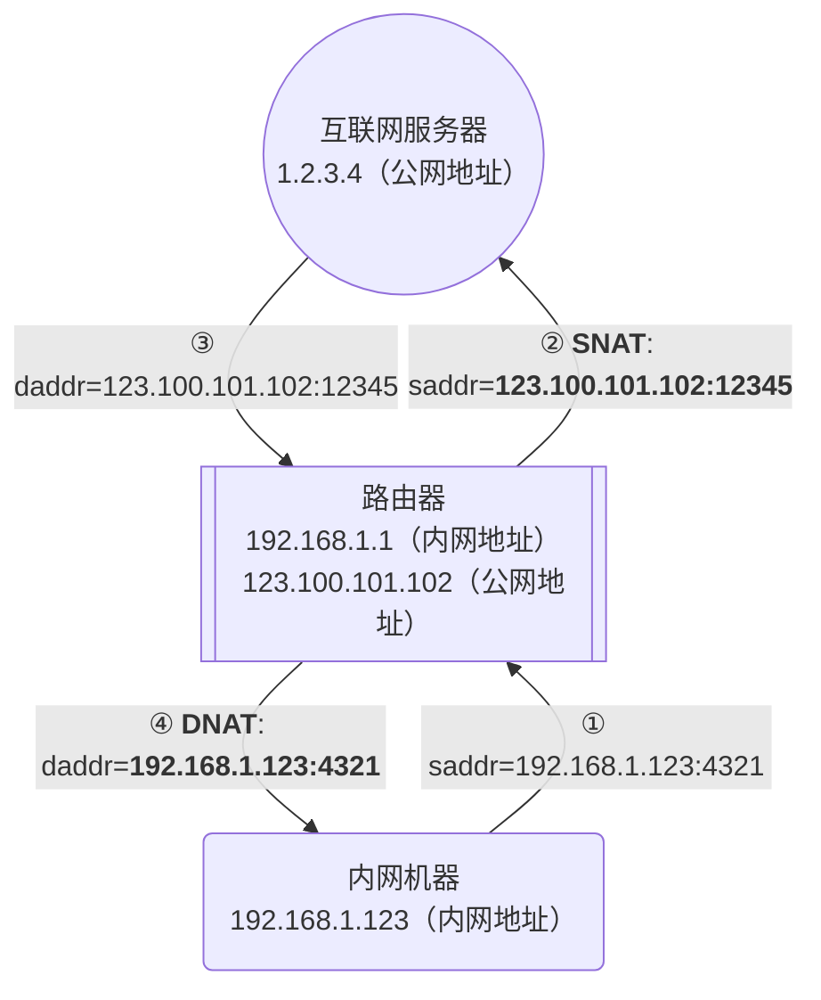

不过可能是为了简洁，我们通常说的 SNAT，指的其实是先进行 SNAT 后进行 DNAT 的整个过程。

与之相对的，DNAT 则是先进行 DNAT 后进行 SNAT，也就是外部地址通过公网请求你的路由器，由你的路由器转发到内网机器上的过程。配置过路由器的同学一定见过类似的功能，它的名字叫做“端口转发”。不过这个功能和这篇文章无关，这里就不展开说了。

## 打破砂锅问到底

书接上文，现在的情况是有线网络和 IPv6 没有受到影响，仅仅在通过无线网络传输数据且协议为 IPv4 的情况下，才会出现问题。而且，解决问题的方式竟然是在旁路由上再做一次 NAT。

至此，我的判断是大概率主路由的 NAT 功能出现了问题。这是因为 IPv6 网络并不需要纯内网地址，所有地址都是可以路由的公网地址，所以不需要 NAT 的 IPv6 没有受到影响；而接入旁路由之前网络连接是正常的，有理由相信这应该是网络结构的变化导致 NAT 出现了一些问题。

带着 NAT、无线网络、旁路由这些关键词，我又进行了新一轮的搜索。

功夫不负有心人，终于在 [关于旁路由设置后，主路由WIFI无法上网的问题](https://cloud.tencent.com/developer/article/2036952) 这篇文章中，我找到了关于所有问题的解答。作为这篇超长文章的最后一部分，请允许我再花一些时间，把这些解答和分析用我的方式转述给大家。

### 网桥和 iptables

文章中给出了这样一个关键信息：对于 Redmi AX5 路由器，有线网口和无线网口之间是有一个虚拟网桥的，且某个内核变量的设置导致了虚拟网桥上的流量会交由 iptables 处理。

为了避免文章过于冗长，这里就不再展开解释网桥的概念了。你可以简单认为是为了让路由器上不同的网口能够互相传输数据，需要像搭桥一样将它们接在一起。

对于不同有线网口的数据传输，路由器本身可以通过内部的交换机芯片，直接在硬件上传输数据。这个时候，路由器的操作系统内核是看不到这些数据的。

但是对于有线网口和无线网口之间的数据，因为底层协议不同，所以必须要交给 CPU 进行一些数据转换。此时，路由器的软件内核就会处理这些数据。

通常情况下，内核也只是简单处理一下数据格式转换，再转发数据到对应网口就结束了。好巧不巧，Redmi AX5 路由器在某些特定状态下可能会开启这样一个 `sysctl` 配置：

```ini
net.bridge.bridge-nf-call-iptables = 1
```

而这个配置的含义就是，让刚刚提到的这些通过网桥跨网口传输的数据，全部走一遍 iptables 防火墙。

我们都知道（不知道也没关系），iptables / netfilter 是具有状态机制的防火墙。它的状态机制实现导致了，如果是被它判定成属于同一个 stream 的数据包，在首次通过 nat 表进行了 NAT 转换后，无论转换结果如何，后续的包都会使用同样的转换方案。

关于如何判定成同一个 stream，这里也不需要更详细地了解。但显而易见，如果一个数据包原封不动地经过 iptables 两次，那它一定会被判定为同一个 stream。

而如果这个包第一次被 NAT 规则判定为不需要进行转换，那么第二次通过的时候，就不会再判定一次，而是直接不进行转换发出。

### 网络结构带来的巧合

知道了上面的信息，让我们回顾一下 NAT 部分提到的网络结构（简化了端口部分）：

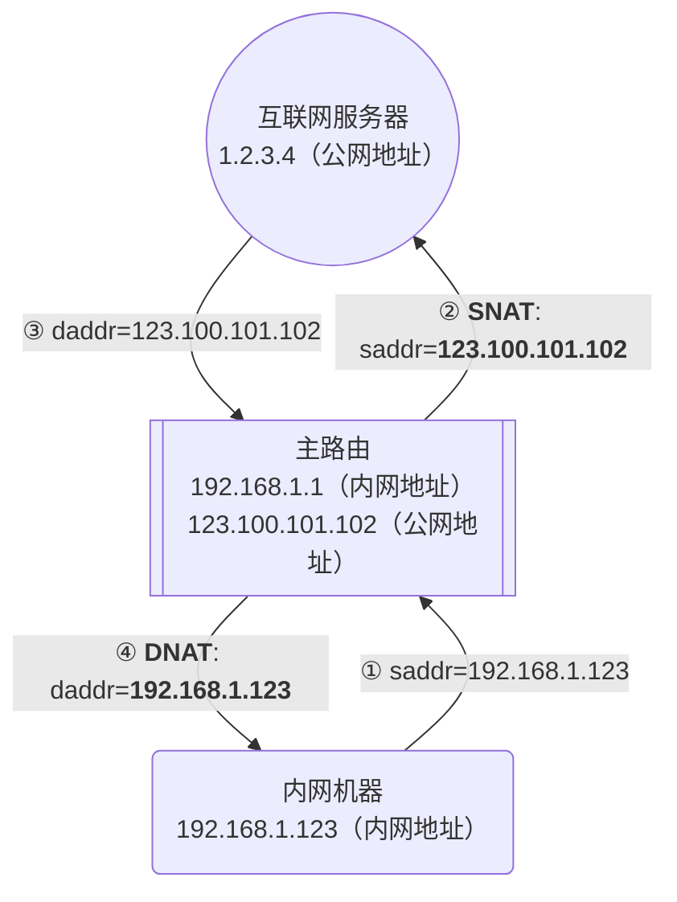

如果我们在这个网络结构中加入旁路由，那么数据传输的前几步就会变成这样：

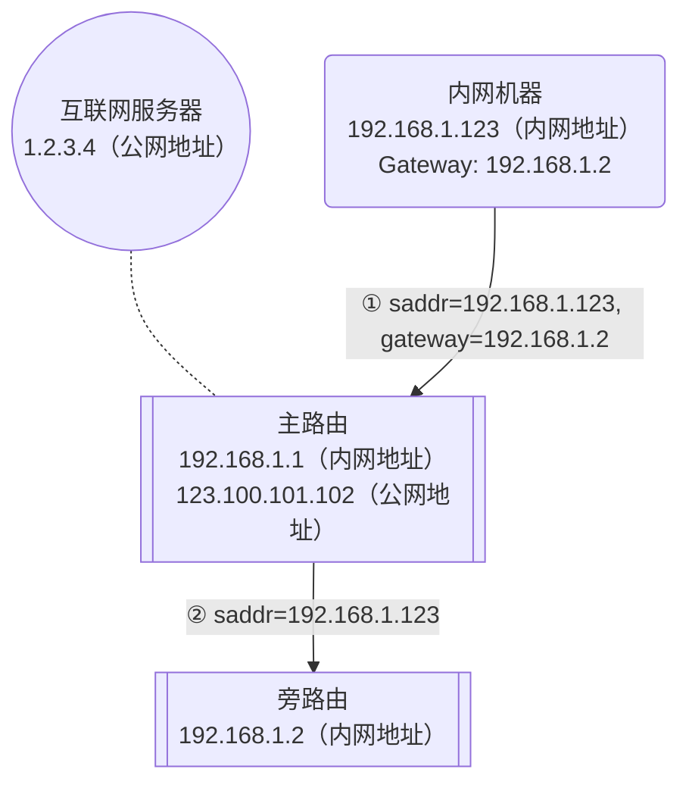

可以看到，因为内网机器的网关设置为旁路由，所以数据包首次经过主路由的时候，会被转发旁路由上。此时，因为旁路由的 IP 也是一个内网地址，所以主路由判定不需要进行 NAT。

如果内网机器与旁路由都是通过有线网络和主路由连接的，那么这个数据包不会被主路由的 iptables 处理，也就没有任何问题。但是当内网机器是通过无线网络连接到主路由（包括 Mesh 连接）时，问题就出现了：iptables 处理了这个数据包，虽然正确转发给了旁路由，但它也记住了一件事情：这个数据包是不需要做 NAT 的。

再继续看几步，就会发现问题所在：

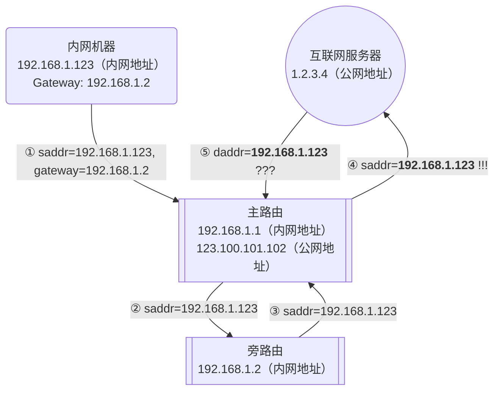

因为旁路由的网关是主路由，所以在处理了这个数据包之后，旁路由会再次将这个数据包扔回给主路由。本来主路由发现这个数据包这次要发向外网了，是应该对它进行一次 NAT 转换的。可因为状态机制的存在，此时主路由会以为这个数据包是之前 stream 的一部分，是一个不需要转换的数据包——于是主路由没有修改 saddr，就把这个数据包发给了互联网（上图中的第四步 `!!!` 部分）。

接下来的事情就和 NAT 章节里没有 NAT 的场景完全一致了：服务器受到数据包后，将数据包的 saddr 作为回复数据包的 daddr 发出。但此时因为 daddr 是一个内网地址，所以互联网上的服务器一脸懵逼，不知道应该把数据包发给谁，只能丢掉数据包（上图中的第五步 `???` 部分）。而路由器和内网机器，也永远都不会收到这个回复了。

### 怎么又是 DHCP 哒！

路由器真的这么傻，以至于连这种场景都解决不了吗？当然不是，实际上只要不让网桥上的流量被 iptables 处理，NAT 的结果就不会被缓存，就能够解决刚刚的问题。

在上面的文章中，作者其实也分析了 Redmi AX5 路由器是如何处理这种情况的。

总结起来，小米的路由器其实进行了一些检查，在 DHCP 的 DNS 或网关中至少有一个配置项的 IP 不是路由器自身的 IP 时，会通过 sysctl 关闭使用 iptables 处理网桥流量的这个功能。

这里会出现 DHCP 看起来很突兀，但仔细想想其实很合理：刚刚的功能很显然是为了优化 NAT 性能，减少 NAT 判断的；但是在有旁路网关（请允许我这里暂时不使用“旁路由”这个词，毕竟这里需要的确实是网关）的时候，这个功能很显然会出现问题。而 DHCP 的这两个配置，将部分网络流量指向了路由器之外的 IP，基本也就意味着网络中存在一个其它旁路网关，且到达这个旁路网关的流量一定会被路由器转发。

所以小米的路由器其实很巧妙地规避了这个问题：只要正常开启 DHCP 服务，并正确配置默认网关，所有流量就都可以被正常 NAT。

即使有其它原因导致不能在小米路由器上开启 DHCP 服务或调整这个设置也没关系，我们还有一个最终方案，那就是 SSH 连到路由器上，直接修改处理对应逻辑的脚本。虽然这样会影响一些稳定性，但至少能够解决问题。

现在 Linksys 路由器上表现出的现象，和 Redmi AX5 上的现象出奇地一致。虽然我没有实际抓包，但是基本也可以笃定，这里遇到的就是这个问题。

既然小米路由器有这个判断逻辑，那我们或许有理由相信，Linksys 的路由器也可以这样设置。

是这样吗？

### 似乎……不行？

说到这里可能大家已经把前面的内容差不多忘光了，请允许我提醒一下：在文章的最开始，我就介绍了 Linksys 路由器的一个最大的问题：DHCP 服务器不能设置默认网关！

这个问题导致了在我配置的网络环境中，主路由器是没有开启 DHCP 功能也不能开启 DHCP 功能的，开启它会导致没有办法自动设置默认网关为旁路由。而这个功能，也因此被迫转移到了旁路由上开启。

之前这个问题可能还只是一个小事，最多导致我们的网络结构变更稍微麻烦一点。但现在它却变成了一个非常致命的问题，让我们直接失去了通过修改 DHCP 配置正确设置 NAT 的这个方案。

也就是说，无论 Linksys 的路由器有没有上述判断逻辑，现在 DHCP 都开不起来，也就无从验证和解决了。

而 Redmi AX5 上的终极方案，也就是直接 SSH 改代码的方案，这里也没有办法使用。正如上面说过的，可能是处于稳定性的考虑，Linksys 的路由器甚至没有开放 SSH 端口，也没有在界面上暴露任何相关的配置。

看起来这条路已经走到了死胡同，但稍微回顾一下，就会发现刚刚我们似乎已经在旁路由上通过修改 iptables 配置解决过这个问题了。那么当时的方案是怎么解决问题的，又有什么副作用呢？

### 旁路由 NAT 是如何解决问题的

刚刚有解释过，旁路由的那条 iptables 命令：

```shell
iptables -t nat -I POSTROUTING -j MASQUERADE
```

实际上就是一条 SNAT 的规则。`nat` 和 `POSTROUTING` 涉及到 iptables 的表和链的实现，暂且不表，简单理解成一个过滤器就行；而这里的 `-j MASQUERADE` 其实和 `-j SNAT` 基本是同样的功能，就是对数据包进行 SNAT 转换，区别在于 `-j SNAT` 需要手动指定一个地址，而 `-j MASQUERADE` 则会自动获取网卡的地址进行转换。

而设置了这条规则之后，所有数据包中的 saddr，就会从原先的内网机器 IP，变为旁路由的 IP。这样主路由就不会将这个修改后的数据包看作刚刚那个数据包 stream 的一部分，而是会当作一个新的数据包，重新在主路由上做一次 NAT，也就规避了缺少一次 NAT 的问题。

而服务器发送回复数据包的时候，因为主路由记录的原始数据包是由旁路由发出的，所以回复的数据包也会被转发到旁路由。而旁路由的 iptables 因为设置了 `MASQUERADE` 规则，所以也会和主路由一样记录一个对应关系，并再次将主路由发过来的这个数据包转发给刚刚的内网机器。这样，就打通了全部的通路，内网机器也能够收到正确的数据包了。

此时的数据流大概是这样：

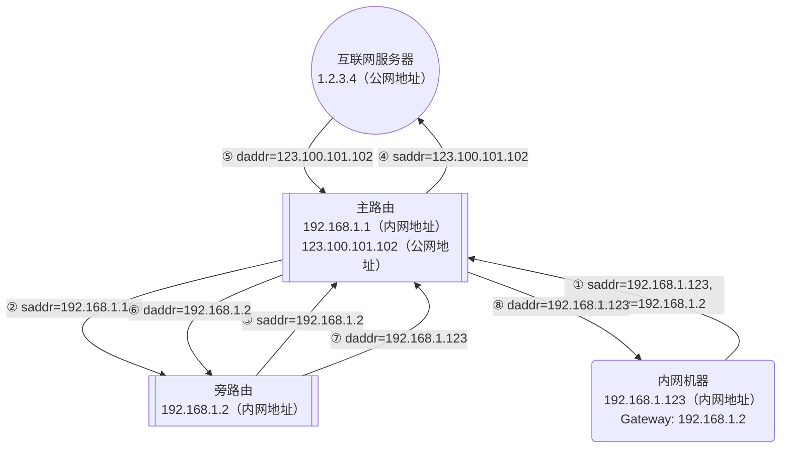

这大概是文章里最复杂的一个图了，希望你能看懂。不过看不懂也没关系，总之就是出去的时候数据包经历了 内网机器 --> 主路由 --> 从路由 --> 主路由 --> 服务器的过程，而回复的数据包则反过来走了一次全程。

这个解决方案中，旁路由终于有了一些名副其实的作用：它完整地执行了主路由和内网机器之间的 NAT 转换，除了和主路由在同一个内网以及所有流量经过主路由以外，其它的部分表现得就像一个挂在主路由下面的二级路由一样。

### 旁路由 NAT 的副作用

问题解决了，但这并不是最好的方案。

正如上面所说，回复的数据包是反过来走了一次全程的。

对于通过代理软件代理的流量，因为本身就相当于旁路由重新发出了一个请求，所以其实不会受 SNAT 与否的影响，总会走完这整条路经。但是对于普通的非代理流量，我们更期望的是在回程时直接从主路由转发到内网机器，而不是再经过一次旁路由，平白无故地多出两次数据包转发的开销。

而本来禁止网桥数据包通过 iptables 的方案，是能做到这一点的。但因为 Linksys 的功能过于保守，我们恐怕没有任何办法可以实现这个方案了。

最终，我在完成了上面所有这些内容的验证之后，还是选择了退货。本来想直接换成小米的路由器，但是想了想还是下单了几台网件的路由器，准备趁着这个机会试一试不同品牌的情况，多踩一踩坑。

毕竟对于爱折腾的人来说，踩坑的经历，其实才是生活中最有趣的那部分。

:::danger[但还是请听我一言]

不要折腾网络，会变得不幸。

:::
