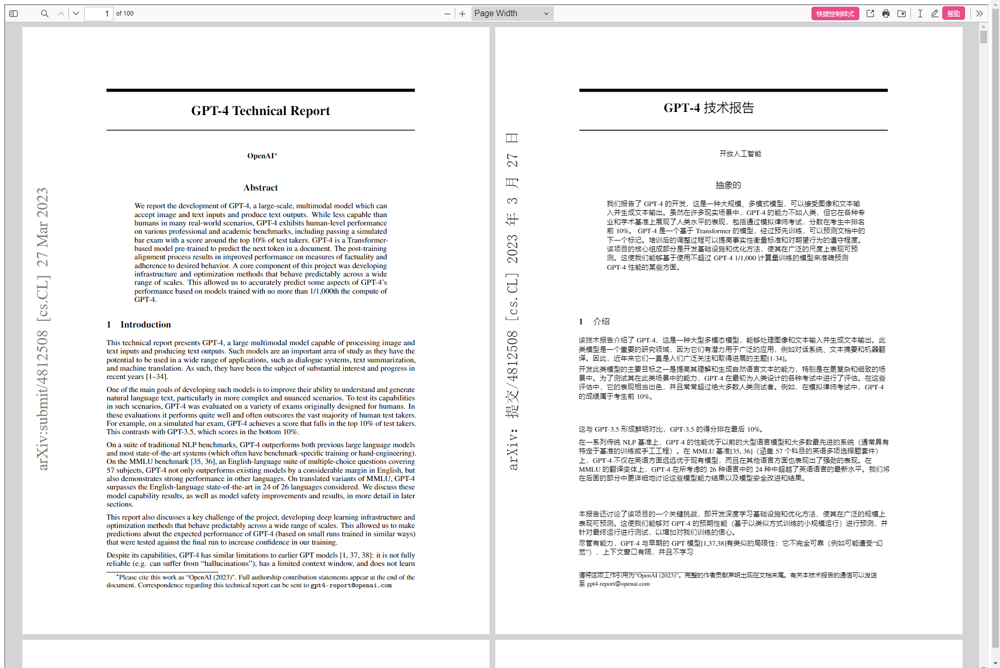

最近状态不好，挑一些简单的 topic 来写吧。

这里推荐一个浏览器插件：沉浸式翻译。可以说它满足了我对一个翻译插件的几乎全部设想，除了缺少 OCR 功能，以及某些特殊的 PDF 文档无法翻译以外，几乎所有工作生活中的主要需求它都能够满足，保留原文的翻译方式也是遥遥领先。再加上可以灵活接入各类翻译接口（软件的接入功能本身是免费的哦！），可以说这是我迄今为止遇到过的最有用的一款浏览器插件，没有之一。

它的官网在 [这里](https://immersivetranslate.com/)，大家也可以去自行了解一二。

至于我有多推荐这款插件，可能从我工作 Slack 的签名就可以看出来：

<!--truncate-->

:::note[关于拖更]

一周多没有更新了，不是因为三分钟热度，也不是因为没有东西可以写，只是因为过去的这一周真的精疲力尽。

不知道是身体原因还是过于累心，最近几周一直在持续胸痛，伴随着左肩的放射性疼痛、晚上大量出虚汗，严重的时候甚至会半夜惊醒，睡眠质量也很差。做了一个 24 小时心电图之后本来想着这周事情太多等周末再去找医生，结果周四开完下班前最后一个会，整个人突然瘫在椅子上动弹不得——实在不敢拖了，于是周五上午强行请了个假去看病。

好消息是，24 小时心电图没有什么异常；坏消息是医生也很难保证没有问题，所以还是开了一个冠状动脉钙化 CT。

而周五下午继续超负荷工作到晚上，也终于能喘息一下了。整个周六都感觉还是没缓过来，直到现在才好了一点，来随便写点简单的东西。

这个状态下别说写博客了，连日常的家务都没法完成。我一方面希望自己的身体别出问题，另一方面其实也有点期待最终还是查出一些小病，说不定还能多一些休息的时间……

:::

## 保留原文的翻译方式

这款插件最重要的功能，就是保留原文的网页翻译方式。

话不多说，让我们用一张图片来看一下翻译的效果。网页来自 [Google C++ Style Guide](https://google.github.io/styleguide/cppguide.html)，翻译接口使用了谷歌翻译。

可以看到相比直接替换网页内容的方式，这种翻译方案可以让我们更有效地将译文和原文进行对比。这在翻译技术文档的时候非常有用，可以避免某些单词被错误地翻译为了非专业语境下的形式，比如 string 和 thread 这类单词。

同时，即使对于日常翻译，在翻译接口并不百分百可靠的情况下，这也可以让我们通过快速查阅原文的方式理解部分“翻译腔”很重的译文。

通过 F12 简单检查了一下它的实现方案，看起来这个插件会通过在每一个块中加入行内标签 `` 来达到插入译文的效果。其中还有一些微妙的技巧，比如对于较短的 `<h>` 标签，插件并不会在 `` 中插入 ` `；但对于较长的段落，则会在 `` 的一开始插入一个 ` ` 来达到换行的效果。截图中的“Background 背景”和后续的文字，就分别属于这两种情况。

## 多种多样的翻译接口支持

这个插件的另一个优秀之处在于，支持市面上你能想到的几乎所有翻译接口，包括 DeepL 和 OpenAI 的收费接口。当然了，虽然接入本身是免费的，但是接口还是要你自己花钱买的——当然也有更好的方案，后面会提到。

而迄今为止最优秀的全文翻译接口，我认为非 ChatGPT 莫属。看过我前几篇文章的小伙伴都应该知道，我的博客就是使用 ChatGPT 完成 [i18n](/blog/adding-i18n-for-a-docusaurus-site/) 翻译的。没看过也没关系，你现在就可以在右上角切换语言试试。

可以说 ChatGPT 的翻译结果，绝大部分情况下都不输于人类翻译——至少比我自己翻译得要好。更有甚者，我发现之前的博客中我在中文版里写的一些错字，ChatGPT 都可以在翻译时帮助我纠正。

沉浸式翻译在对于 OpenAI API 的支持上也是做到了最大的开放性，除了最基础的模型选择，它还提供了包括 prompt 定制、切换不同第三方服务（例如 Azure 这种直接提供 ChatGPT API 的厂商，或者 Moonshot 这种模拟了 ChatGPT 接口的厂商）、限制请求速率等各类配置项。

当然如果全部情况都使用 ChatGPT 翻译的话，除了价格可能有点吃不消以外，本身翻译的速度受限于接口调用频率和返回速度限制，也不能特别令人满意。所以我个人的做法是日常使用谷歌翻译，在某些比较难翻译的小段文字部分切换到 ChatGPT 接口。因为插件本身做了很好的优化，所以只会翻译当前网页显示位置附近的文字，不必担心一个长文档会全部被翻译一遍。

可能唯一可惜的是，在我尝试使用 Moonshot 的接口进行翻译时，即使请求速率限制到了一秒一次，实际的请求次数还是会超过这个数字，导致必定会触发速率限制，无法完成翻译，所以没法白嫖这部分免费额度啦。

## 本地文档翻译功能

除了能够翻译网页以外，这个插件还有着同样优秀的本地文档对比翻译功能。

关于它支持的翻译方式，可以从插件菜单中看到：

这里电子书和字幕文件的翻译都不太常用，而 HTML / txt 的翻译又有太多替代手段，所以 PDF 翻译是我最常用的一个功能。

这里还是用一个例子来展示翻译的效果，原文来自 [OpenAI 关于 GPT-4 的论文](https://cdn.openai.com/papers/gpt-4.pdf)：

可以看到不管是正常的论文文本，还是侧面的 arXiv 信息，插件都能够正确翻译。其实我之前还用它翻译过一些 Intel / AMD 关于 CPU 介绍的幻灯片 PDF，效果也相当不错。可惜家里的电脑上没有这个文档，没法展示出来了。

这个功能唯一比较坑人的可能是它打开文件的方式是右上角那一堆小按钮里，“打印”按钮左侧的那个相比“打开”更像“分享”的按钮。有不少被我推荐这个插件的人，都问过我如何打开本地 PDF 文件。不过其实第一次打开这个功能时下面文档的指引有提到这件事情，大家还是太粗心了。

另外，对于一些特殊的 PDF 甚至一些 DVI 文件，这个插件可能就没有办法处理了。我写邮件反馈过这个问题，得到的答案是确实不支持。这类文件的特点是你直接复制内容的话会复制出一串乱码……我虽然用过一段时间 LaTeX，但其实对这些输出的格式也不是那么地了解，可能确实很难支持吧。

## 可持续的盈利方式

对于类似这样的优秀开源插件，我通常都会有两个有些矛盾的担忧：一是作者没有足够的收入能不能持续维护下去，二是作者会不会为了收入慢慢将插件的部分关键功能开源。

好在沉浸式翻译插件一定程度上为自己定义了一个看起来很不错的盈利模式。对于没有自己购买 ChatGPT 和 DeepL 接口的用户，如果购买了它们的会员，可以直接使用插件服务器提供的后台接口调用 ChatGPT 或 DeepL 进行翻译。插件的会员费和直接购买 DeepL Pro 会员基本持平，而 ChatGPT 则因为是按量请求所以不好计算。

插件本身因为会承接大量翻译请求，所以实际上其中重复的请求也很多。插件服务器通过缓存这些请求，来达到减少实际接口调用的效果，从而赚取其中的差价。

总所周知，DeepL 和 ChatGPT 接口与会员的购买，在国内是一件并不太简单的事情。对于的确有需求的用户，直接购买这个插件的会员，确实能省下不少事情，也算是一种双赢吧。

对于这种能产生 [帕累托改进](https://en.wikipedia.org/wiki/Pareto_efficiency) 的工具，我向来都是很喜欢的。

## 彩蛋

除了上面介绍的主要功能之外，这个插件还有丰富的配置选项，其中很大一部分都能根据用户的需求改进翻译体验，非常值得一试。

一个小彩蛋是，这个软件的 [主页](https://immersivetranslate.com/) 和 SQYBI.com 一样，也是使用 Docusaurus 搭建的。证据就在网页的 meta 信息里。

