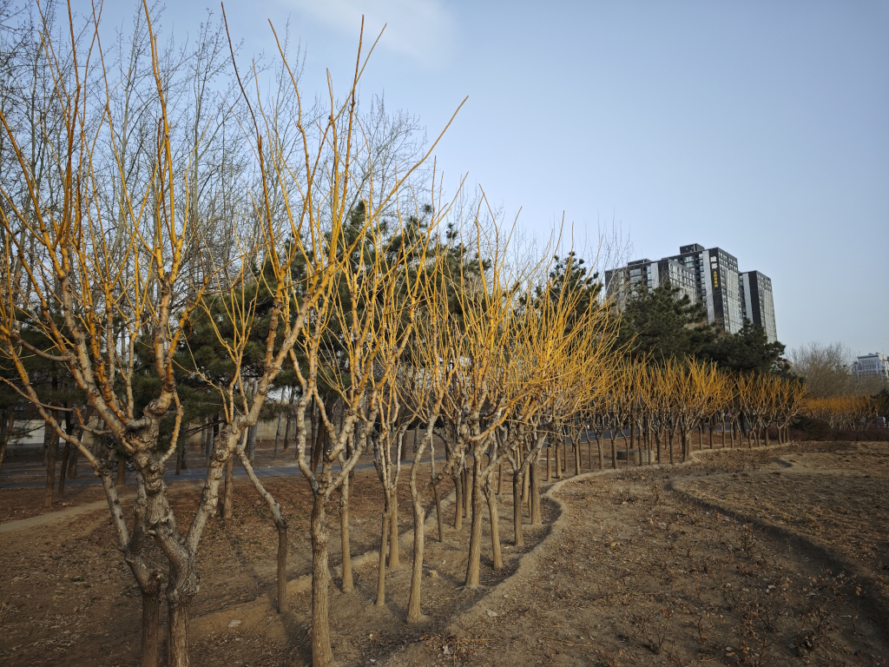

> 如果需要查看系列中的其它文章，请使用 tag 跳转到文章目录界面：[#from-taking-pictures-to-photography](/blog/tags/from-taking-pictures-to-photography/)。

这篇文章我们接着介绍上一篇文章中遗留的几个相机基础参数。

<!--truncate-->

## 数码相机的其它基础参数

### 焦距

相信即使对摄影知识没有太多了解的读者，也听说过“广角”“长焦”等词汇——毕竟现在的手机特别是高端手机，越来越像专业摄影设备，导致这些词语也越来越多地出现在我们的生活中。

作为最基础的知识，焦距主要影响的还是同样拍摄距离下，拍摄主体在画面中的大小。通常来说，焦距越长，数值越大，也就是越靠近“长焦”端，主体在画面中越大；反之焦距越短，数值越小，也就是越靠近“广角”端，主体在画面中越小，画面中容纳的内容也越少。

例如，一张靠近广角端的照片可能是这样的：

同一张照片，如果用长焦端对准后面的建筑拍摄，则可能是这样的（这里为了演示使用了画幅裁切来表示，不是真正的长焦端拍摄，但是效果类似）：

这个对比应该足够大家理解广角和长焦的区别了。

而对于光线，通常光圈不变的情况下，镜头焦距和进光量是不存在相关性的。也就是同光圈下不同焦距的镜头，进光量几乎一样。

单纯使用相机的话，只要记住这个结论就可以了。如果你好奇这是为什么：因为实际上光圈值等于焦距和入瞳直径的比值。也就是在光圈值的定义中，已经消除了焦距对进光量的影响。具体原理可以参考：[镜头焦距和光圈与进光量的关系](https://zhuanlan.zhihu.com/p/38354785)。

### 环境光强度

可能大家看到这个标题会疑惑，环境光的强度明明和相机本身没有关系，为什么会作为相机的参数之一列出呢？

这里更准确的名称可能是“相机测量到的环境光强度”。一方面，这和相机的传感器接收光线的能力有关，例如传感器像素的设计、传感器的大小、传感器滤光片和镜头的镀膜等，都会导致同样的光线下不同相机接收到的光线量不同；另一方面，这和相机计算光线强度的方式，也就是测光方式有关——毕竟相机只能知道每个像素接收到了多少光线，但整个画面的光线强度并不一定是这些像素的平均值。

当然，最简单的测光方式就是直接把所有像素取一个平均——这一般被称作平均测光。而一些更特殊的测光方式，例如点测光和中心测光，则受你手动指定的对焦点或画面中心的光线强度影响更大。

好在现在的相机通常默认的测光模式（例如“多重测光”或“评价测光”）都是比较复杂的，能够通过一定的算法将图片分区后再加权得出相对准确的环境光亮度，这已经足够绝大部分场景使用了。作为初学者没有必要详细追究具体的测光原理，只需要知道部分特殊情况下可能需要改变测光方式让相机检测到的环境光强度更准确——例如拍摄在一个纯黑的背景中晃动的烛光，或许选择烛光进行点测光是更好的做法。

除去测光以外，还需要了解的是环境光本身就是决定照片好坏的关键因素之一！除了影棚这种特殊场景，大部分情况下闪光灯和补光灯都只能起到辅助作用，而找到方向、强度、颜色都合适的环境光，就很容易拍出好的照片。

所以即使在日常生活中没有携带专业拍摄设备的时候，也多观察身边物体的光影，判断哪些光影是“好看”的，这样可以逐渐积累对光线的敏感度，对摄影技术的提升非常有帮助。

### 曝光补偿

前面提到了环境光强度，但是并没有指出相机是如何使用它的。

在刚刚接触数码相机的时候，最令我迷惑的功能就是“曝光补偿”了，没有之一。因为这个功能的名字其实和它的功能本身并不符合：它并不能对曝光和画面的亮度做任何的补偿，实际上只是一个自动或非全手动模式下，通过调整某些参数（快门、光圈、ISO 等）来达到指定画面亮度的功能。

所以，曝光补偿更合适的名字可能是“画面预期亮度”（自动模式下）或“当前画面亮度”（手动模式下）——也就是上一节中提到的通过测光模式测出的亮度。当然为了能够适应大部分摄影设备，这里我也就不再造词了，后面的文章中还是会规规矩矩地写作“曝光补偿”。

通常曝光补偿的值由 EV 表示。当曝光补偿为 0 EV 时，意味着当前的光线强度处于最亮的白色和最暗的黑色中间的位置（但这不代表接收到了 50% 的光线，而是约 18% 的光线，影调部分会详细介绍）。

还记得前面的文章中提到的“档位”的知识吗？每当曝光补偿的值 +1，就意味着光线强度增加了一档。这可能是快门时间延长一倍、ISO 增加一倍，也可能是光圈值缩小到原来的 1/1.4（光圈值的计算方式请温习：[从拍照到摄影（01）：相机的基础参数](/blog/from-taking-pictures-to-photography-01/#不好计算档位帮忙)）。同理，如果曝光补偿的值 -1，则意味着光线强度降低了一档。简而言之，EV 变化 1 就意味着整体照片亮度也随之变为之前的 2 倍或 1/2。

因为 2 倍的变化过于剧烈，所以通常相机的 EV 变化最小档位是 1/3。每增加 1/3 EV，光线强度则会变为原先的 $2^{1/3} \approx 1.26$ 倍。而增加三个 1/3 EV 也就是 1 EV 之后，光线强度也就自然变成了 $1.26^3 \approx 2$ 倍。当然这里甚至连这个结论都不需要记住，只要知道调整 EV 能改变亮度就足够了。

但是这里需要再次强调：相机是通过调整自动模式下的参数来适配 EV 的。

例如某个场景下，使用相机的光圈优先模式，光圈被固定在 f/2.8，ISO 被手动设置为 ISO 100。此时，唯一可以调整的参数就是快门速度。假设 -1 EV 时快门的速度为 1/100s，此时你觉得亮度太低，需要 +2 EV 的曝光补偿，把画面亮度变为 1 EV——没问题，相机会通过将你的快门变慢 $2^2 = 4$ 倍达到了 1 EV 的效果，此时的快门变为 1/25s。

但是这不是没有代价的。因为快门太慢，所以如果相机不在三脚架上或手不够稳，你会发现画面“糊”了。这时，更好的方法是不要单纯依赖曝光补偿的调整，而是手动增加 ISO 来保证足够快的快门。虽然更高的 ISO 可能带来更多噪点，但是要知道这些噪点都是一定程度上可以通过后期处理去掉的。而且即使不能去掉，“拍到”也永远比“拍好”重要。噪点多的照片可能只是看起来不那么干净，而一张糊了的照片是根本没有办法使用的。

综上所述，等到后面了解互易律之后，我推荐所有使用数码相机的初学者在摄影早期都尽量多地使用手动模式并手动固定 ISO，而非光圈优先和快门优先模式，甚至是全自动模式。在这种模式下，对曝光补偿值的调整是无效的（因为没有可以自动调整的参数）。但是相机会通过 EV 值的方式输出当前的测光结果，可以作为对画面亮度的参考。

这可能在早期会花费你更多的时间调整相机参数，甚至错过一些决定性瞬间。但我个人认为这是值得的，因为你会非常迅速地了解各个参数在不同场景下的作用。当你很清楚不同场景下哪些参数是可以调整而哪些参数是不能的时候，你就可以使用上述几种其它模式，从而达到更快抓拍的效果了。我也会在后续的文章中详细介绍这几种模式的使用场景。

### 画幅

通常来说，作为摄影新手，你手里应该很大概率只有一台相机，而且很可能是全画幅或 APS-C 规格的残幅相机。

我比较推荐你等到同时拥有全画幅和残幅两台相机的时候，再详细了解画幅的作用。这里，我只列出一些关于画幅最基础的知识：

- 可以简单地理解为小画幅等于对大画幅的传感器裁切，例如 APS-C 画幅就是从全画幅相机中裁切出约 $(1/1.5)^2$ 或 $(1/1.6)^2$ 面积的一部分（其中 1.5 / 1.6 为对角线长度比值；之所以有不同系数，是因为不同厂商的 APS-C 画幅传感器大小可能有些许区别）。
- 在上文“焦距”部分的例子中，可以看出裁切基本等于改变焦距。
  - 裁切图片画面和裁切传感器其实没有太大区别，所以全画幅相机通常也可以通过裁切一部分传感器能接收到的画面来模拟残幅相机。
  - 但是事实上通过裁切得到的焦距和原生的焦距是有区别的，裁切只能影响画面中物体的大小，但是不能影响已经拍摄到画面的景深和透视。关于景深和畸变是什么，后面的文章中会介绍。
- 因为一些历史原因，镜头的焦距等参数都以全画幅相机为基础定义。而为了便于理解，残幅相机都会给自己的镜头标注两个焦距参数：（原始）焦距和等效焦距。其中等效焦距表示“残幅相机裁切后，物体的大小等效于全画幅下多少焦距的镜头拍摄的物体大小”，而焦距参数则表示镜头本身的焦距。
  - 等效焦距只影响物体在最终画面中的大小。
  - 焦距影响实际的虚化效果和透视效果，后文会介绍虚化和透视的详细内容。

## 小结

在这篇文章中，你已经学到了：

- 焦距越靠近长焦端，数值越大，焦距越长，物体在画面中显得越大，画面容纳的内容越少，也就是通常所说的“拍得远”。
- 焦距越靠近广角端，数值越小，焦距越短，物体在画面中显得越小，画面容纳的内容越多，也就是通常所说的“拍得广”。
- 环境光是摄影中很重要的因素，会直接影响照片的好坏。
- 相机可以通过测光来得到环境光强度，现代相机的默认测光模式已经可以适应绝大部分场景。
- 曝光补偿并不是一种“补偿”，而是通过调节配置为自动的参数达到提升相机亮度的效果。
- 曝光补偿的值每 +1 EV，意味着画面亮度变为原来的 2 倍，也等效于某个参数变为原来的 2 倍（但相机可能会通过调整多个参数来达到一样的效果）。
- 曝光补偿的调整是有代价的，例如过慢的快门可能会导致画面糊掉；新手在早期推荐使用包括手动 ISO 在内的全手动模式，此时曝光补偿是失效的，但可以参考相机测出的 EV 值判断画面亮度。
- 残幅相机的镜头参数中，等效焦距只影响物体在画面中的大小，而焦距会影响虚化和透视的效果；因为某些历史原因，这些大小和效果都是以全画幅相机作为基础比较的。

在接下来的一篇文章中，你即将学到：

- 焦距和光圈如何影响景深
- 焦距如何影响透视和畸变
- 焦距如何影响手持时的稳定性
- 原生感光度和双原生感光度
