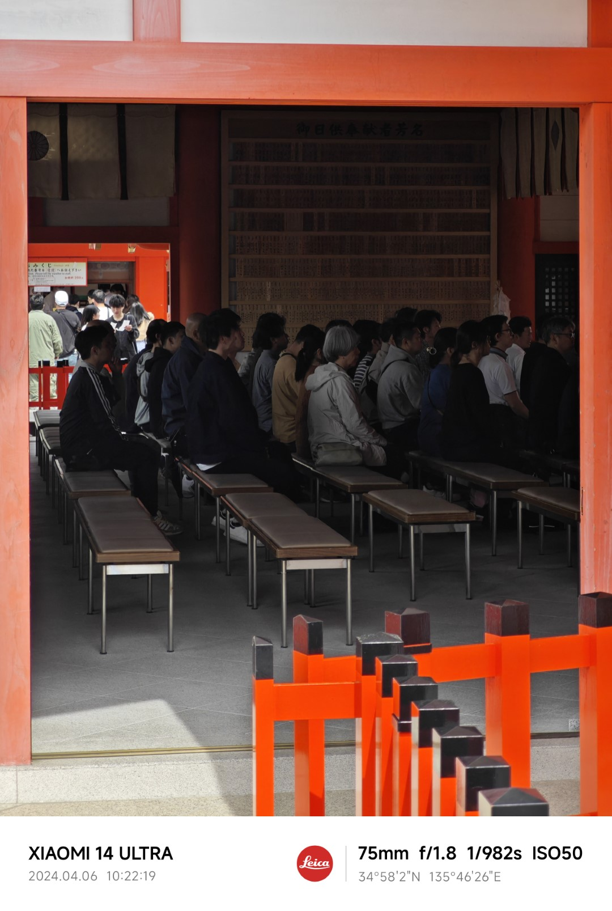
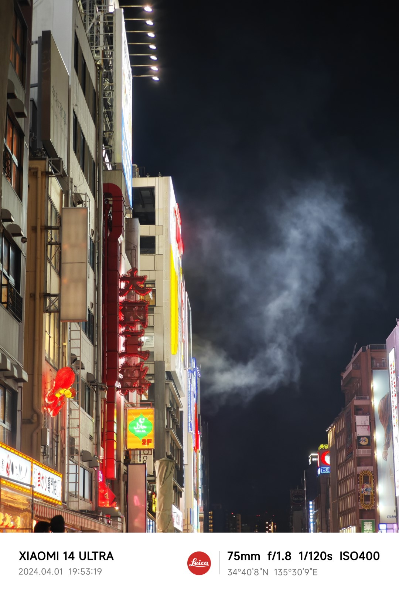
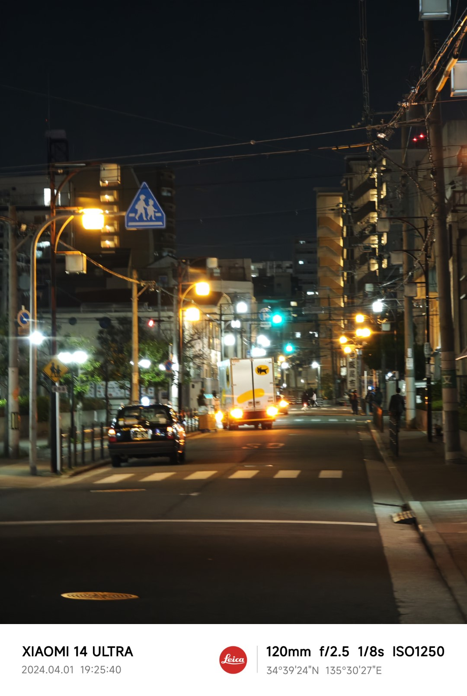

在一个多月之前，我入手了小米 14 Ultra（和它的摄影手柄套装），替换掉了手里的小米 12 Pro。

一方面，我之前的手机性能着实差了一些，一些你们都懂的游戏掉帧严重，特别是在同时还打开了微信视频的情况下更是如此，是时候更新换代了。

另一方面，上一代小米 13 Ultra 专注于摄影的思路着实有点打动我，不过我当时也看到了这台手机设计上存在的一些问题，所以没有入手。而这次的发布会上，能够感觉到之前的这些问题特别是重心问题在 14 Ultra 上已经有了很大改善。

此外，我最近也是越来越体会到旅游时并非每一天每一刻都适合随身携带相机。而现在的手机摄影已经相当成熟，可以作为非正式出片时相机的良好补充。这让我有越来越强烈的需求，想要持有一款影像素质更强的手机。

所有这些原因叠加在一起，我决定首发购入小米 14 Ultra。恰逢最近有一些工作上的变动，正好有了一个接近两周的假期可以去日本旅游，我也在这个过程中深度体验了这款手机的优缺点。

总的来说，这款手机的优点颇多，基本上和各类软文或者非软文的评测一样，无论是大光圈、大底带来的暗光表现，还是徕卡影调带来的一键出片效果（调教得真的很棒！），以及视频拍摄上的种种优化，只要是用过这款手机的人基本都会认同。

所以，接下来的文章可能会主要集中在手机的部分小缺点上。这并非意味着它不是一款出色的手机，但这款手机过于专注于特定的用途，以至于它并不适合所有人，或者说甚至不适合大多数人。如果你是它的目标用户，那么这些缺点多多少少都是可以忍受的；但如果你不是它的目标用户，那么这些缺点的任何一个都有可能成为在使用体验上压倒你的最后一棵稻草。

适合的才是最好的。

<!--truncate-->

## 在小米 14 系列中做出选择

首先要提的是，选择小米系列而不是同样专注于影像旗舰的 OPPO / vivo，肯定是有我多年都在使用小米的原因所在——迁移数据毕竟是很痛苦的事情。

但是前几年经历了把数据和应用迁移到 iPhone 又迁移回来，我依旧还在使用小米手机，自然也是因为它的产品定位和我足够契合：不一定有特别的亮点，但一定是短板足够长的水桶。

所以这里我们不会聊品牌之间的选择，而是更主要聊一下我为什么在小米的三台新机型中选择了 14 Ultra，而非 14 或 14 Pro。

### 小米 14，小屏机的旗舰

首先说一下小米 14 这台小屏机。在小屏机这个相对小众的市场上，小米可谓杀出了一条血路。这次的小米 14 从各种配置和设计上，在保证了整体小巧的情况下，可以说和 14 Pro 不相上下，我甚至差一点就没等到 14 Ultra 发布，而是直接入手了这台机器；当然最后还是忍住了。

我这次一起出行的朋友中，就有一位使用小米 14 作为主力机的摄影爱好者。整体来看，虽然小米 14 的主摄没有一英寸底，但是实际夜景表现也并没有相差太多。而长焦段的 JN1 传感器和 14 Ultra 长焦使用的 IMX858 其实并没有可以明确体验到的差别，我们这两台手机的长焦端成像效果至少在手机屏幕上看起来半斤八两。

小米 14（也包括 14 Pro）在旅行摄影上的唯一不足，可能就是缺少一个 100mm 以上焦段的长焦了。但其实如果只是发发朋友圈，75mm 左右焦段的 3x 长焦加上裁切，也足以应付绝大部分情况。

所以**如果不是强烈需要将手机作为相机的代替，那么小米 14 将是我最推荐的日常机，没有之一**。

### 小米 14 Pro，大屏真的是优势吗

而说到小米 14 Pro，高情商的说法是，14 Pro 拥有和 14 几乎一样的配置和性能，是提供给非小屏爱好者的选择。低情商的说法嘛，那就是 14 Pro 作为一个大屏机，几乎没有什么能和 14 拉开差距的配置。

甚至写到这里的时候，我都不知道这台机器还有什么可以说的优点。

反正我肯定是更心动小屏的，所以见仁见智吧。

### 小米 14 Ultra，差异化和泛用性

和 14 Pro 不同，14 Ultra 则是做出了足够的差异化。一方面，几颗镜头更大的光圈和主摄的一英寸大底，虽说绝大多数场景下的拍摄体验上并不一定能带来肉眼可见的提升，但至少从参数上给人一种“我拍的照片更好了”的感觉。另一方面，增加的 5x 长焦提供了旅行中常用的最长焦段视角和压缩感，而稍微更广一些的广角端……我自己比较菜，是不怎么知道如何使用广角端的，但是广角这东西确实每一毫米都有它的作用，所以应该有人可以无视这颗广角令人发指的畸变把它用好吧。

14 Ultra 相比 13 Ultra 的一个重要优化是修改了之前头重脚轻的重心设计。我虽然没有购买 13 Ultra，但是也去小米之家摸过不少次，只能说但凡还想日常把手机当一个手机来使用的话，就绝对不应该入手 13 Ultra。而 14 Ultra 的改动则令人欣喜：虽然摄像头模组依旧巨大，但是现在手机整体的重心合理，甚至镜头下方能够成为一个很好的手指支撑点。

当然作为一个纯粹的手机，我认为 14 Ultra 大镜头模组导致的问题依旧存在，例如整体重量依旧很重、容易摸脏镜头，横握的时候非常难受等等。我也不会推荐购买这台手机之后，把它纯粹地当作一个手机使用。不过相比 13 Ultra，这一代现在至少已经是能用的程度了。

如果说还有什么令我浑身难受的缺点，那或许就是这套镜头模组防抖系统的晃动问题。虽然心里知道这是正常的，也知道实际使用上不会有问题，但这套防抖的晃动幅度还是让人难以习惯，反正我是真的没有见过第二台防抖系统有这么大晃动噪音的手机或者相机了。

说得夸张一点，如果你在自习室里摇晃手机，我很怀疑旁边的同学会因为防抖系统产生的咔哒声把你轰出去。

### 如何在三款手机中进行选择

所以总的来说，我认为在这三台手机之间选择，只需要遵循如下方案：

1. 首先确认你是不是一个需要手机作为相机在某些场景下替代的摄影爱好者，而非只想用手机记录下生活中的某些画面。如果你的目的是使用手机替代相机的话，那就可以考虑 14 Ultra；但如果不是，那么我觉得购入 14 Ultra 的意义不大。
2. 当你是一个小屏爱好者的时候，优先考虑 14。或者说，你都是小屏爱好者了，还有什么理由不选择 14 呢？
3. 如果你不喜欢小屏，但也不会拿手机当相机重度使用的时候，可以考虑 14 Pro。

## 摄影手柄体验

不得不说，这次的摄影手柄还是很吸引眼球的。可实际体验下来，我觉得摄影手柄并没有想象中那么好用。

### 摄影手柄的最大优点

首先是优点，调节拨轮和拨杆真的很爽！我使用的配置是调节拨轮用来调节 EV，而调节拨杆则是配置成了分段调节镜头倍率。也就是说拨动拨杆的时候，焦段会在 0.5x、1x、2x、3.2x 和 5x 间调节，而非无级调节，这也符合我使用变焦镜头的习惯，大部分场景下只固定在若干个焦距上，如果要裁切的话后期回来再说。我个人比较推荐无论是相机还是手机，在入门阶段都尽可能地这样使用变焦镜头，以快速熟悉各个焦段的画面范围、压缩感和距离感，为过渡到定焦头打好基础。

但是仔细想想，这一定程度上也是因为小米的相机软件界面调整 EV 和焦距的操作并不舒适。特别是在这一代的徕卡调色下，正确调整 EV 是拍摄时的重中之重，而 EV 的调整竟然要手动在一个远离快门的位置点击 + 拖动，甚至如果要退出调整的话还需要第二次点击！

### 快门按钮不如点击屏幕

手柄的快门按钮，则是我使用下来体验最差的功能。

键程长，触发力度大，左手本来为了避免挡住镜头就要虚握，而手柄本身的仿皮材质很滑，这一系列原因导致按快门的过程几乎一定会导致相机向下移动一小段距离，偏离一开始的构图。

也正是因为如此，在使用手柄的时候，我几乎还是会点击屏幕来触发快门。这可以说是这款手柄最糟糕的一个设计了。

### 手柄设计中的其它亮点

除了按钮和拨杆以外，这款手柄的设计还是有一些其它亮点的。

首先这款手柄是搭配了一个专门的仿皮手机壳使用的，这款手机壳背后有一个镂空的小洞，用来适配手柄锁死的卡扣。而这个洞的位置，恰好可以露出手机背板上的小米 logo——相信所有第一次装上这个手机壳的同学，看到这个小洞的时候都会会心一笑。

另外，这款手机壳背后的摄像机模组周围，有一个可以拆卸的金属环。这个金属环除了可以换成其它颜色（我购买的白色手机壳，自带了银色和金色的环），最主要的一个功能是可以更换成滤镜转接环，直接转接相机滤镜！虽然我一次也没有用上过，但是这应该就属于“我可以不用但你最好能有”的功能了吧。再退一步，就算真的不用，至少能换成金色金属环也是炫耀感满满的。

### 一贯糟糕的品控

说完功能设计上的特点，就不得不聊一聊这款手柄的糟糕品控了。首批品控不行，也是很多小米供应链产品的通病。

我是和手机一起购入的手柄，所以拿到的应该也是最早的那一批次产品。结果在使用过程中，就遇到了各种各样的品控问题。

首先是一个没那么多人提到的问题，那就是上面提到的可拆卸金属环在拆卸的时候非常紧。这款金属环的拆装方式有点类似于相机镜头：有一个解锁按钮，在按下的状态可以旋转金属环将其拆下；而安装的时候则是旋转到按钮位置就可以咔哒一声卡死。

而我遇到的问题简单来说，就是这个按钮的固定装置过紧了。当手机壳装在手机上的时候，因为本身和手机之间有一定的缝隙，所以即便用再大的力气按这个按钮，手机壳本身的变形也会导致没有办法按到底，从而根本没办法解锁金属环！而拆下手机壳之后，也需要用另一个手指顶着按钮后面，同时用很大的力气按住按钮，才能拧下金属环。

我也看到一些网上的评论提到他们的金属环遇到了相反的品控问题，就是太松了导致没有拆卸就会有一定的晃动。小米啊，你可长点心吧……

第二个问题就是很多评测中都提到的电池充电逻辑问题了：摄影手柄会优先给手机充电，这就导致手机电量不足 80% 的时候，摄影手柄会持续给手机充电直到自己的电量耗尽。而手柄并没有预留另一块电池给自己的正常功能，从而会发现出去拍了没多一会儿，手柄就失灵了。

据说这个问题在新的固件中有所改善，前几天固件刚刚推送了。而因为后面的文章中会提到的一些原因，我没能在这次的旅行中体验到这个问题是否已经解决，只能等后续的机会了。

第三个问题则是断连，这个问题也有很多人报过了，我也是万万没想到 Type-C 口的连接竟然也有断连问题。使用中需要通过重新插拔手柄解决，且似乎有少量几率需要多次插拔，不知道是不是我使用的姿势问题。因为手柄本身有一个卡扣（也不知道有卡扣怎么还断连？），每次插拔要解锁再锁上，还是蛮麻烦的。

第四个问题是最致命的问题，也是导致我这次旅行没能带上手柄的关键原因：在放置了一个礼拜没使用之后，手柄直接充不进去电了！

我在即将出发的时候才发现了这个问题，不光是手柄本体无法充电，将手柄连接手机的时候，手柄和手机都没有办法进入充电状态。

正因为如此，我在临出发前的那个晚上匆忙申请了小米的售后，并把手柄留在了家里让老婆帮我交给快递员。因为实在是太突然了，所以我甚至没来得及找到全部配件（指包装盒和另外的两个金属环），只留下了手机壳和手柄本体。

### 令人惊喜的售后维修

这个问题固然是令人烦恼的，但可能是小米也知道自己的手柄出了品控问题，所以维修的过程十分简单明了：直接给我寄了一套新的手柄套装回来。

我对这个维修结果还是很满意的，唯一可惜的是：早知道就不把配套手机壳还回去了，这个手机壳单卖也要 200 块钱呢。

这个新的手柄至少到现在为止还没有过断连。但是正如上文所说，我暂时也没有特别多的机会测试这个手柄的续航表现和稳定性，只能等待下次出门的机会了。

### 最佳的第三方配件

或许你已经看过[一些视频](https://www.bilibili.com/video/BV19Z421h7rA/)，说小米 14 Ultra 的摄影套装后盖可以完美适配银鹭八宝粥的盖子。

我实际体验了一下，不仅仅是银鹭八宝粥，娃哈哈八宝粥的盖子也能完美适配！而且银鹭八宝粥的盖子是黑色的，而娃哈哈恰好是白色的，完美地对应上了摄影套装的两种颜色。

而使用了一段时间之后，不得不说这个严丝合缝的程度远远比品控出现问题的金属环好太多了，甚至到了我有一段时间每见到一个人都要把手机连着八宝粥盖子交给他把玩一番的程度。

这才是小米 14 Ultra 的最佳第三方配件啊！

## 摄影体验

聊完这些杂七杂八的，终于要开始聊摄影体验了。

经过这一个多月的体验，我现在使用这台手机的方式已经基本固定下来了：使用默认拍照模式，选择合适的焦段，构图，略微调整 EV，偶尔根据情况选择焦点，拍照。

### 过于复杂的专业模式和不够复杂的默认模式

因为 JPEG 的后期空间确实不大，所以我一开始也尝试过使用专业模式拍摄，并储存 UltraRAW 图片。但是用过几次之后，我发现即使有摄影手柄，手机上实际可以使用的拨轮和拨杆数量还是太少了。而对于每个参数都需要精细调整的专业模式（基本等同于相机的 M 模式），在手机上操作的复杂度实在太高。

另外，我为了尝试 UltraRAW 也曾经把一张照片放到 Lightroom 里做了后期，结果发现自己后期的效果和当时直拍的徕卡影调几乎一模一样——可以说是我现在的后期技术还不错，和徕卡影调的效果不相上下；反过来也可以说徕卡影调和我的思路很一致，基本上就可以直接拿来用了。

所以后来我也开始放弃抵抗，直接使用默认模式拍照，除了 EV 以外基本什么都不调整，结果反而拍得更舒服了。有很多没有思考时间的抓拍场景都能拍下不错的照片，同时也能将更多的精力专注在如何构图上。同时，专业模式没有办法自动附加水印，可能也是我不想使用它的原因之一。

下面就是一张我在公交车上使用默认模式抓拍到的照片。

当然反过来说，只需要调整 EV，也就意味着 EV 调整才是拍摄中的重中之重。你要根据照片希望体现的影调和照片中的高光与暗部表现，来决定提升或降低几档 EV。但毕竟需要调整地只有一个参数，所以已经是很容易上手的了。

此外，我还是希望小米可以在后续的固件迭代中，将直方图和斑马纹下放到默认模式。毕竟在手机屏幕上顶着大太阳看过曝和曝光不足的地方，有时候还是过于困难了一些。

### 徕卡影调的暗部问题

徕卡影调的调色方案，在我看来是在拉高对比度，压低高光且压低大部分颜色饱和度的同时，保留了红橙色调的饱和度。

这自然不是完美的，比如在一些光比很大的场景中，暗部经常会过黑。虽然导入到电脑上放大后发现真正黑成一坨的情况并不多见，但在手机屏幕上有的时候看起来还是很难受的。此外，有一些场景下高光部分恰好是红色的话，会导致对比度进一步拉大，从而暗部可能真的会过暗。

当然，如果是大逆光的话，也一样会出现类似的情况。不过本来逆光拍摄又想保留暗部就是不太正确的做法，更多情况下使用相机拍摄也一样要堆栈，放到手机上主体面积比较小的话很难触发 HDR，这里就不展开说了。

一个红色高光导致暗部过暗的例子可以见下面这张照片。

### 主摄不如长焦？畸变和光圈的分析

在这两周的拍摄过程之中，我还可以发现一个趋势：1x 主摄使用越来越少，3.2x 长焦使用越来越多。主摄裁切的 2x 和 5x 的长焦通常会作为补充，而 0.5x 的广角几乎没有使用过。

这个焦段的使用结果自然有我自己拍摄习惯的问题，比如我用 24-70 的镜头时大部分时间也是锁在 70mm 端的，偶尔用一用 35mm，24mm 也不太常用。但是在使用上，我觉得这次 1 英寸大底的主摄和 0.5x 广角镜头是存在一定问题的。

首先，即使是主摄镜头，畸变也过于严重。而 0.5x 广角镜头的畸变更是惨不忍睹，我甚至找了半天都没能找到一个样张。我不确定是不是受限于硬件大小，所有手机的广角头都是这样，但实际上这确实让它的可用性大打折扣。

其次，因为这次 3.2x 镜头的光圈给的足够大，IMX858 的性能也足够好，或许还有这次整体影调偏低调的缘故，这一切都导致夜景的拍摄中大底主摄不是必需品。很多时候只要光线没有暗到一定程度，3.2x 镜头的拍摄效果一样很好，例如下面的这张照片。

作为一个对比，5x 镜头就远没有那么优秀。例如下面这张照片的自动快门速度就来到了 1/8s，从而导致整张照片都拍糊了。如果 3.2x 镜头也是这个进光量，恐怕夜景就只能靠主摄了，这个长焦大光圈可能也是 14 Ultra 相比 14 为数不多的显著优势吧。

### 过慢的快门速度

再回到上面这张照片。仔细看一下水印中的参数就会发现，这张照片暴露了小米 14 Ultra 反复出现的一个问题：不知道是不是因为高感的效果实在不好，当感光度来到 1000 左右的时候，手机的算法宁可拉长曝光时间，也不愿意再提高一些感光度。

有过一定经验的拍摄者都知道，在手持的情况下，与其为了减少噪点降低 ISO 延长快门速度，还不如降低快门速度到安全范围内，然后拉高 ISO。毕竟无论什么时候，拍到都比拍好更重要，而一张糊了的图片是完全不能用的，也就等同于没有拍到。（如果你不知道，可以关注我的[从拍照到摄影](/blog/tags/from-taking-pictures-to-photography/)系列文章。现在还在连载中，后面会提到这些知识点的。）

如果以后有机会，我可能会开专业模式尝试一下暗光下高感的效果，看看这只是相机参数策略的失误，还是真的有其必然原因。

## 其它细节使用体验

除了上述摄影方面的体验之外，我也尝试记录了这段时间的一些其它使用体验。

其中某些众所周知的问题，例如防抖系统的晃动噪声问题已经在上文中提过了，这里就不再赘述。

### 摔！狠狠地摔！

手机在旅行中总是免不了一些磕磕碰碰。无论是因为放进口袋的时候放歪了，还是抬手的时候碰到了旁边的人，总之我的手机在这两周的旅程中从差不多胸部到腰部的高度跌落了三四次。

不过就像大部分跌落测试中展现的那样（而且我的手机并不是裸奔，还有手机壳和原厂膜的保护），无论是屏幕还是镜头，在这几次跌落中都没有任何的损伤。想起当时被我随随便便摔碎屏幕的小米 10 系列，只能说曲面屏除了帅以外没有任何优势，微曲才是正解啊！

可惜的是，这几次跌落导致我的原厂屏幕膜有一些挫伤和气泡，同时原厂的透明手机壳也产生了一点裂纹。这几天可能就要换新的贴膜和手机壳了，但是我并没有接到广告 :P

### 品控，又是品控

除了手柄之外，手机上我也遇到了一点疑似品控问题的小问题。

这次小米 14 Ultra 的音量和电源按键手感是相当不错的，按下的时候有非常明显“咔哒”的段落感。

但是在我来到日本的第二天，我的电源按钮按下时突然变成了很肉的手感，这时我甚至还没有摔过这台手机。

上一次遇到类似的问题是在飞智的黑武士 3 手柄上，这款手柄的 START 按键也出现了失去段落感的问题。我怀疑可能是内部的硅胶从某个特殊的角度卡住了，但是也并不知道怎么解决。

幸运的是，在即将离开日本的时候，这台手机的电源按钮突然自己恢复正常了。虽然后续还是会非常偶然地出现一些奇怪的手感变化，比如能感觉到按下的时候有一个左右的位移，不过也算是基本可用了。不然这种小问题，真是让人觉得送修不值得，不修恶心人，令人进退不得。

### 照片后期编辑的问题

因为我现在的拍照基本都是使用普通模式的 JPEG 直出，所以导入到 Lightroom 做后期就显得不是那么必要了。同时小米的相册 app 也提供了足够好的编辑功能，基本上可以满足绝大部分后期编辑的需求。

只不过在使用的过程中，我还是遇到了一些软件交互设计上不太舒服的地方。

首当其冲的问题是，对于一张照片，在进行了一次编辑后，会以编辑时间作为文件名保存一个新文件。虽然相册中似乎是按照拍摄时间排序的，所以依旧会看到编辑后的照片和拍摄时的照片排列在一起，但拷贝到 NAS 或者电脑硬盘之后，就很难根据文件名区分哪张照片是由哪张照片编辑得到的了。而且编辑后的照片并不会有特殊的文件名，看起来就像直接拍摄的照片一样，这真的很诡异。

其次也是一个编辑后保存的问题。通常在编辑一张直接拍摄的**带水印的**照片时，小米的相册 app 会自动移除水印部分，把照片本身展示在界面中编辑，并在编辑后根据设置重新加上水印。可此时如果希望再次编辑这张带水印的**编辑后的**照片，就会发现水印也成为了照片的一部分被编辑，所有裁剪、调整亮度、调整颜色的功能，也都会作用在水印上。此时，就只能手动裁剪掉水印部分，或者重新编辑原始照片来解决，但无论那种方法都很麻烦。

再接下来还是一个水印相关的问题。简单来说，拍摄时生成的水印与二次编辑后的水印，字体和间距是不完全一致的。我也不知道怎么解释这个问题……

最后，我还比较偶然地遇到了几次定位不准确的问题。我在京都、神户等地区拍摄的一系列照片中，竟然混入了几张定位是东京的照片——然而我的这次旅行目的地是日本关西，根本就没有去过东京。

这些大大小小的问题看似都不那么关键，我也不确定小米什么时候能在系统更新中修复它们。希望有朝一日这些问题真的能被解决吧。

## 其它杂七杂八的体验

除了上述摄影相关的体验以外，还有一些不知道该归到什么类别中，和摄影没有直接关系的体验，就统一写到文章的最后吧。

### 无线充电支架

我是在小米之家线下购买这台手机的，所以拿到了一张几百元的优惠券，可以用于购买店内任何小米产品。

思考了一下之后，我决定购买了和手机同时上市的新款无线快充支架。

不得不说，这款支架还是给了我一些惊喜的。我一直以来都有在电脑上使用 [Beancount](https://github.com/beancount/beancount) 记账的习惯，之前我都是用 MIUI+ 投屏到电脑上对账的。但是偶尔的高延迟加上很多场景无法呼出输入法，以及一些需要指纹识别和禁止投屏的场景（财务相关的软件尤其多），还是会带来很多不便，让我不得不频繁抓起手机。

但是有了这款支架以后，配合新系统的眼部追踪功能，几乎可以在我记账的过程中全程维持只要我看向手机，手机屏幕就会自动点亮。同时，支架的角度也很适合不取下的情况下输入一些简单的文字，或者进行一些简单的点击和翻页操作。

不过考虑到场景受限，以及这款无线充电支架本身的价格，我并不推荐任何人在没有需求和没有优惠的情况下购买它。

### MIUI+

前面既然提到了 MIUI+，也顺便提一下小米 14 Ultra 在 MIUI+ 上的体验。

小米迟迟不肯将 MIUI+ 开放给小米笔记本外的 PC 系统，一直是受人诟病的一个问题。好在还是有一些方法搞到 MIUI+ 安装包的，所以我也一直用着它的投屏功能。

但是从 12 Pro 更换为 14 Ultra 之后，之前的 MIUI+ 突然就不能使用了，连接时手机上会提示“当前电脑应用版本过低”。这个情况一直持续到我去日本旅游，我也是对它毫无办法。

好在旅游回来之后，我打开电脑就发现 MIUI+ 应用内推送了新版本更新。升级了新版本之后，虽然扫码连接的时候还是会有上述报错，但手机上是可以成功弹出连接提示的，且确认连接之后所有的功能都能够正常使用。

唯一还存在的问题是，如果从电脑端 MIUI+ 上选择在线的手机主动连接，手机上无法正常弹出提示。也就是说，每次连接都需要使用手机重新扫描电脑上的二维码才可以。但是这都是小问题了，能用比什么都好。

希望有朝一日，小米可以把这个好用的多端互联功能公开出来，下放到所有品牌的 Windows PC 上吧。
