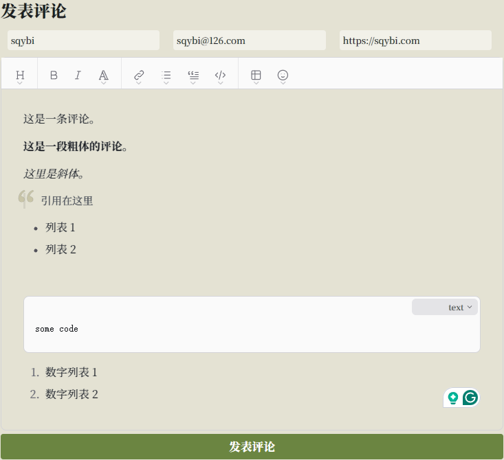
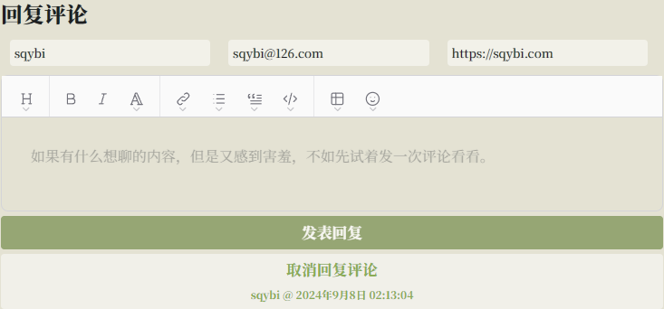
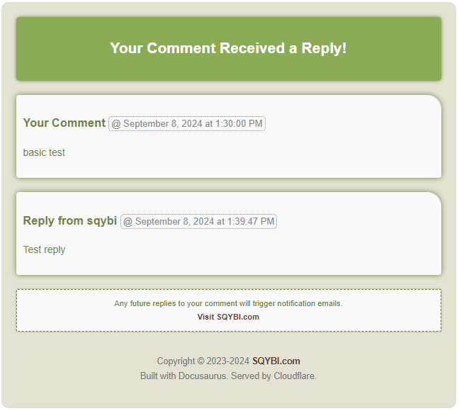

从上次 SQYBI.com 下线开始，我就尝试过很多次自己手写实现一个博客系统。

这件事看起来简单，但实际上还是蛮难的，在 [SQYBI.com：时隔十年的重新上线](/blog/sqybi-com-relaunching-after-a-decade/) 中我有提到过少量细节。当时虽然有 Django 这样基础的框架，也（忍着痛苦）写完了对应的基本功能，但是那时的前端框架实在过于简陋，除了 CSS 的问题以外，基于 AJAX 的动态更新逻辑写起来也是很麻烦的。

好在随着这十年的技术发展，大量新框架、新语言和新服务提供商涌现出来。感谢 Node.js、React、Docusaurus、Cloudflare、ChatGPT、Brevo、Github、wysimark、Giscus 以及可能我没有提到的其它基础设施，我才能这么快速地搭建起来现在这个网站。

之前博客上线之后，我一直在使用 Giscus 作为评论系统。但是我发现，慢慢地就没有人再发表评论了。

Giscus 背后是基于 Github 的，而众所周知在国内 Github 是不能访问的状态。加上一些之前配置的问题，让 Giscus 在部分手机端即使有梯子也无法显示出来。

虽然不知道这到底影响了多少人回复的意愿，但我还是决定用自己写的评论系统替换掉它，毕竟我不能简单地认为所有访问者都有梯子。同时，这其实也是让我重新捡起当年没写完的博客系统的机会，至少完整地完成一次大块的功能。

另一个原因可能就是最近重新装修了一下这个网站之后，Giscus 的前端看起来有点格格不入了。虽然调整 CSS 或许也能做到，但工作量想必也不会小。事实证明，即使是开发自己的系统，大部分时间也是花在了调整 CSS 上。

小小的自夸一下，这算是深度定制 Docusaurus 了吧。不知道有没有其他人像我一样使用 Docusaurus 搭建博客，还做了这么多的二次开发。如果有的话，我也想围观一下他的网站。

<!--truncate-->

:::tip[尝试一下]

既然上线了新的评论系统，看到这里的你，不如就直接来试着发表一条评论吧！

:::

## 简单介绍新的评论系统

首先来简单介绍一下这套新评论系统的主要功能和亮点设计。

### 发表评论区域

最基础的功能，自然就是发表评论的功能。



#### 配色

在这个区域，我特地将评论框的各种颜色都调整成了和博客新主题类似的配色，同时移除了原有的各种边框。另外，我还特地调整了字体，让这部分的字体和全局统一。

#### 文本编辑器

文本编辑器是一个 [WYSIWYG](https://en.wikipedia.org/wiki/WYSIWYG) 的编辑器，后台会转换为 Markdown 语法。本来打算使用一个简单文本框的，但是既然设计的目标是减少发表评论的难度，那也不太可能要求来评论的每个人都学习 Markdown。这里需要感谢 [mundimark 的总结](https://github.com/mundimark/awesome-markdown-editors)，这个简单好用的编辑器就是在这个列表中找到的。

不过现在还有一些小问题，比如编辑器里的 blockquote 和我自己 CSS 中加的样式冲突了，可以看到图中大引号下面有一个重叠的竖线。这个不会太难改，有空的时候再修吧。

#### 发表评论按钮

发表评论按钮的逻辑也花了我一些时间处理，现在的状况大概是这样的：

- 如果评论内容是空，则按钮不可用。
- 如果评论者的昵称是空，则按钮也不可用。
- 当按钮可用并点击发送的时候，会有一个发送动画出现。
- 发送失败的情况下，按钮会恢复可用状态，且所有内容不清空，等待重新发送。
- 发送成功之后，会清空编辑区内容但保留评论者信息，同时按钮恢复不可用无动画状态，等待发送下一条。
- 当昵称为空的时候，会在周围显示红圈提示必须填写。


感谢 React，让这所有的逻辑（也包括下面的大量逻辑）变得简单易写，否则我可能真没有精力和动力手撸这么一套系统。

#### 嵌套评论

对于已经发表的评论，右侧会出现一个“回复此评论”的按钮。这个功能的交互细节会在下面聊到评论区域的时候再讲，简单来说就是点了这个按钮以后，发表评论区域的标题会变成“回复评论”，底下的按钮也会变成“发表回复”，同时多出一个“取消回复评论”按钮。



这部分 UI 我自认为设计的还是不错的，现在唯一的问题是虽然加上了时间戳，但还是比较难以判断自己回复的是哪条评论。老婆在测试的过程中就发错过一次，后面可能要想办法高亮一下对应的评论，或者干脆把被回复评论的内容贴在下面。

如果点击了“取消回复评论”，一切就会回到初始状态。但是放心，已经输入的评论内容不会丢失。

:::warning[丢失数据风险请注意！]

这里有一个小问题是刷新页面还是会丢失评论内容，后续的版本里会修复这个问题。

:::

#### 评论者信息

每个评论者可以输入三个信息：必须输入的昵称，和可选的邮箱与网址。

和大部分评论系统一样，如果你输入了网址信息，那么你的评论中名称上面就会出现到这个网址的链接。而如果你输入了邮箱，首先你的头像会变成 [Gravatar](https://gravatar.com/) 上设置的头像（前提是你注册过，如果没有也可以去注册一下，之后就能看到了！）。其次，当你发表评论或收到评论回复的时候，就会收到对应的邮件。

**我非常建议所有人在评论的时候都填写一下自己的邮箱，因为有人评论你的时候能够收到邮件，还是蛮关键的一件事。**

此外，这个区域还有一个小功能，但是我感觉是非常非常重要的功能：当你输入过一次自己的信息（名称、邮箱、网址）之后，就会在浏览器中记录这些信息并在下一次自动填写。除非你换了浏览器或者清空了历史数据，否则通常都不需要再重新填写这些信息了。

我想如果没有这个功能的话，每次面对着空空如也的昵称区域，发表评论的兴趣肯定会大减吧。

最后，如果你没有输入邮箱或者输入了没有 Gravatar 头像的邮箱，处理的逻辑是这样的：

1. 如果输入了没有 Gravatar 头像的邮箱，则会根据这个邮箱生成一个头像；同时当这个邮箱注册了 Gravatar 之后，会更新为 Gravatar 的头像。
2. 如果没有输入邮箱，则会根据昵称生成一个头像，且保证整个网站上这个昵称对应的头像都是一样的。

这样即使有人不想输入自己的邮箱，也不会出现在评论区不能快速判断哪些评论是同一个人发送的情况。

### 邮件系统

接下来，在介绍评论区之前，我想提前介绍一下这次实现的功能中最有用的一个：邮件系统。

简单来说，在填写了邮箱以后，你会收到两种类型的邮件：

- 发送了一条评论之后，会收到一封邮件。
- 有人评论了你发送的评论之后，你也会收到一封邮件提示有新的回复（当然他也会收到自己发送了评论的邮件）。

这部分逻辑不复杂，但是我被 Cloudflare Worker 的邮件发送逻辑坑了很久才发现根本没法实现需求。

最后研究了半天最终找到了 [Brevo](https://www.brevo.com/) 这个服务，提供 HTTP 接口的同时每天限额还很高，解决了我的燃眉之急。

发送的邮件我也特地设计了配色和 CSS，希望收到的人不会觉得太丑陋。



因为时间原因，暂时所有的邮件内容除了评论以外都是英文的。我会在后面找时间为邮件也增加 i18n 的处理逻辑，关于什么是 i18n，可以参见 [为 Docusaurus 站点添加 i18n：LLM 的正确打开方式
](https://sqybi.com/blog/adding-i18n-for-a-docusaurus-site/) 中的介绍。技术上来说已经确认可行了，不过需要的改动还是不小的。

**这里再唠叨一次，我非常建议所有人在评论的时候都填写一下自己的邮箱，因为有人评论你的时候能够收到邮件，还是蛮关键的一件事。**

### 评论列表区域

在发表评论区域的上方，就是评论列表区域了。

评论列表大概长这个样子，如果这篇文章的评论能够多一些的话，也可以直接拉到下面看。


可以看到几个关键的点：

- 评论列表可以嵌套。
- 评论的右侧有回复评论的按钮。
- 当评论层级达到一定深度的时候，回复评论的按钮会消失。

以及有一些图中看不到的信息，首先是回复评论的按钮当鼠标指到对应评论范围的时候（不一定要在按钮上），颜色会加深，以提示可以回复评论。我觉得这个交互有助于增加回复评论的意愿，不过也只是猜测。

限制回复评论层级也是有原因的，主要是考虑到嵌套太深的话会影响界面展示。不过后来测试的时候发现忘了考虑移动端，最后几层还是会出框。现在再改动层级限制问题比较多，可能会考虑后续在移动端减小头像大小和缩进，以便于显示更多内容。

此外，在首次加载页面和发表新评论后刷新评论内容的时候，都会有一个小的加载动画。这几年的技术发展还是很有用的，这个动画（以及网页上绝大部分能看到的各种各样的动画）是纯粹使用 CSS 实现的，并不需要上传 GIF 图片。不过一个没解决的小问题是这个动画会比加载早一点点完成，这是因为我还没有找到 React 中某个 DOM 元素渲染完成后的事件，所以对于评论区这样比较大的 DOM，如果渲染速度慢了，看起来就是加载动画先消失了。

添加这个动画的初衷还是避免读者觉得评论区“卡了”，发表评论时的动画也是如此。用动画解决卡顿也算是业界这么多年经久不衰的一剂灵丹妙药了。

### 单条评论

进一步看每一条评论的内容，由以下几个部分组成：

- 用户的头像。
- 用户的昵称，填写了网站的用户则会获得一个可以跳转的链接。
- 评论的发表时间。
- 评论的内容。

其中头像是 Gravatar 的，前面已经提到过。其它的显示包括位置，也都经过了精细的调整。

评论的内容是用 HTML 的方式呈现的，整个评论系统的收取和发送都是在 Cloudflare Worker 上实现的，发送评论的过程中 Worker 会将 Markdown 转化为 HTML 存进数据库，在评论展示的时候使用。

此外，鼠标指到评论区域的时候，还会有一个不太明显的发光效果。这个单纯是我自己觉得好看随手搞的，因为怕过于花哨了所以没敢做得太明显，我自己还是比较满意的。

### 深色模式适配

除了上面的基本功能以外，我还为整个评论系统进行了完整的深色模式适配。

一开始我其实还想着能不能复用一些变量，但是后来就放弃了。如果你看了我的源码，就会发现基本上是“哪里不行改哪里”，颜色不对的就加一个 `[data-theme="dark"]` 来打补丁。

聊到这里又不得不说一下业界发展的情况，CSS 选择器的功能迭代其实在各种框架的多配色、多平台、多语言适配中起到了很大作用。如果没有属性选择，可能这些功能的实现也都会复杂很多。

### i18n 适配

最后要提一下的是，作为一个支持 i18n 的网站（再次提示：不了解的读者可以看 [为 Docusaurus 站点添加 i18n：LLM 的正确打开方式
](https://sqybi.com/blog/adding-i18n-for-a-docusaurus-site/) 这篇文章），这次的评论功能也进行了 i18n 的适配。网页右上角的下拉菜单可以选择语言，切换到英文就能看到效果。

这个过程中我发现了一个以前没发现的技巧，之前我只会用 Docusaurus 的 `<Translate>` 来配置多语言，这几天发现原来还有一个配套的 `translate()` 函数可以用于组件属性之类不能使用 DOM 元素的地方。之前可能有一些其它的页面实现的时候因为这个原因漏掉了一些翻译，后面如果发现的话我再补上吧。

还剩下一个小问题是我选择的这个编辑器组件本身的 tooltip 只有英文，这个我实在是改不了了，将就着用吧。

## 背后的技术选型

以产品经理的角度聊了系统的设计之后，接下来聊点技术的东西，也就是各种组件的选型。

### 后端服务

因为 Docusaurus 是一个纯前端的框架，所以实现评论系统必然要有一套后端的服务。

熟悉我的人应该在文章开头就能猜到，我是用了 Cloudflare Worker 搭建这套服务的。下面聊一下更细节的选型。

这套服务的代码我也开源了，可以在 [sqybi/blog-comment-service](https://github.com/sqybi/blog-comment-service/) 看到。代码暂时还没有 refactor，挤在一个文件里，看着可能有些费劲。

#### 数据库

这套评论服务使用了 Cloudflare D1 作为后端数据库。

相比 KV 数据库，还是 SQL 更适合存储评论这种完全结构化的数据。

#### 邮件发送

首先，我使用了 Cloudflare Worker Queue 将邮件发送的步骤和评论发送拆分开，避免因为邮件服务问题导致评论无法发送的情况。

需要注意的是，很早的时候我认为 Cloudflare 的 Queue 是一个类似于 Kafka 的消息队列。但是后来用了一下才发现，这个 Queue 其实是一个高延迟的队列，主要目的是让 Worker 能够尽快返回，把一些耗时的任务放在另一个 Worker 进程里执行。同时，Queue 也提供了一些 batch 和重试之类的功能，方便批量处理请求。

接下来，邮件的发送用到了 Brevo 这个服务。前面也简单介绍过了，这算是一个很好用的邮件发送服务，而且对于我这种发送量很少的个人用户是免费的，甚至不用绑定信用卡。服务本身的 API 和管理界面也都做得很不错，好评。据说 Brevo 的前身叫 Sendinblue，不知道有没有用过的小伙伴。

我其实在发现 Cloudflare 无法完成邮件发送的时候，首先尝试的是 AWS 的邮件服务。可惜的是，AWS 需要验证电话，但是我又接不到他们打来的电话，怀疑是最近电诈太多统一屏蔽了。不过也算是因祸得福，以我的了解，AWS 的服务多少应该还是要收一些钱的，限制也会更多。

#### CORS

因为现代浏览器的一些安全性更新，现在如果不处理 CORS 的话，基本是没有办法应对这种跨域接口调用的。

好在 CORS 的处理并不难，只需要在发送请求端带上 `Origin` 标头，同时在接收端判断是否允许跨域，并对于允许的情况带上 `Access-Control-Allow-Origin` 标头就可以了。

另外因为浏览器通常都会提前发送 `OPTIONS` 请求来缓存 CORS 信息，所以对于这类请求也需要额外处理一下，一样是返回 `Access-Control-Allow-Origin` 标头就行。

#### Cloudflare Wrangler

这次开发 Cloudflare Worker 之前，我已经积攒了一些经验，所以也顺便整理了一下本地的配置，现在能够比较轻松地使用 Wrangler 进行调试和部署了。

整体的配置方案是：

- 维护一个 `wrangler.toml` 的模板。
- 在本地添加两个 `.gitignore` 文件，分别是 prod / staging 环境的 `wrangler.toml`；并尽量把所有有区别的配置（连接到的 Cloudflare 服务、各种 token、服务名称）都在这个文件里区分。
- 使用 Wrangler 命令行的 `-c` 参数加载不同文件来区分环境。
- 使用 Wrangler 命令行生成 `worker-configuration.d.ts` 文件，并也一并加入到 `.gitignore` 中，避免把环境变量的值不小心带到 Github 上。

这样，基本就可以通过下面的几个命令来完成大部分开发中需要的操作了：

```bash
npx wrangler types -c wranger-${env}.toml
npx wrangler dev -c wranger-${env}.toml
npx wrangler deploy -c wranger-${env}.toml
npx wrangler tail -c wranger-${env}.toml
```

### 前端实现

前端因为本身是在开发一个 Docusaurus Component，所以基本就是 React 开发，没有后端那么多可讲的细节。

#### 使用 ChatGPT 协助开发

和之前一样，因为开发中需要编写大量 CSS，所以我还是会让 ChatGPT 来帮助我生成 CSS 并进行一些最初的设计。

在使用 ChatGPT 的过程中，我通常会遵循以下的方式：

- 尽量将任务拆解：例如如果我想实现一个酷炫的功能，我会考虑把功能拆解之后逐步扔给 ChatGPT。例如，先实现最基本的 HTML 结构，让后设计元素之间的关系让 ChatGPT 生成基础 CSS，自行修改配色等细节后再找 ChatGPT 生成一些自己不好写的部分譬如动画效果。
- 不要过于相信 LLM：尽可能不要把已有的代码都扔给 ChatGPT 让他重写，或者直接实现完整功能（“生成一个网站”是行不通的，因为开发者自己都描述不清里面的需求细节）。更有效率的方式是用语言描述最小功能之后，学习一下生成的代码是怎么实现的，并转写到自己的项目里，这样也有助于找到 ChatGPT 写出的 bug。
- 帮忙排查错误：当遇到一个复杂的报错时，把报错内容整个扔进去让 ChatGPT 翻译反而是效率很高的。我的本职工作会大量编写 C++ 代码，这时让 ChatGPT 帮我查 gcc / clang 的报错，效率提升尤为明显。
- 小众软件库相关的回答容易出现幻觉：例如 Docusaurus / Cloudflare Worker 这种使用人数并没有那么多的软件，实际上 ChatGPT 的回答经常出现幻觉。在提出问题的时候就要有一个最基本的判断，例如一个 Python 语法的问题大概率会得到对的答案，但是一个 Docusaurus 下如何实现某功能的问题则需要搜索引擎协助的二次确认，或者干脆自己写一段代码验证一下。
- 同时使用不同的 LLM：除了 ChatGPT，我也会同时打开一些免费的 LLM 服务，例如 [Kimi](https://kimi.moonshot.cn/) 和 [豆包](https://www.doubao.com/chat/) 进行协助。现在很多国产服务都是支持在线搜索的，对于比较新的技术，准确性会高一些。多个服务之间的结果，也可以用来进行对比。上面提到的这两个服务的开发者里都有我的前同事在，同时也都还蛮好用的，这里给他们打一个小广告。

#### CSS 踩坑

实现过程中，遇到问题比较多的就是 CSS 了。

大部分问题最后都解决了，一个完全没有解决的问题是 Docusaurus 站点主题配置的 `custom.css` 中无法引入本站图片，即使只填写了路径，也会被解析为一个 Javascript object，从而导致最终静态网站编译生成的 CSS 中这个路径变为 `[Object object]` 无法读取。

我倾向于认为这是一个 Docusaurus 设计的问题，暂时能想到的方案就是使用带上域名的完整路径（并没有测试过，猜测可行，有人测试了的话可以在下面留言）。但是这个方案实在是太 hacky 了，希望 Docusaurus 能早点修复这个问题。

另外一个问题是，使用 `import styles from './index.module.css'` 在 js 文件中导入 stylesheet 的时候，出现过某些 CSS `@keyframes` 动画无法正常加载的情况。、

但是后来重新实现发布评论动画的时候，却发现 `@keyframes` 动画又可用了。或许是当初的写法出了什么差错吧，当时的代码也已经删了，这估计会成为一个未解之谜了。

#### 通过 dotenv 加载本地配置

Cloudflare 是可以直接集成 Docusaurus 部署的，整个编译过程都会发生在云端，只需要把代码传到 Github 就可以了。

在这个过程中，Cloudflare 还可以配置一些编译时的环境变量。而 Docusaurus 则支持在 `docusaurus.config.js` 中通过 `process.env` 将环境变量加载到 `siteConfig` 中，并在需要的时候通过下面的方式调用：

```javascript
const {
  siteConfig: { customFields },
} = useDocusaurusContext();
```

但是本地启动 dev 环境的时候，这些环境变量是不存在的。这时就需要安装 `dotenv-cli` 软件包：

```bash
npm install --save-dev dotenv-cli
```

然后在根目录下编写一个 `.env` 文件存储环境变量，并改动 `package.json`，在启动本地环境的时候带上 `dotenv` 命令：

```json
"scripts": {
    "docusaurus": "dotenv docusaurus",
    "start": "dotenv docusaurus start",
    "build": "dotenv docusaurus build",
    // ...
},
```

当然一些本地的 Node 脚本也可以这么搞，比如我本地调用 ChatGPT 进行 i18n 翻译的脚本也是用 dotenv 启动的。

## 其它改动

除了评论系统本身，还有一些其它小的改动也一并合入了，这里都简单介绍一下。

### 调整字体加载

在配置了网络字体之后，经常会出现页面刚打开的时候是默认字体，过了一会儿突然切换到正确的网络字体的情况。

这个实际上是由字体配置的 CSS 文件中 `font-display` 控制的。我将之前的 `font-display: swap` 修改为了 `font-display: fallback`，观感应该好了一些。

关于这个配置的细节，我在这里不赘述了，可以参考 [mdn web docs 的文档](https://developer.mozilla.org/en-US/docs/Web/CSS/@font-face/font-display)。

## 后续可以做的改进

### 导入 Giscus 历史评论

后面可能会找个时间把之前的历史评论都导入进来，毕竟之前还是有一些文章评论蛮多的。

这个和新评论互不影响，这点不需要担心。

### 给每条评论提供可跳转的 URL

这个功能不太复杂，但是背后的一个复杂功能是给邮件内也加上能够跳转到这条评论的链接。

邮件的跳转功能则这个涉及到数据库的改动和 i18n 的适配，所以现在这一版没有上线这个功能，等后续一起实现。

### 支持给文章点表情

这个其实是 Giscus 之前提供的功能，感觉还是蛮有趣的。

不过最近使用这个功能的人也不多，优先级不会排得很高。

### 前文提到过的内容

前面的文章中已经提到了一些需要进行的改进：

- 邮件内容支持 i18n。
- 编辑器的 blockquote 显示问题。
- 以更清晰的方式显示正在回复哪个评论。
- 刷新页面不丢失编辑中的评论内容。
- 适配移动端显示。

## 写在最后

其实该写的都写完啦，已经没有什么好写的了。

都看到这儿了，你还不试着发一个评论吗！
