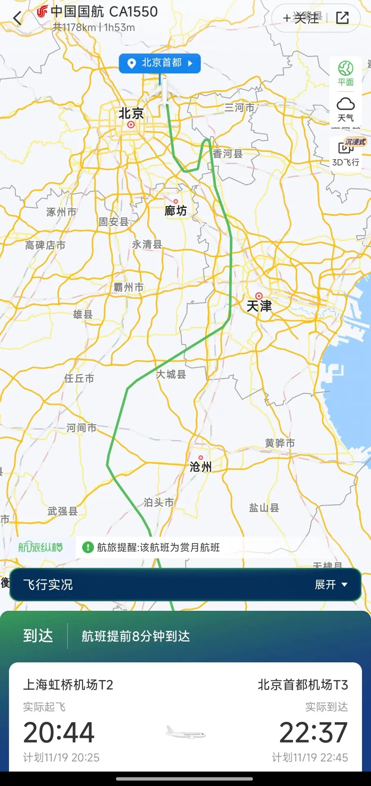
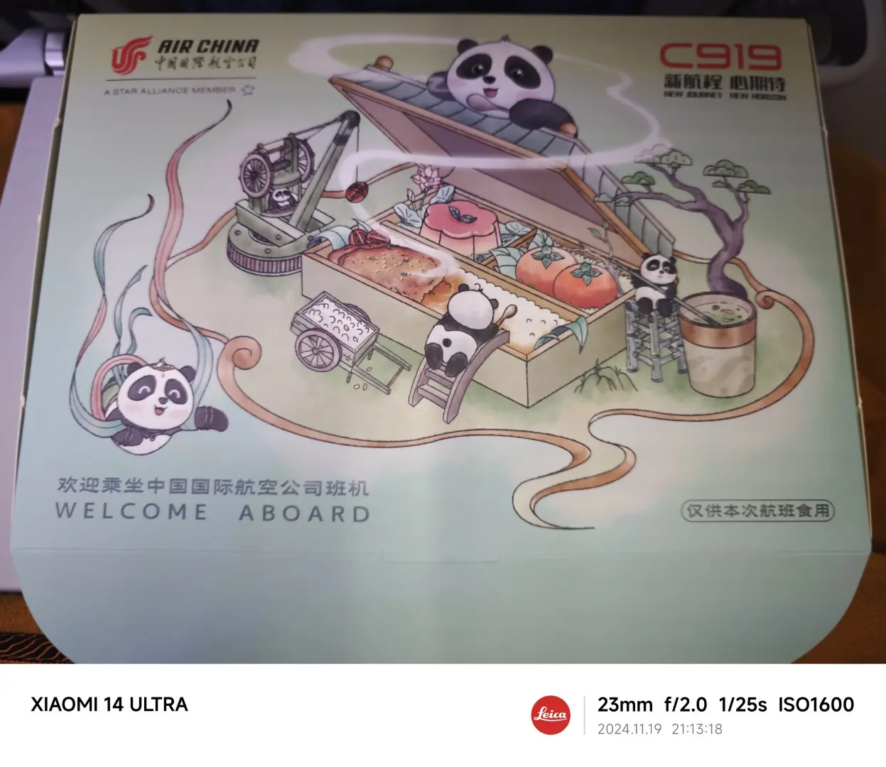
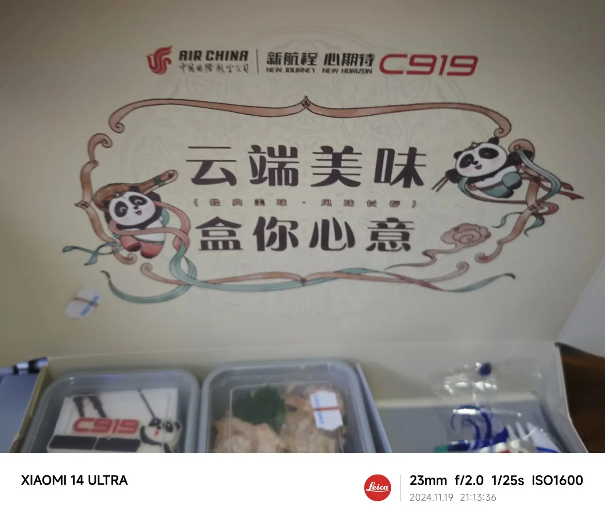
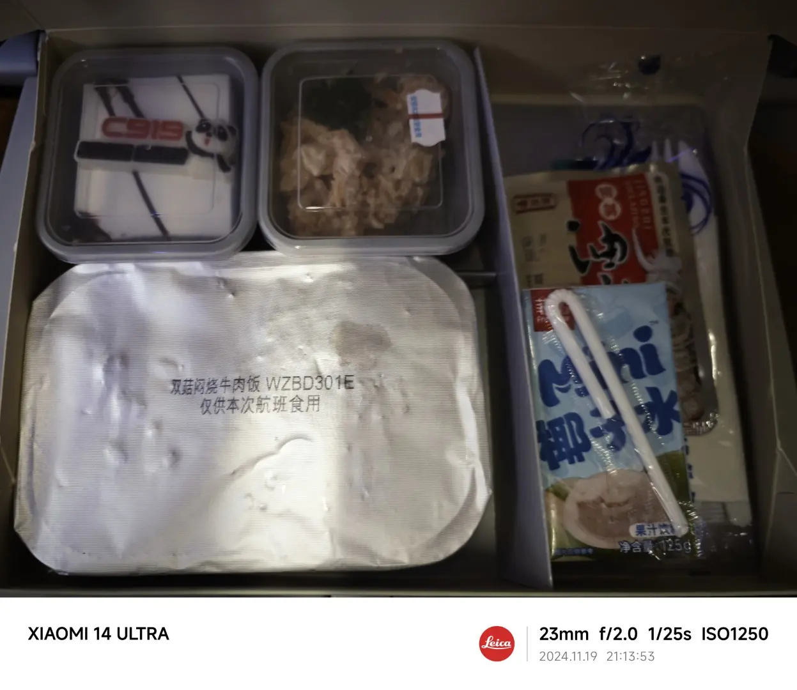
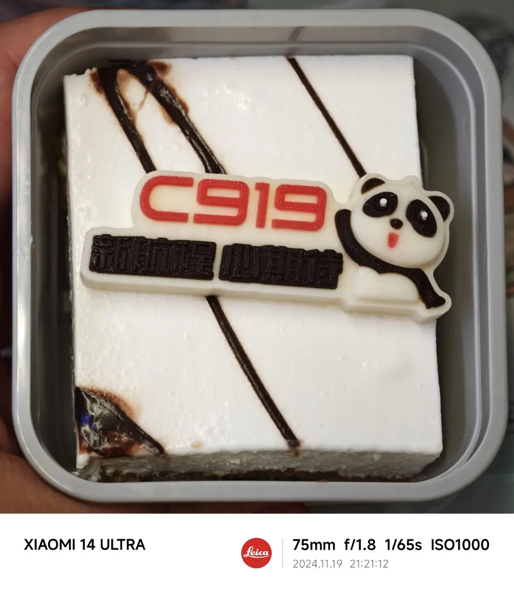
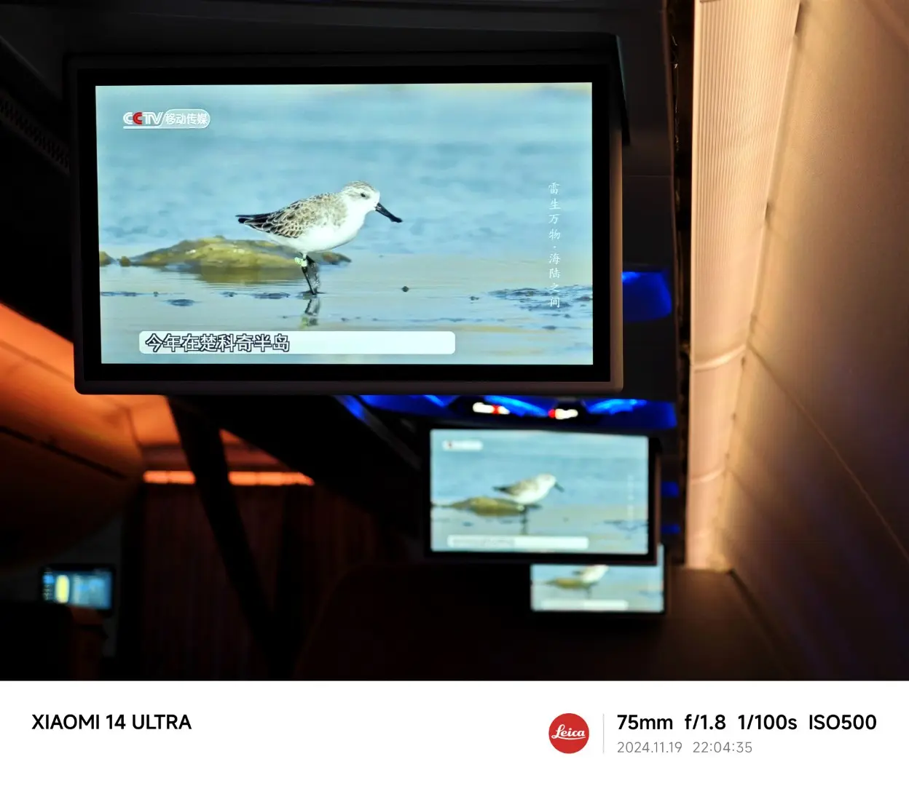
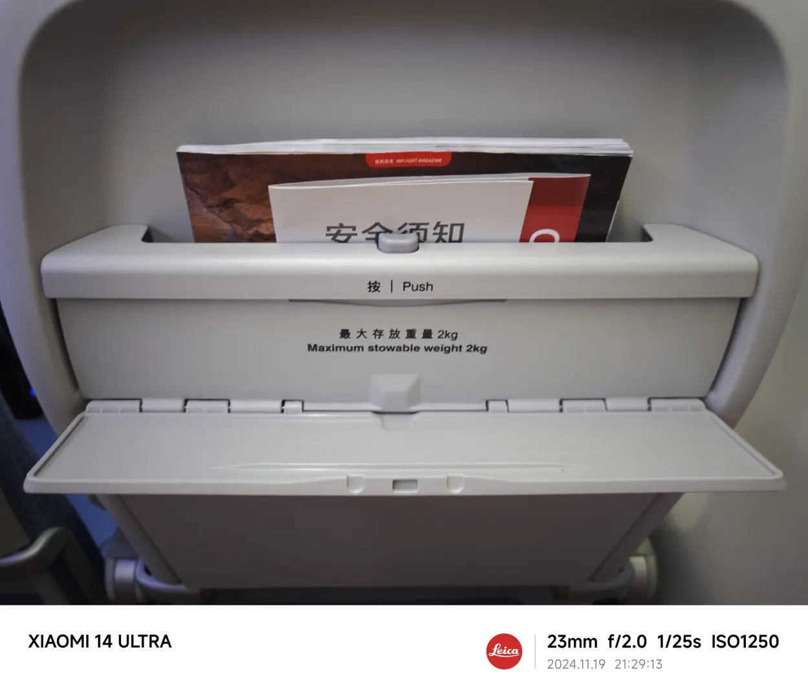
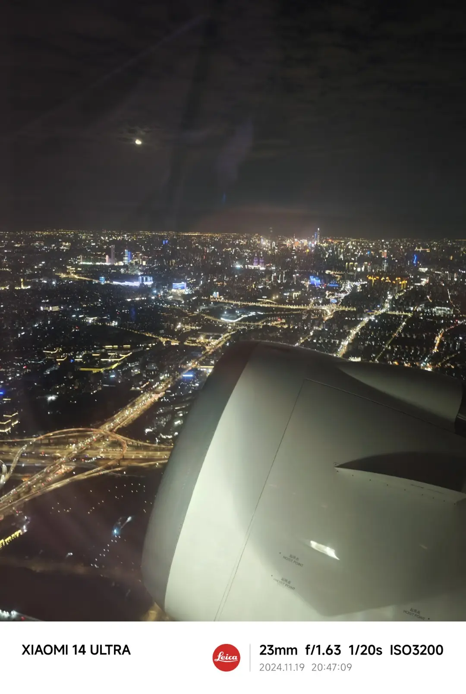
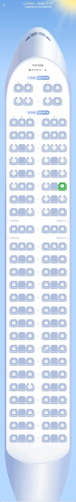
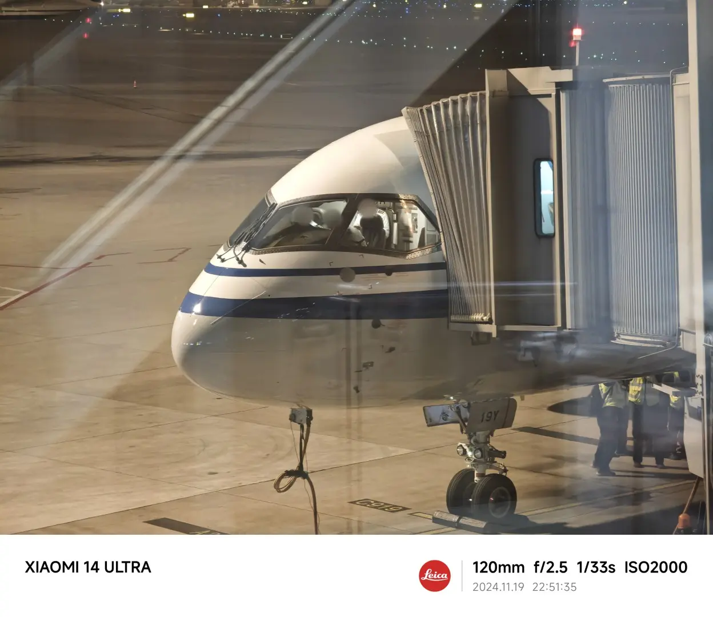

上周从上海出差回北京，返程的航班和之前一样选择了国航。结果等到临近值机的时候，突然发现航旅纵横上显示的机型是 919/100B。一时间我还没反应过来，直到退出去看了一眼，这不是 C919 嘛！

我不是什么飞迷，也没有那么了解各种关于飞机的门道。不过即使是这样，作为去年中国在机械制造和高新科技领域的最大成果之一，C919 这个机型应该还是广为人知的。

实际上，中国的客运大型机项目开始的时间可能早于包括我在内大部分人的认知：在 2001 年被提出，在 2003 年开始论证，2007 年就已经立项——这时北京奥运会甚至都还没有开始，中国商飞也在 2008 年才正式成立。

不过直到去年也就是 2023 年的 5 月 28 日，C919 才进行了第一次商业飞行。此后的一年多内，只有东方航空一家公司承接了 C919 执飞的航线。而国航的第一架 C919 首飞，已经是今年 9 月 10 日的新鲜事了。

我这次乘坐的 B-919Y，是国航的第二架 C919 飞机。它的首飞，如果我没弄错的话，在 11 月 14 日——这和我乘坐这架飞机的 11 月 19 日仅仅隔了 5 天，一周不到的时间！而且这真的是一个随机事件，我甚至在购买机票的时候都没有注意过执飞的机型（或许注意了当时也还不是 C919，毕竟那时飞机都还没有正式投入使用）。

既然这么幸运，那就不得不小小地记录一下啦。

<!-- truncate -->

## 亲儿子的待遇

不知道从何时开始，我已经很久没有坐到过京沪通勤在廊桥登机的航班了——或许有一些航班写着“廊桥”，但至少登机和离机的其中之一，通常都需要坐一个时间不短的地铁进行换乘，这和摆渡车也没什么两样。

而因为各种天气原因，京沪之间飞机晚点延误也已经是常态。偶尔坐到半夜一点落地的飞机，第二天还要早起上班，真的是头都要炸了。

不过这次 C919 最大的体验就是，亲儿子果然不是盖的：不仅起降都是廊桥，而且降落的廊桥是离行李转盘最近的那个，走到行李转盘区域只需要目测不到 50m 的距离；同时虽然前序航班到达有些晚，但基本上是飞机收拾好了就能登机，登机完成就去起飞。怪不得很多人都提到，不管什么飞机，现在统统得给 C919 让路呢。

虽然最后还是在天津附近绕了个圈，但是飞机全程只用了不到 2 小时就平稳落地，速度也是拉满了。

感觉机上的机组人员也很兴奋。登机的时候我问了一句这是不是一架新飞机，空姐非常自豪地介绍：对，是上周四才开始飞的！整个机组完全没有其它航班那种打工人的疲态，机上的服务和餐食也让我有种回到了十多年前坐飞机时的感觉。

## 这不是能把饭做好吗！

既然提到了餐食，就不得不说一下 C919 的飞机餐了。

作为对比，这次出差从北京飞往上海的飞机，是国航几乎同样时间起飞的 C1589 航班。让我们看看这个航班上的飞机餐：一小袋零食，一瓶矿泉水，没有了。对，作为一个 8 点半起飞的航班，这趟去程的航班是没有正餐的！好在公司能报销机场的晚饭，首都机场那几个休息室的食物真的是不怎么好吃。

而这趟 C919 的航班号是 CA1550，起飞时间仅仅早了 5 分钟，机上的 C919 特制餐盒长这个样子：

里面的食物包括：

主食的牛肉饭基本就是十年前飞机餐的水平，虽然说不上好吃，但是不至于像现在某些航班的正餐那么难以下咽。我在已经吃过一顿饭的情况下（因为根本没想到会有正餐！），还是吃了半盒。

而旁边的几个小菜、甜品，就个顶个的好吃了。

最一般的可能是右边的油辣子，和之前飞长沙时航班上的黄辣椒相比，确实差了些，主要还是这东西不热着吃多少有点油腻。

其次是两个小盒中靠右的那盒冷荤沙拉，作为金枪鱼沙拉难得没有什么腥味，大概是用品质不错的罐头制作的。

而剩下一盒则是 C919 特制小甜品，我还特地拍了一张大图：

其实就是一个小蛋糕加上国航 C919 的巧克力牌，巧克力我是没吃的，但是这个小蛋糕真的相当好吃，感觉已经不知道多少年没有在飞机上吃到这么好吃的甜点了。所以说现在的航司是真的在降本增效，你看这不是还能把飞机餐做好吗！

当然在得知航班是 C919 的第一时间，我的反应是这么难得的机会，肯定要升个舱体验一下。不过可惜的是，因为看到得比较晚，唯八的商务舱座位已经都卖出去了。好在后面看了一些视频，似乎 C919 宽敞的经济舱才是亮点，仅有的几个商务舱座位其实并不太舒服，那就下次有机会再体验吧。

## 合格的机舱设施

假设我不知道这架飞机是 C919 的情况下坐上了飞机，第一反应应该就是：腿部空间好大！

虽然之前刷视频的时候就听说了 C919 经济舱的宽敞程度，不过实际坐了之后确实会发现腿部空间不是一般地舒适。我的体型相当胖，很多窄体客机可能坐到座位上都费劲，如果要一直保持一个姿势不动也很容易疲惫。但 C919 的空间保证了我全程腿部都可以随意改变姿势，舒适程度++。

不过似乎经济舱的座椅也有和商务舱类似的问题：硬。虽然腿部舒适，但是臀部和背部一趟不到 2 小时的航班下来都有点微微发麻了，这也确实是往返京沪的航班上很少遇到的情况。

除了座位以外，机舱内的多媒体屏幕也是一个小亮点。虽然没有个人娱乐系统只有公共屏，但是这块公共屏的分辨率非常清楚，可能这就是新飞机的优势吧：

可惜的是这块屏幕尺寸有点小，不过高分辨率即使是小屏看着也是很舒服的。毕竟还是早期的国产客机，硬件没那么跟得上也能理解。

只是相比多媒体屏幕这种可有可无的设备而言，有些其它的硬件着实让人有点难受。

当然没有多媒体屏幕的情况下，这块座椅后的空间也没有闲置：C919 设计了一块小板子，可以用来放置手机和平板这种电子设备。

这块板子不是桌板，桌板在它的下方另外可以打开。我尝试了一下，放一个手机还是蛮正好的。只不过因为没有上下的限位装置，飞机颠簸的时候还是有点担心手机会飞出去。

## 嗡嗡嗡嗡嗡嗡嗡

整趟飞行下来，最难以忍受的莫过于飞机的噪音了。

或许是使用了动力更强劲的引擎，这架飞机的噪音明显高于我坐过的其它窄体客机。因为京沪航线比较短，加上通常起飞降落都不允许戴耳机，所以我最近出差已经不会带降噪耳机了。结果这一次，全程的嗡嗡声确实有那么一点点超出了我的忍受范围。

掏出航旅纵横看了一下机上模式的分贝数，基本是卡着 85dB 不怎么变了。之前其它客机基本上也会在 81-85 之间跳动，让我不禁怀疑这个数字的准确性。

而相比单纯的噪音，更难受的是整个机体都有些随着发动机一起共振。特别是起飞前的阶段，震动的声音是会传递到全身的。好在到了平飞阶段，这个问题多少有所缓解。

如果说下次还想坐 C919 是因为亲儿子般的待遇和机上的餐食，那万一下次不想坐了，就一定是因为这严重的噪音。

## 有人？没有人？

从排队登机的时候，就能明显感觉出这架飞机没有坐满。而航旅纵横上显示的舱位图更是神奇：

可以看到很多座位包括商务舱的座位，都是被锁上的。而且我特地去国航的值机界面看了一下，这些座位也一样是被锁上不能选择的。

不过实际登机之后我观察了一下，这些座位应该基本都是有人的。只是不知道这些人是怎么值机的，莫非是什么特殊保留票？

但即使考虑所有这些乘客，不得不说以京沪之间航线的繁忙度，这架飞机也可以用空旷来形容了。中间的两列座位几乎没有乘客，不知道有没有安全方面的考虑，还是说跟廊桥待遇类似，单纯是为了给大家一个飞机坐起来很舒服的初印象。

无论如何，自己家的飞机，应该还是会得到不少自己人的支持吧。

蛮期待民用航空领域也能像我曾经蹭了几年从业经验的汽车行业一样，有中国自己生产的飞机占据主要市场地位的那一天出现。

最后以一张离开飞机后拍到的机头照片收尾。因为不小心拍到了三位机长，所以浅浅打了个码。
