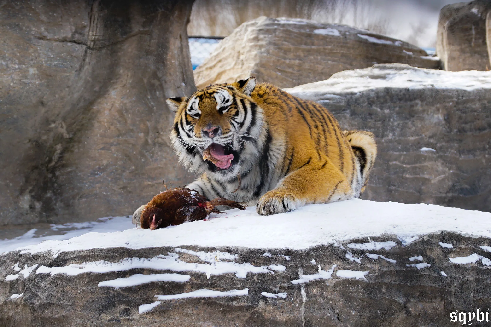

最近几年每到春节前夕，对于我来说最重要的事情都不是抢回家的车票，而是开始规划出门旅游的行程。

对于在北京工作的天津人，因为距离实在太短，城际列车实在太方便，所以回家成为了一件随时都可以做的事情。正因为如此，把春节这样一个全年最长的假期拿来回家躺着而不是出去旅游，就有点过于浪费了。

加上家里没什么亲戚，父母也没有过年一定要回家的要求，这些年的春节就变成了一个纯粹的假期：去年去了湖南，前年去了哈尔滨。

而今年，我的一位朋友正好想一起组团春节出去玩，所以两家四个人一起商量了一下，准备出国搞个大的。最开始是想去新西兰，但是查了一下现在新西兰一趟还是蛮贵的，想玩爽了人均大概要几万块钱。本来是抱着吐槽的心态说这价格都能去马尔代夫了，结果四个人一合计：既然都这么说了，不如干脆就去马代吧！

感谢当时我们这个未曾深思熟虑的决定，这个世界上现在又多了几个被续了一大口命的打工人。

<!-- truncate -->

偷偷放两张前两年春节出去旅游时拍的照片，湖南（我们去了长沙和衡阳）跟哈尔滨的体验也是蛮不错的！不过现在好像去哈尔滨的人有点太多了，我们当时恰好躲过了后面两年人们扎堆去东北的热潮。

## 选岛

### 制定基本方针

因为马代的岛确实太多，所以全都选一遍显然是不现实的。

我们采取的选岛策略是：制定基本方针 -> 初选 -> 收集详细信息 -> 复选 -> 找旅行社询价 -> 排序 -> 按照顺序看哪个能订到票。因为我们预定的时间比较晚了（接近 12 月底），所以很多想去的岛最后没有订上。不过即使并非第一备选，最终的 Nova Maldives 这个岛的体验还是堪称完美，不愧是马尔代夫。选岛的时候其实也不需要太纠结，马代这边的岛还是比较一分钱一分货的。

这次我们选岛的基本方针是：小孩少 + 浮潜还行 + 景色别太差 + 食物够丰富，当然在这个方针之外也要划定一个大概的心理价位。

初选的时候使用了只要在马代选岛就一定听说过的马代实验室，上面的信息虽然可能已经 out-of-date 了，但多少能做个大致方向上的参考，筛选掉一些实在不行的岛。

而后续收集详细信息就主要靠小红书了，不得不说不管是国内还是国外旅游，小红书的信息量和真实性都是独一份的。当然这个过程中也可以参考一些国外网站比如 Booking.com，这些网站上可以不走旅行社自己订马尔代夫的岛，所以也有不少来自世界各地的真实评价。

### 浮潜和景色可以兼得

先说浮潜和景色，有人会说这两者其实是不可兼得的：浮潜的两个重要因素是浪小+鱼多，浪小意味着岛上得有防浪堤，鱼多则意味着鱼要有地方藏身，而最好的藏身处是海草。但无论是防浪堤还是海草，都会影响到景色的美观。

但实际体验下来，我觉得这个说法有些过于极端了。以我自己的体验修正一下这个说法，那就是：顶级的非出海浮潜体验，和职业自媒体账号运营级别的拍照出片，二者不可兼得。

很显然，大部分人都不需要这么顶级的浮潜体验（有很多岛也是可以选择出海浮潜的），拍的照片也只是发朋友圈而不是用来起号赚钱的。

就以这次我们去的 Nova 举例，浮潜的鱼种还是很丰富的，水屋直接下水的鱼就很多，浮潜点附近更是鱼量和种类都爆炸多。甚至我这种去马代之前游泳都不会的新手，一样可以在海里追到不止一种鲨鱼。

与此同时，这个岛上并没有什么海草，取而代之的是大量礁石，礁石一样可以吸引鱼群，海星海葵海参海胆也都不少。而这个岛设计得非常好的一点是防浪堤也是用礁石替代的，而且高度合适，涨潮的时候甚至会直接被水没过去。虽然这会导致浪确实大了一些，但只要别选在光线很差或者海浪半米高的时候下海，新手一样可以顶着浪下去浮潜——当然作为新手，还是安全第一：绳子绑好，注意洋流方向，戴好脚蹼，保存体力。

换一个例子，对于一个一心浮潜的爱好者来说，也大概率不会在乎海面上拍照好不好看——反正照片视频都是水里的 GoPro 和 Action 拍的。或许只有我们这样的新手第一次马代选岛的时候，才会纠结这些有的没的。

### 规避小孩

我们这一次选岛还有一个重要的目标，就是尽量选小孩子少一些的岛，避免岛上过于吵闹，也是怕作为浮潜新手下水的时候小孩子太多有危险（虽然很多小孩子比我们熟练多了，但毕竟小孩子不像大人一样会躲人和规避风险）。

总的来说，有两个选岛的方向可以完成规避。

第一个当然就是直接选“成人岛”，也就是标注了 XX+ 的岛。举个例子，我们这次本来的首选芙拉瓦丽（Hurawalhi）就是一个 15+ 的岛，15 岁以下的客人是不能预定的。每个岛的年龄限制也不太相同，比如菲诺岛（Finolhu Villas）是 10+，你和我岛（You & Me，一看名字就是个蜜月岛）是 16+。这应该是最直接的筛选方式。

除此之外，也可以关注岛上有没有儿童设施。有一些岛是有儿童俱乐部的，这很显然就是给带小孩的客人准备的。规避这些岛，也可以选到一些小孩子比较少的岛。当然反过来，如果有带小孩的需求，就可以考虑这些岛了——前提是你的孩子英语要过关，毕竟带小孩的人、岛上的其他小孩、甚至儿童俱乐部的电视节目都是说英语的。

### 民以食为天

中国人或许是马代选岛的时候最关注吃的怎么样的一批人了。

一方面，大家本来就对吃很挑剔；另一方面，大部分马代的岛吃的无论好坏都是白人饭，所以吃惯了中餐的话不适应也是正常的。

好在我们同行的几个人都相对适应白人饭，所以也没在这上面花太多心思。事实证明，如果不是非中餐不可的话，我们这次的 Nova 算得上是 AI 自助餐的食物种类和质量都很不错的岛了。

既然这里提到了，给没有过选岛经验的小伙伴展开说一下什么是 AI：这个 AI 不是人工智能，也不是 Adobe Illustrator，而是 all inclusive 的缩写，也就是一价全包。

不知道是不是有什么当地的旅游局在规范着，马代的度假岛上套餐形式是统一的，通常就是 BB / HB / FB / AI 这几种。

BB / HB / FB 的区别一般就是有几顿免费的饭：BB 只有早餐，HB 会包含早餐和一顿正餐（通常是午餐），FB 则是一日三餐。当然大部分用餐都是有可能限定餐厅的，一般以自助餐厅居多，也有一些可以允许在非自助餐厅点限量的菜或者点特定的套餐。

AI 会在 FB 的基础上增加额外的饮品或其它服务，比如我们这次的 AI 就包含了岛上部分有酒精和无酒精饮品（虽然说是部分但也足够喝了）畅饮，以及若干乘船出海和免费拍照之类的活动。

有趣的是，我们上岛之后才知道，这个套餐是中国代理专享的。对于国外的代理，套餐会包含非自助餐厅的三餐选择，但是减少了出海和拍照的活动。在额外掏钱体验了岛上另一家餐厅的正餐之后，不得不说这些国内代理还是很有眼光的。与其吃一顿让人昏昏欲睡又不怎么好吃的西餐，还是这些活动更吸引我们。不过这个套餐还是保留了一顿漂浮早餐和一顿沙滩上的晚餐，这两顿饭相对来说都还是很合我们胃口的。

顺带一提，偶尔还会看到有一种套餐叫 RO，是 room only 的意思。这个套餐最简单，也就是除了住宿，别的都要额外花钱啦。

## 采购

### 浮潜装备

因为我们之前都没有浮潜经验，所以整套浮潜装备都要从头准备。

虽然岛上据说是可以租借的，但吹嘴和面镜这种东西还是用自己的比较干净和安全。加上怕到时候万一哪一种租借不到导致没法浮潜，我们最终决定除了脚蹼和救生衣以外所有装备都自己准备。

对于浮潜新手来说，一定要准备的东西，包括了面镜+吹嘴+呼吸管+水母衣+潜水手套。其中呼吸管和吹嘴是一套，我们选择了干式的，事实证明非常有用。虽然有人说干式呼吸管比较危险，但实际测试下来我觉得只要在下海之前做足够多的练习（主要是万一躺过来怎么翻身的练习），干式呼吸管对新手一定是更安全的。而水母衣和手套是必需的，它们全程三四天的时间应该帮我避免了五六个大大小小的伤口。要知道海水有极强的腐蚀性，很容易造成伤口感染，一旦身上有了伤口下水就是很麻烦的事情。同时，水母衣也有比任何防晒霜防晒泥更好还更简单的防晒效果。

除此之外，安全方面，我们还购买了安全绳和求生哨。求生哨当然是没用上的，但是这东西有一个总比没有安心（酒店的救生衣上也有一个，但没去之前很难得知）。安全绳的话，我更推荐住水屋可以自己从屋里下水的时候购买，对于新手的前 2-3 次下水很有帮助，主要是起到一个安心的效果。不过如果你是从浮潜中心这种公共潜点下水的话，安全绳可能会影响其他人的浮潜，就不太适合绑了。

另外一些可选的装备是手机防水袋、漂流袋、潜水袜。手机防水袋我们全程没有用到，浮潜的时候根本不会有心思看手机的。漂流袋可以看作是一个可以防水的书包，我并没有真的把它扔到海里（同样是因为浮潜的时候是不会用到里面东西的），但无论是出海坐船还是带东西到海边，以及临走的时候把没有晾干的衣服收进去，它都是一个用来进行干湿分离的优秀容器。

潜水袜这个东西有些见仁见智：我在穿了几次之后就不穿了，因为租到的脚蹼尺码比较小，脚蹼本身的保护作用也很好了，没必要再套一层。但我的朋友就很喜欢穿，甚至可以拿它代替鞋子，穿上就可以出门。浮潜新手出海是一定要戴脚蹼的，不然很容易逆流游不回来，所以仅考虑下海使用的话我认为可以不买。

### 拍摄设备

运动相机看起来是浮潜必定会准备的东西。

但作为之前连游泳都不会的新手，我还是想唱唱反调。

我们这次是租了两台 GoPro 带过去的，但这次在岛上的四天时间，我全程都没有使用过它们。一方面原因是第三天下午开始我才能比较自由地掌控在水里的动作，同时追上一些游得不快的鱼（鲨鱼还是追不上的），这之前拿着 GoPro 也拍不到啥，而且第一次下海已经很紧张了很难分心。另一方面，我的朋友作为会游泳的浮潜新手，第一天就在海里弄丢了一台 GoPro。

综合我们两个人的经历考虑，我觉得如果对自己的浮潜水平不自信，同行的人又有水下拍摄设备，可以就考虑不准备第二台了。反正菜鸡拍出来的画面肯定比较一般，不如直接偷对方的图和视频吧！

另外绝大部分岛考虑到隐私问题都是不能飞无人机的，所以通常就不用准备了。因为起飞就会拍到隔壁，很多房间有露天泳池、露天淋浴甚至露天浴缸，确实不太合适。

有一些岛有能包场的拖尾沙滩或者无人岛可以去，这些地方可能是可以飞的。至于为了飞这一次拎着无人机来回一趟值不值，就要自己考虑了。

### 其它有的没的

驱虫用品：岛上虽然都会做驱蚊，但是通常房间里还是会有一些蚊虫的，而且房间外的开放空间蚊虫相当多。不过事实证明蚊子吃谁主要还是看谁好吃，和喷了多少驱蚊剂也没什么关系。聊胜于无吧。

美元：每人带一百刀左右，到了马累机场或者岛上之后，都换成一刀和五刀的零钱，四天的话完全够用了。

转换插头：不同的岛似乎不太一样，Nova 是不需要的（都是多种插头通用的接口），不过还是备上比较保险。

衣服：岛上昼夜有一定的温差，白天的状态是热+晒，晚上相对比较舒适，可能有一点点冷。考虑到物理防晒是最好的防晒，个人推荐薄的短袖上衣+薄的长裤+防晒衣+遮阳帽是最好的组合，漂亮衣服带一两身用来拍照就可以了，拍完赶紧换回防晒套装。我这次后面两天浮潜的几个小时因为懒所以放弃了面部防晒，就这几个小时导致回家之后脸直接黑了两个色号。

## 上岛

### 每天干什么

说了这么多，似乎一直没有提到一个问题：去了马代之后，在岛上究竟能干什么？

因为每个人喜欢的活动都不一样，我只能说一下我们这段时间在岛上的体验。好在我们这次活动安排的比较全，各种类型的娱乐基本都体验到了。我这里列一个时间线，应该可以作一定的参考。

通常我们会在当地时间的晚上 10-11 点睡觉，第二天早晨 6-7 点起床。

起床之后简单洗漱就可以顶门去吃早餐了，在没有活动的日子，早餐之后我们通常会选择躺平休息或者在屋里潜水。早晨和上午是很适合潜水的时间，通常比较风平浪静，鱼也相对比较多，太阳也不会太晒。

上午的时间其实过去的还蛮快的，中午再大吃一顿之后，下午 3-4 点之前一般是躺平的时间。躺平休息的方式也有很多，比如泡泡泳池上来冲个澡，或者在躺椅上吹吹海风。也可以干脆在房间里吹吹空调睡个午觉，毕竟这个时间是一天里最热的时间，屋外还是很晒的。

下午 4 点左右就可以考虑继续去潜水了，通常下午的时间我会出门到码头的潜点下水。选择下午去潜点主要是因为上午时间比较少，一个来回就要花费不少功夫，还要换衣服洗澡，在房间里就更合适一些。

晚饭开始得比较晚，如果是选择非自助餐厅一般都需要预约，时间可能就会更晚一些。吃完可能已经 9 点 10 点甚至更晚啦，回去洗个澡休息一会儿就能睡觉了，一睁眼又是新的一天！

实际上只看这个时间表，感觉每天也没干什么，除了躺着就是潜水。但是不管是躺着还是潜水都很开心，就是那种身体在大自然里感受到的从内而外的开心，把身上的班味儿洗得一干二净。

对于现代人来说，躺平吹吹海风可能才是最难得的快乐。

### 出海活动

除了赠送的日落巡航以外，我们还报名了深潜和出海追蝠鲼的活动。

深潜不必说，体验过的话应该都会喜欢的，只是岛上的深潜并不坐船出海，只是去岸边的海沟下面，稍微有点玩的不够爽。

追蝠鲼（也就是 manta，一种长得有点像鳐鱼的鱼）本身是一个很有意思的活动，小黑会开船出去找蝠鲼经常聚集的地方，找到之后就可以直接从船上跳进水里跟着蝠鲼一起浮潜。本来我们对这个活动的担忧是作为新手能不能安全地在海中央下水，没想到的是我们这趟的运气比较差，两个小时都没有找到蝠鲼的影子。中间有一次小黑似乎发现了蝠鲼，赶紧招呼大家下水，结果几个先锋队跳到水里之后发现不对，然后我们在船上的人就看到小黑从远处捞上来了一个黑色的塑料袋……可以说是不要在海边乱扔垃圾的教育片了。

说回日落巡航，这个是赠送的活动，船上看起来也都是华人。简单来说就是坐着小船出海，日落之前朝着太阳开，日落之后朝着岛开。但就是这种单纯的吹风聊天喝饮料看落日，带来的体验却是直击心灵的。

现代人真的被钢筋水泥困住得太久太久了。

## 放松紧绷的神经

在选岛的时候，有一个条件最开始并不在我们的目标里，但随着选岛的过程逐渐成为了筛选条件的一部分：岛上的服务。

但在实际上岛之前，我们对马尔代夫岛上服务的好和坏并没有一个准确的预期，只是大致知道这个价位的岛应该没有一对一的管家服务，以及筛选掉了一些差评中提到对亚裔有明显歧视的岛。

或许是运气真的不错，Nova 这个岛的服务体验下来是相当好的。这种好并不是有什么无微不至的照顾，而是一种“没有压力”的感觉。

最开始选岛的时候，我们就发现 Nova Maldives 这个岛在国内平台上的信息相当少。实际上岛之后，岛上也确实几乎没有什么中国人，部分看起来像华人的人听语言也大多是港台的，或者也可能是新加坡的，说普通话的人寥寥无几。直到下岛前的最后一天，我们才碰到了两个来自苏州的超级大 E 人，第一次用中文跟其他游客聊上了两句。

可能也正因为如此，这个岛上的服务状态是欧美的那种大开大合：上岛第一天前台的唯一一个中文管家就告诉我们这个岛上没有一对一管家服务，但是有什么问题都可以来前台或者打电话找人解决。当然可能是因为我们塞了一些小费的原因，后续她还是加了我们的微信，帮忙解决了不少问题。

等到真的待够了四天，你会发现虽然确实没人跟着你帮忙安排每件事情，但如果你主动提出什么问题，一定会有人来帮你解决。岛上的工作人员看到你都会打个招呼，但也只是一个简单的招呼。岛上的活动可能会有额外的收费项目，但一定有人在开始之前一条一条地解释每个收费项目具体的价格，并附带一句这都是自愿选择的，不买这些额外项目也会有很不错的体验。

这个“自愿选择”并不是单纯的“明码标价”，而是一种“即使不选择也可以获得很多快乐”的自由。互联网催生的商业模式很多时候都会利用人性的弱点设置一些看似自愿实则强迫的氪金点，最常见的就是免费版本阉割到用着难受，以此来让用户觉得自己的消费很“值得”。

但没有人是傻子，大家接受这个模式并不是真的喜欢它，而是一种被逼无奈，一种向大环境做出的妥协，一种相互让利的行为。但让利就意味着算计，意味着勾心斗角，意味着本来就因为工作压力紧绷的神经，在一次次的利益计算和无可奈何中继续被拉紧，拉紧，不知道什么时候就会断掉。

当你发现马尔代夫的岛上有这样一种商业模式，你花出去的钱真的可以买到自己想要的东西，而非那些你本来就应该获得但被克扣之后额外施舍给你的东西时，那种精神上的放松感实在是难以用语言形容。

小费的问题也是一样，在岛上的这些天，我们一直都是在服务完全结束之后才给小费的。觉得服务员提供了额外的服务就给一些，只是正常服务就不给。服务人员也都不在意，依旧提供着该有的服务。

某一天的晚餐是套餐赠送的，叫做沙滩晚餐。简单来说就是把桌子摆到沙滩上吃，餐品就是前菜+汤+主食+甜点的正常组合。我们这桌的服务员也是个 E 人，全程在找话题聊天，大家都很开心。最后一道甜点吃完的时候，沙滩的另一侧正好开始了一场火焰杂技表演，我们就在桌子上留下了小费跑去看表演了。

等表演结束，我们走回房间路过沙滩上的桌子，正好看到刚才的服务员在收拾桌上的餐具。可能是因为拿到了意料之外的小费，他开心地哼起了歌；就像这些日子每次有了新鲜体验的我们一样——

快乐得像个孩子。
