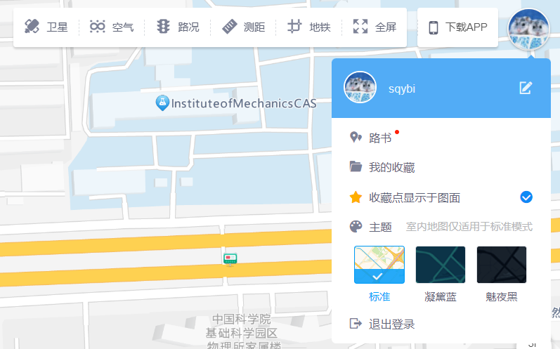
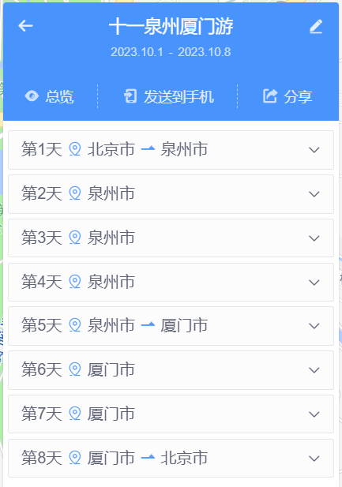

> (This article was translated by ChatGPT automatically.)
>
> This article used a word in Chinese: 路书 (LuShu). It has different meaning under different situation. ChatGPT translated it to "itinerary", but I think it's not accurate. However, it is only a codename, and I will explain it in the article.

Before every trip, we inevitably engage in some travel planning.

For me, the most critical part of trip planning is preparing an itinerary that includes various travel routes and schedule arrangements.

Unless our physical condition doesn't allow it, our trips generally proceed along the general direction recorded in the itinerary, although of course there are various minor adjustments according to actual conditions. Whether you want to conveniently check later segments of the route, record sights you've already visited, or adjust your path on the fly, a handy itinerary software is naturally indispensable.

I want to share some useful itinerary software for domestic and international travel based on my own experience in this article. Hopefully, they can be helpful in everyone’s next travel planning.

Here's a summary of the software I'm recommending along with some key points, but I believe most readers are more concerned about my experience in using them.

| Software         | Applicability | Pros and Cons                                                                       |
|:---------------- |:------------- |:----------------------------------------------------------------------------------- |
| Google My Maps   | International | Excellent basic functions; very few additional features, average mobile usability    |
| Gaode Itinerary  | Domestic      | Adequate basic functions, serious product and development team; somewhat rudimentary features, lacks walking navigation  |
| exping           | Domestic      | Excellent basic and additional features, community features don't interfere, extremely user-friendly on mobile; web experience is poor and problematic |

<!--truncate-->

## What is an Itinerary

"Itinerary" is a fascinating term. In the Chinese internet context, this term seems to be widely accepted and naturally represent different meanings in different scenarios. However, in English, it corresponds to completely different terms in different contexts.

I'm not well-versed in the specific origins of this term, so I shouldn't overstep my bounds. But in order to explain some basic concepts that I will talk about later, I can only speculate the origin of this term based on my own knowledge and search results.

### Rally Racing Might Be the Origin: Pacenotes and Roadbook

I'm not sure how many people are like me—the first time I heard the term "itinerary" was in rally racing.

Back when television was the main entertainment, my family was no exception. I first learned that this type of car racing needed a co-driver to tell the driver how to drive by using something called an "itinerary" during the Dakar Rally broadcasted on CCTV-5.

In short, drivers generally drive the route twice before the formal race. The first time is for recording the itinerary, the second is for confirming and correcting the itinerary with the co-driver (source: [How do rally drivers and co-drivers cooperate?](https://www.zhihu.com/question/24806202/answer/379193213)). It seems that the term used here for the itinerary are [pacenotes](https://en.wikipedia.org/wiki/Pacenotes) and [roadbook](https://en.wikipedia.org/wiki/Roadbook).

As for how the two terms are used, one idea is an official full-event itinerary is called a roadbook and the co-driver's segment itinerary is called pacenotes; another is there's no significant difference between the two. I'm not here to introduce rally racing basics, nor do I have the capability, so I'll not elaborate further.

Not only rally races, but other car races may also involve co-drivers and itineraries. In most cases, the itinerary at least serves the purpose of marking various terrains and turns. Especially over long routes, the driver's memory isn't enough to remember all the bends and special terrain features as in Formula 1, allowing a co-driver to remind with an itinerary helps drivers focus more on driving skills, which can enhance the spectacle of the race.

For cross-country rally racing, the itinerary has an additional function, which is to assist navigation information (electronic compass) in positioning and navigation to avoid the embarrassment of "taking the wrong route." Don't think this is a joke—rescue in the wilderness, especially in deserts, isn't as timely as on the roads, and for some events (like the Dakar Rally), the route might cross minefields left over from wars, stepping on a landmine if you take a wrong turn is not out of the question.

:::note[Electronic Itinerary]

I remember when I watched the race back in the day, the co-driver would hold a notebook with a handwritten itinerary or a long printed strip of paper.

However, when I searched for information this time, I found that itineraries seem to have become electronic and integrated with electronic compass navigation systems. Having been away from the racing scene for a long time, I'm not sure if this technology is now widely used or if many drivers and co-drivers still insist on using traditional itineraries they're more accustomed to?

I wonder if there's anyone in the comments familiar with rally racing who can help clear the confusion.

:::

### Cycling Itineraries: Cue Sheet

In recent years, road and mountain biking has grown from a niche sport and gradually gained visibility. The “itinerary” needed for cycling is a common topic of discussion in the circle.

When I search using keywords like bicycle + pacenotes, I couldn't find much useful information. After exploring, I discovered that the "itinerary" used in the cycling field seems to be called a cue sheet, as mentioned in articles like [Just The Tip: Cue Sheets](https://lifeisabeautifuldetail.com/blog/cue-sheets) and [How to Read a Cue Sheet](https://www.ridestudiocafe.com/connect-communicate/clinics/how-to-read-a-cue-sheet).

The biggest difference between bicycle races and car races is that bicycle races can't have co-drivers, so it's difficult for cyclists to survey routes and record itineraries themselves. Instead, for large races like the Tour de France, the itinerary is issued officially by the organization.

Limited by the structure of bicycles, such itineraries won't be large, usually small pieces of paper that can be attached directly to the handlebars.

For cycling enthusiasts, there are quite a few who prepare a similar itinerary when planning routes. So, when you search for "itinerary software" in a Chinese context, you'll find that many such software are actually prepared for cycling. While they have similar functions, compared to travel's focus on attraction information and transportation details, these types of software may focus more on collecting road and landmark data. They also typically integrate functions like speedometer and pacing, which are unnecessary for travel.

I will mention later that in searching for suitable travel itinerary software, these software end up being the biggest interference. 

### Travel Itinerary: Travel Map

I'm confident that the term "itinerary" used in travel is inspired by the two "itineraries" mentioned above.

Similarly, I can only attempt to find the correct English keywords through searching. After some effort, I found a likely correct term: travel map.

Compared to the more professional itineraries, a travel itinerary is closer to practical use. Rather than using professional notations to record detailed routes, travel itineraries generally focus on:

- Recording attraction information and strategies
- Route planning based on multiple modes of transportation
- Transportation time calculation
- Other personalized customization and integrated functions, like ticketing services, hotel and flight recommendations and booking, car rental services, etc.

Given my personal needs, in this article, I will mainly focus on attraction marking, route planning, transportation mode selection, time calculation, and as comprehensive as possible note-taking functions (including remarks about attractions and routes). I believe those features are enough for me to complete a thorough travel plan, and other integrated services should be handled by more specialized software.

You can have your own thoughts on this, but it won't affect my following recommendations based on the above principles.

## Recommendations for Travel Map Tools

### Google My Maps: The Go-To for International Travel

When mentioning Google Maps, friends who have traveled overseas should be familiar with it.

Except for the special area of mainland China, Google Maps has very good coverage in most countries and regions. In addition, like most of Google's products, Google Maps features are also excellent. It was a big help when transferring(subway) in Japan—although, in the end, I mistakenly boarded an express train to the airport and had to awkwardly have my card recharged in the guard room at the next station because I didn't have any cash, it serves to say that the complexity of the Japanese subway system is truly irredeemable.

But here I'm talking about Google My Maps, which is not Google Maps, but another Google product. You can access it through [Google My Maps](https://www.google.com/maps/d/).

This tool doesn't seem to be born for travel map creation; it's more like a universal map editor from Google that has been made public. This tool offers some quite basic functionality:

- Add layers
- Add waypoints, and modify their properties such as color
- Add routes between waypoints, including straight lines and planned routes for various transportation modes
- Import and export layer data in various formats
- Collaborative editing

Although there are only these functions, Google My Maps perfects them to the extreme. Without any fancy additional features, this product is extremely handy for creating a travel map: create layers for different segments of the journey, mark all the places to visit on the layer, connect them with lines, write some notes for them—and there you have it, a perfectly usable travel map.

Alternatively, for anyone who is sufficiently geeky, it's hard not to be impressed by such a simple yet useful product. In my seven years working in the self-driving car industry, I've seen countless developers use Google My Maps as an editor for KML (a geographic data format defined by Google) or other formats. It's definitely better than most of the editors we've developed in-house for generic scenarios.

The only significant downside might be that its mobile side relies on Google Maps and the entry point is deeply buried, making operation far from easy on mobile. It's more suited for viewing maps only.

Since most of my overseas trips have been with a few friends working at Google, I haven't considered other tools anymore. However, in the process of searching, I also came across other online tools, such as [TravelMap](https://travelmap.net/). At least judging from [its demo](https://clem.travelmap.net/cycling-around-australia), this tool seems quite useful, maybe next time I can give it a try.

### The Domestic Travel Map Market Dominated by Travel Agencies

Perhaps because Chinese people don't have the habit of writing itineraries before traveling, or maybe because the self-driving tour market has just started to rise among this generation, finding domestic travel map products was incredibly challenging.

In China, you can see many products flying the "travel map" flag. But every time you click into these products, you'll find their homepage featuring words like "custom planner," "marketing," "travel agency," or they are extremely tailored for driving, cycling, and other specific scenarios.

Among these products, the latter is too deeply customized to adapt to various travel needs. As for the former, though they can be used for route planning to a certain extent, you'll soon discover they all have consistent problems, such as only including popular attractions, charging in a to-B model, and focusing more on introducing attractions to customers rather than planning routes.

At least from my actual experience, I feel these travel map software fall far short of being "usable." At this point, I turned my attention back to domestic map software, trying to find one with a similar function to Google My Maps.

### Amap's Travel Map That Passed By

Among several major domestic map software, many have the function of custom maps (if you can't find it, check the corresponding cloud platform). But the vast majority of such functions are limited and more inclined to make custom maps rather than plan routes. Key features like navigation are often missing. Also, since many similar functions are actually part of a cloud platform, there's no good mobile app support when you're on the go.

Fortunately, during my search, I discovered that Amap (Gaode's mapping service) has a feature called "Travel Map" on its web version:

And this feature, just like its name, is a pure travel map. Apart from the lack of walking navigation, the basic features are almost complete. I even created a complete travel map before the trip started.

But just when I was about to adjust this travel map by categorizing points with different colors, I suddenly encountered a very strange bug. After changing the color or icon of some places, the entire travel map page started to spasm uncontrollably and all operations on the page stopped responding.

A simple debug in the console led me to suspect that the problem was associated with route display. After further investigation, I found a way to reproduce the issue: simply create two very close points, connect them with a line, and if the expected drive time between them is less than 1 minute, the problem occurs. When the issue arises, starting from this route, the expected times for all subsequent routes will no longer display. This further corroborated my guess that there's a problem displaying expected times.

Continuing the investigation, it’s apparent that the problematic code checked an expected time returned by an API and split it based on the word "minute". Hence, the root cause seems obvious: when this API returns a time of less than a minute, it's likely in "seconds" instead of "minutes". The frontend didn't handle this return value correctly, leading to an infinite loop, causing the map to zoom infinitely and seizing up the frontend thread (although technically speaking, JavaScript doesn't have threads, but you get the idea).

I identified the problem, but I was not able to fix it myself. I clicked on the "feedback" button in the upper right corner of the interface, hoping for some luck.

The good news was that the feedback function wasn't an auto-reply bot, but it actually opened [a forum](https://lbsbbs.amap.com/forum.php?mod=forumdisplay&fid=60); the bad news was, the latest post on this forum was from 2018, which seemed to have been left unattended for a long time.

When I continued to dig deeper, I found [this post](https://lbsbbs.amap.com/forum.php?mod=viewthread&tid=46620&extra=page%3D1):

> Dear users of the Gaode developer forum:
>
> As of October 18, 2018, besides the car machine section, other sections of the Gaode developer forum will stop posting and maintaining. If you have any usage issues, please [submit a ticket](https://lbs.amap.com/dev/ticket/type) to contact us. Thank you for your understanding.
>
> Thank you for your attention to the Gaode developer forum, and we wish you a pleasant life.

As long as there's a place to submit a ticket, that's good enough, so I clicked the link, submitted a ticket, and described the problems mentioned above in detail.

The customer service responded quickly, telling me the ticket had been transferred to the engineers. But the bad news was, I was using this travel map feature before the National Day holiday, but their engineers could only give me feedback after the holiday.

During this time, product managers from Gaode also contacted me. The first one said that although my ticket was submitted to the open platform, the travel map is actually part of the app's function and needed to be transferred there. Later a product manager from the app side also got in touch with me, but likewise said that they would have to wait until after the holiday to arrange debugging and repairs.

Having already planned my trip out, I couldn't wait and had to look for another alternative.

### Useful but Not Entirely: exping

After much hassle, I discovered a domestic travel map product [exping](https://exping.world/) through an [article on Minor Tech](https://sspai.com/post/73855).

This product can be said to be the most user-friendly travel map product I've used. In addition to the basic functions mentioned many times before, it also provides some additional features:

- Collaborative editing
- Emoji custom icons
- Grouping by date and route
- Emoji check-ins
- Place ratings
- Community

Moreover, I used it during this year's National Day holiday, so there are some features that were introduced later that I haven't used yet, such as drawing custom lines between two points.

Although I've been emphasizing Google My Maps' advantage of not having many fancy features, I wasn't put off by exping's features. The reason might be that their product design is truly restrained—for example, I'm not interested in community features, and during my usage, they've hardly forced any community feature entry points on me.

This product, since it started as a mobile product, has a very user-friendly mobile app experience. During the trip, it's inevitable to modify the previously established plan due to various reasons. During this National Day trip, I made a lot of changes smoothly in exping's mobile app, even on the go (if you want to do the same, please pay attention to traffic safety!), without feeling cumbersome.

Despite so many advantages, this product still has its own issues.

The most obvious problem is that the free version has too many feature limitations. Although I'm the type willing to pay for excellent products, I must say that limits like the maximum number of groups during the trial were rather disappointing. I'm not sure how many people would sign up for a monthly subscription for a trip, although the price isn't high, I'm concerned whether Chinese people's payment habits can sustain this software's revenue.

I myself would probably sign up for a month's membership each time I need to use it during a trip, as a way to provide minimum support.

Another hard-to-tolerate problem is that the web version of the software is too rudimentary and has too many bugs.

For example, the logic for group display is inconsistent between mobile and the web, and even the web itself seems inconsistent. For instance, it appears that route grouping is tied to dates, but the web UI displays all route groups and dates in a flatten manner without showing their connections—this makes adding or deleting groups and dates on the web quite difficult.

Of course, when I started using this software, the web version might have recently been launched. I also saw a detailed survey on the web side, investigating various potential issues, so I'm temporarily tolerant of this.

However, completing the entire travel map on mobile isn't the best experience. I hope these issues will be resolved before my next trip.

Lastly, I'm somewhat skeptical about this product's community feature. With such a small user base, it's hard for quality itineraries to emerge in the community, so I can't quite understand the need to launch a community feature at this time. But considering the developer's restraint on this feature's entry points, I'll take it as a minor experiment on their part for now.

## Postscript: Fixing the Gaode Travel Map Bug

As my trip was about to end, Gaode's programmers also returned to work.

Ignoring the context that I provided detailed reproduction steps and even helped them locate the code error, they managed to identify the problem relatively quickly and informed me a few weeks later that they had fixed and deployed the solution. I verified it, and the problem was indeed gone.

I was actually quite surprised with this outcome, as the forum indicated that it was a product on the decline, and such a fundamental bug had never been reported, which very likely meant the product really didn't have many users.

ypically, for such issues, it’s okay to either give users a cursory response or to slowly schedule a fix. I even got the impression that these programmers and product managers were becoming quite unfamiliar with the Roadsbook product during their communication; they didn't even know where the product's entry point was. But they still took the issue seriously, recorded it, and completed the repair, for which I want to thank the product managers and programmers who were sincerely involved in this process.

The next time I get a chance, I will try using this product again to plan my entire trip—although it may fall further and further behind products from startups like Exping, that is a matter of corporate decision-making.

Those who are serious deserve to be treated seriously.
