:::info[Translation Tool]

This article was translated by ChatGPT automatically, with minor manual corrections.

:::

TL;DR: When using Linksys VELOP routers as the main router in a network environment with a secondary router, it may lead to difficulties in setting up the secondary router or loss of network performance. It's recommended to consider other routers first. Update: Netgear routers won't work either; just stick with Xiaomi.

:::danger[A word of advice]

Don't mess with networking; it can lead to unhappiness.

:::

A few days ago, tired of the frequent disconnections of the wireless Mesh network of the Asus routers, I decided to upgrade the home wireless Mesh network as a whole. After some simple research, I opted for the Linksys VELOP series routers with a reputation for having “less functionality and customizability but being stable.” The model I chose was the MX4200.

After setting up the wireless Mesh network with several routers, I began attempting to integrate a secondary router into the system.

Since my previous Asus router was already connected to a secondary router, I naively assumed that a similar quick configuration would suffice.

However, the actual situation was completely different from what I had imagined, and I faced numerous issues. Not only did a simple configuration fail to resolve the issues, but even after I eventually figured out all the problems, I found that I could only use an imperfect solution to incorporate the secondary router.

This is why I concluded from the outset: The Linksys VELOP is not suitable as the primary router in a network environment with a secondary router.

Below, I will analyze in detail all the issues encountered during the integration process, their causes, temporary solutions, and the principle behind them.

The article is quite lengthy and contains many technical terms. If it's difficult to read in one go, consider reading in sections. Of course, if you do manage to get through it all at once, please let me know in the comments — I will respect you as a hero, whether you're a man or a woman.

<!--truncate-->

:::note[Linksys’s quirky naming scheme]

Linksys routers follow this logic:

- The MX4200 is a tri-band router, with a total bandwidth of 4200M across three bands, hence the MX4200 name.
- When buying a set with two MX4200 units, since the package contains two routers with a bandwidth of 4200M each, the total bandwidth is 8400M (Note: Actually, bandwidth cannot be calculated this way!), so the set is called MX8400.
- Similarly, a set with three MX4200 units is called MX12600.

The first point is somewhat understandable, as many routers use a similar method to identify the model. But the next two are a bit too puzzling for those who are not in the know.

:::

:::note[Secondary router? Secondary gateway?]

The so-called secondary router seems more appropriately termed "secondary gateway," as in most cases, this device does not take on many routing functions but is instead used as the default gateway to achieve global traffic forwarding and splitting. The emergence of secondary routers is mainly due to the special network environment in China, which has a demand for "global proxies." This network architecture is rarely deployed in the home networks abroad, making it a term used almost exclusively in China, with no corresponding concept in English.

I personally am not particular about names, so I will still be using the better-known term "secondary router" in this article.

:::

## Wireless Mesh Technology and Secondary Routers

Before revisiting the network deployment process, I'll briefly introduce some of the technical terms that will be frequently mentioned later.

### Simple Home Network Structure

In a common home network environment, there is usually only one router, or a modem with router functions. When both a router and a modem are present, one is often set to bridge mode, so essentially there is still only one device performing the router function.

Our personal computers, smartphones, tablets, and other devices will connect directly to the router via ethernet or WiFi or through a series of layer 2 switches before connecting to the router. I won't delve into the differences between layer 2 and layer 3 devices here, but in simple terms, in such a network environment, it's as if all devices are directly connected to the router.

However, such a simple network structure can encounter various bottlenecks with more complex requirements. For home networks in mainland China, the two most common issues are likely insufficient WiFi coverage and the inability to proxy globally.

Mesh technology and secondary routers have emerged to address these two issues.

### Wireless Mesh

First, let’s discuss wireless Mesh, a technology developed to solve the issue of covering WiFi signals, even wired signals, across larger areas.

Even before the advent of wireless Mesh, there were many similar technologies that could address such problems. For instance, the AC + AP technology often used in homes and offices: pre-laying ethernet cables within walls and connecting many APs to a single AC via those cables. The APs serve as extensions of the AC, expanding the network coverage of the AC device through WiFi where they are placed, avoiding situations where a single AC or router device cannot cover the entire house with wireless signals. At the same time, the AC + AP scheme manages signal switching through a series of protocols, meaning when moving devices transition from the signal range of one AP to another, it can notify the device to switch signal sources at the appropriate moment, ensuring a seamless transition, such as not dropping from a game you’re playing during the switch.

However, pre-laying ethernet cables is not very practical for scenarios like renting apartments. Even if visible wiring is an option, considering the difficulty in routing, aesthetics, and the complexity of dismantling and reinstalling when moving, it’s not a good choice.

This is where wireless Mesh technology comes into play: it can connect multiple routers wirelessly, allowing them to function without the need for ethernet communication, effectively replacing pre-layed ethernet with wireless signals. Furthermore, different brands of wireless Mesh technology have their optimizations, and some don't even rely on a central node (the earlier AC), ensuring a functional wireless Mesh network as long as the remaining devices have sufficient signal strength to communicate.

:::note[The chaotic naming of wireless Mesh technology]

Each brand has its unique names for its wireless Mesh technology, for instance, the VELOP mentioned in this article is Linksys’s wireless Mesh technology. Asus’s technology is called AiMesh, TP-Link’s is known as “Deco Mesh” internationally but differs domestically, while Xiaomi modestly calls it their “self-developed Mesh.”

Linksys’s naming is particularly confusing among other brands. For example, their Atlas router is similar to wireless Mesh technology, but it doesn’t include VELOP in its name. However, they renamed the technology used by this router to Velop Intelligent Mesh, thus maintaining the brand image. (Source: [VELOP gets a rename and slim down!? Linksys Atlas Pro 6 Mesh Wi-Fi System](https://www.hkepc.com/20766/VELOP_%E6%94%B9%E5%90%8D%E5%8F%88%E8%AE%8A%E7%B4%B0%E5%92%97__Linksys_Atlas_Pro_6_Mesh_Wi-Fi_%E7%B3%BB%E7%B5%B1)).

:::

After deploying a wireless Mesh network, you can consider that the wireless signal has been simply expanded to a wider range. Users also don’t need to worry about which specific wireless signal they are connected to, as it's all treated as a direct connection to the router's wireless card—a very important point that will be revisited later.

A more unique use case is using a Mesh router to extend the network, then connecting the extended router's LAN port to a computer. In this network configuration, although it seems the computer is connected via ethernet to the extended router, data is actually transmitted over the wireless Mesh, meaning the computer is connected to the main router's wireless card—again, very important, as it will be relevant later.

### Early Global Proxy Solutions

Let’s set aside wireless Mesh for now and talk about secondary routers, a technology not directly related to it. In simple terms, its function is to introduce a second gateway into the network. By setting end devices (computers, phones, tablets, etc.) to use the secondary router as the default gateway, all network traffic first passes through the secondary router for processing and then is forwarded to the main router, and finally, out to the internet.

To understand why this technology emerged, we must look back at early global proxy solutions.

As is common knowledge, proxy software on a device typically handles some or all the traffic, diverting part to a proxy server with the rest going through the usual routes. To share a device’s proxy software with another device, one would typically use something like a local SOCKS proxy.

While SOCKS proxies do work, the setup can be cumbersome. Plus, with software that doesn't support SOCKS proxies, or where setting them up is inconvenient, things get even more complicated.

But reconsidering this, in the network structure mentioned above, doesn't all local network traffic go through the main router? And since the proxy software can proxy all traffic on a machine, if I run the proxy software on the main router, could I not simply proxy all traffic through the router and divert it there?

Fortunately, the operating systems of most routers are essentially UNIX-based, so porting the proxy software used on Linux wasn’t too difficult. Some router manufacturers, like Asus, are quite open in this regard, offering default SSH functionalities and even allowing for custom firmware updates.

As a result, early global proxy solutions relied heavily on modified Asus firmware or involved flashing routers supporting OpenWrt, the open-source router system, directly.

Over time, this solution proved inadequate for some users. While modded systems could falter in stability compared to the original systems, possibly resulting in network outages, the requirement for high-performance routers drove up costs.

To address these issues, new solutions were proposed.

One category of solutions revolved around using ordinary ARM/x86 devices with open-source router systems, implementing routing functions at the software level on devices that didn't originally support them, also known as "soft routers." But this only partially addressed the cost and performance issues while potentially introducing new problems concerning energy consumption due to software emulation's demand for performance.

The other solution decomposed device functions, introducing a lower-cost ARM device into the network that hosted proxy software and had all outbound network traffic pass through it. This way, the primary router would only need to support standard router functions, not global proxying.

This extra device is what we commonly refer to as "secondary routers."

### Improving Global Proxying: Secondary Routers

Having said this, you might have understood why at the beginning, I mentioned the device should perhaps be called a "secondary gateway."

In reality, this newly added device doesn't necessarily need routing functions (to be more precise, it might have minimal routing functions, often NAT). Its role is to split the data traversing it, having some go to the proxy server, some directly out, with all traffic passing through its default gateway. It's less about routing and more like an independent gateway, with the unique aspect that both its source and destination traffic are the same device, namely the primary router.

The benefits of this arrangement are obvious: The primary router now only needs to support the functions a regular router should have, and virtually all original system routers can support this scenario. This greatly enhances the stability of the primary router and significantly reduces the performance demands placed on it.

Furthermore, if the secondary router encounters issues, you can simply disconnect it from the network and switch all devices' default gateway from the secondary to the primary router, leaving the network capable of regular function except for global proxying.

Thanks to the existence of DHCP technology, modifying the default gateway is generally simple, as you would merely update the default gateway address in the DHCP settings of the main router. The DHCP service will automatically deliver this address to all devices on the network, eliminating individual device setup. Some people might prefer not to apply this configuration as they may want only certain home devices to use the proxy, but I'm not inclined to configure the gateway address for every IoT device and every electronic product my wife uses in our home, so this automatic gateway distribution function is something I definitely need.

To summarize, with the above configuration, the network environment with a functioning secondary router looks like this:

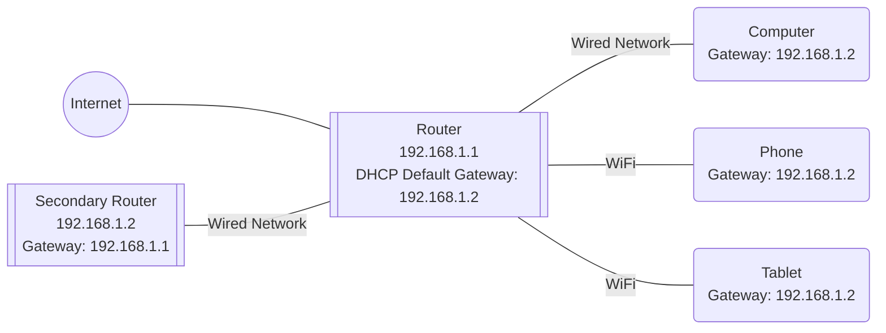

And when the secondary router malfunctions, you only need to change it to this to get online:

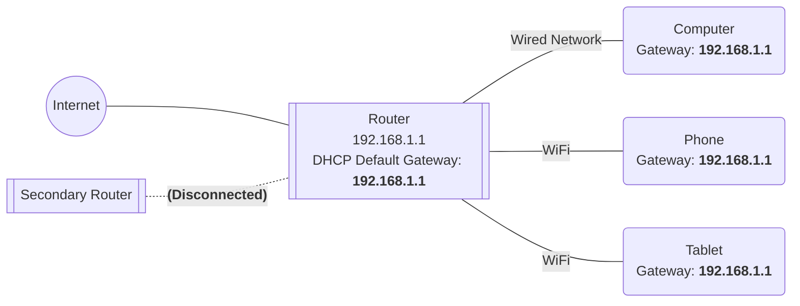

Does everything seem perfect...?

## Stability or Inflexibility?

Before purchasing the Linksys router, I had heard that their routers were known for their stability. This not only reflected in their infrequent firmware updates but also in Linksys’s firmware scarcely supporting any SSH-like extensions; even the front-end interface had limited configurable items. Perhaps it was because of this that the routers maintained such stability.

At the time, plagued by the instability of the Asus router’s AiMesh, I was naturally willing to sacrifice some flexibility in exchange for the router's stability. After all, it seemed that the functionalities requiring expansion could be achieved on the secondary router, rendering the main router's need for flexibility unnecessary.

However, it wasn’t until I started deploying the routers that I realized something was amiss.

### DHCP Unwilling to Modify Default Gateway

Typically, after configuring the main router, we only need to do a few things:

1. Connect the secondary router to the LAN port of the main router;
2. Assign a fixed IP to the secondary router device;
3. Change the default gateway address in the main router’s DHCP to the just assigned secondary router IP;
4. Reconnect various devices or restart the router to enable devices to get gateway info from DHCP anew.

But when I got to step three, I was surprised to find that there was no place to configure the default gateway address in the Linksys DHCP settings page!

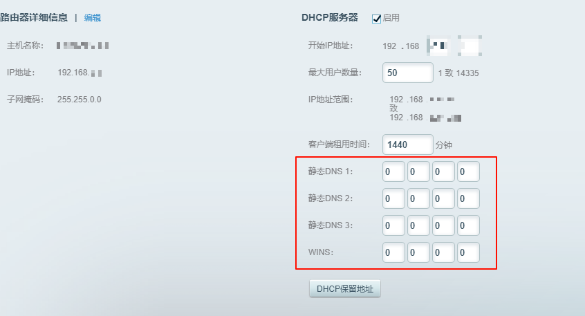

Baffled, I began scouring for information. However, the more information I found, the more I felt something was wrong.

Whether on Chinese or English web pages, I came across similar questions. Yet, all hints pointed to one answer: Linksys simply does not support setting a gateway other than its own IP in DHCP.

Some even mentioned reaching out to customer support, only to have the service circumvent the actual question by answering that the default gateway address can be changed by modifying the router’s own IP, which in essence means the address can only point to the primary router.

I even asked GPT with a final glimmer of hope but GPT was quite certain: Sorry, but the setting just does not exist!

Lacking such a commonly used configuration option, this is not just stability but borders on inflexibility.

### My Secondary Router Can Do DHCP Too!

After failing to find solutions for modifying the DHCP default gateway setting within Linksys’s system, I had almost given up on the possibility. Although I wonder whether forbidding the modification of the default gateway does indeed enhance stability, I have already paid the price in advance.

But no worries, although the main router's DHCP is short of options, we still have the secondary router.

In theory, because my secondary router also has OpenWrt installed rather than plain Linux, it already includes a DHCP server. Simply turning off the DHCP service on the main router and enabling it on the secondary one would achieve the same effect.

This wasn’t the initial approach because switching to it if the secondary router fails would require a slightly higher effort: previously, just modifying one default gateway would suffice, but now the DHCP service on the main router would need to be re-enabled. Additionally, having two DHCP servers simultaneously in the same network can cause conflicts, so when restoring the secondary router, the DHCP service on the main router must be disabled before re-enabling the DHCP service on the secondary one.

But under the circumstances with no other choice, the process isn’t that much more complex. Accordingly, I made the necessary configuration adjustments to switch to the secondary router DHCP solution.

After completing the configuration, I tested on my computer, and both network access and proxying were working normally. I thought all was settled, so I told my wife the network was usable, and then—

Genshin Impact, launch!

But before the game finished loading, complaints from my wife came in.

All terminal devices in the house other than my computer seemed to have no network access.

### IPv4 and IPv6

Here I need to introduce a background, which is the network access of my wife's desktop computer. Since this desktop computer is in the study and the structure of the house is not conducive to wiring, I chose to place a Mesh node in the house and connect this desktop computer to the LAN port of this node via a wired connection.

To put it simply, the network structure is roughly as follows:

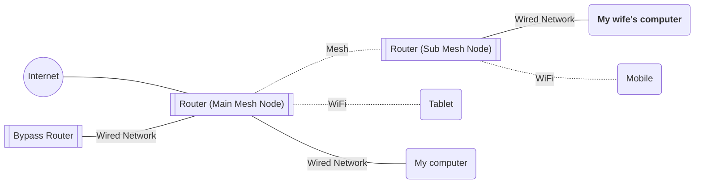

Initially, I thought it was a problem with the WiFi settings, but when I heard that this desktop computer couldn't connect to the network either, the problem became very bizarre.

Although a Mesh device was incorporated into the network, the computer itself was still connected to the device by wire, and the Mesh protocol only used the WiFi channel, so the connection itself would not be affected by WiFi. Moreover, it seems that only the internet was inaccessible, while the local network was still reachable — which means that the Mesh pathway itself was not problematic.

When I was configuring the network before, I encountered situations where the DNS on the bypass router, especially on Windows through IPv6 connections, might lead to incorrect IPv6 DNS address acquisition. So at that time, I was also calm: no matter what, let's first turn off IPv6 and give it a try.

But to my surprise, when I tried it out, I found out that I had already disabled the IPv6 protocol on the network card during the last network configuration, which means that the current inability to access the internet was happening under a pure IPv4 network.

What's even more bizarre is that after I enabled the IPv6 protocol, many websites suddenly became accessible again. Although some applications were still problematic, such as QQ, which could not log in, this suggests that there is a high probability that there is a problem with the IPv4 network, and applications like QQ that can only work over IPv4 are therefore unusable.

Actually, at this point, I was somewhat relieved. After all, compared to the complicated IPv6, IPv4 is still a territory I am more familiar with. A search online should always lead to some answers, right?

Genshin Impact, close.

Google, start!

## A Sudden Solution

After a search, I discovered that the problem was more complicated than I had imagined.

### Knowing the Effects but Not the Causes

Many people online have encountered similar problems, but most scenarios are not completely the same as mine. At the same time, perhaps because fewer people are concerned about IPv6, I have not seen reports where IPv6 is available while IPv4 is not.

However, I still found some clues. In some discussions, it is often mentioned that after incorporating a bypass router, there were scenarios where wired network access was available, but WiFi access was not.

If we ignore the case of my wife's computer, which is wired to the Mesh node, the other devices perfectly display the above characteristic.

Considering that the computer being connected to the Mesh node via wired connection is also not a very common network structure, it is very likely that this is the same issue. And some discussions provide a solution; you just need to set up iptables in the bypass router:

```shell
iptables -t nat -I POSTROUTING -j MASQUERADE
```

This could let all devices access the internet normally!

When I tried this solution, I found that it indeed solved the problem. Not only all wireless devices but also my wife's computer could access the internet normally now.

Although the problem is temporarily resolved, as a programmer, I obviously cannot be satisfied with such an answer. Not knowing what happened or whether this change has any side effects.

Fortunately, I had previously studied the [ps4broadcast](https://github.com/Tilerphy/ps4broadcast/) project and had done some secondary development, so I had some understanding of iptables. Obviously, the command above is attempting to perform DNAT address translation on the bypass router.

Generally speaking, since the router's IPv4 subnet address is a private address, the router would undoubtedly perform NAT transformation between the private address and the public address. If the main router already has this function, why does the bypass router need to perform a DNAT again to access the network properly?

Moreover, if there were a problem with the main router's NAT transformation, why would the wired network not be affected but only the wireless network and Mesh are affected? What do the WiFi connection and the Mesh connection have in common?

### Interlude: iptables

Before continuing with the story, to help you understand what I am talking about, let me explain what iptables is.

Some friends with network experience can say, iptables, isn't that just Linux's firewall?

Correct, but also not quite.

iptables seems to specify some rules for filtering and modifying all network packets that pass through the kernel, before sending the packets out again. Referring to such a function as a “firewall” seems reasonable, and even the main page of the [netfilter](https://www.netfilter.org/) project writes it this way:

> iptables is a generic **firewalling software** that allows you to define rulesets. Each rule within an IP table consists of a number of classifiers (iptables matches) and one connected action (iptables target).

Wait a second, why is the introduction of iptables on a website called "netfilter"?

This is the "not quite" part: in fact, the real executor of these rules is a framework called netfilter in the Linux kernel. The website also states:

> The netfilter hooks are a framework inside the Linux kernel that allows kernel modules to register callback functions at different locations of the Linux network stack. The registered callback function is then called back for every packet that traverses the respective hook within the Linux network stack.

So to give an analogy, iptables is like a front-end tool of the netfilter framework, which facilitates easier configuration of firewall entries.

However, for most users, there is no need to distinguish so clearly. Knowing that iptables can configure the firewall of the Linux kernel is enough to understand most content.

Here, the “firewall” should not simply be understood as the firewall in antivirus software. Many antivirus software firewalls can only control whether data packets pass through or not, while iptables not only controls the passage of data packets but can also modify the content of the IP protocol packet header.

And this is the principle by which iptables can implement NAT.

### Interlude: NAT

When it comes to implementing NAT, one can't help but discuss what NAT is. This part will skip the basic knowledge of the TCP/IP four-layer model and the OSI seven-layer model since they do not significantly affect the subsequent understanding. If you want to understand thoroughly, please dig out "Computer Networks" and start revising.

According to the [IPv4 Header](https://en.wikipedia.org/wiki/IPv4_header), the header of an IP packet contains some information needed for routing and data transmission. For understanding NAT, we need to pay attention to "Source IP Address" and "Destination IP Address" – henceforth referred to as saddr / daddr.

From the perspective of IP layer data transfer, a packet sent from a machine with an internal network address to the internet generally undergoes the following processes:

1. Sent from the internal network machine to the default gateway, which is the router. At this time in the packet header, the saddr is the address of the internal network machine, while the daddr is the target address on the internet.
2. The default gateway, which is the router, receives the packet and needs to decide where to forward it. Considering a simple network environment without a bypass router, the default gateway discovers that the destination address is an internet address, so it needs to forward the packet to the next-tier router on the internet. This router will be connected to your router via your ISP's cable and several switches.
3. After the internet router forwards the packet several times, it arrives at the server. The server is likely to send a reply where it will use the original packet’s saddr as the daddr for the response packet, and through the internet routers, send it back to your router.
4. Your router will then use the information of the daddr to send the response back to your internal network machine. Thus, one communication is completed.

Perfect?

Actually, no. Any friend with a bit of networking sense can see a very obvious problem here.

In the IPv4 protocol, the internal network machine's address is usually a private address, such as an address like '192.168.1.123' (there are also other address ranges, but let's use the most common Class C address as an example). The characteristic of a private address is that your home's local area network has this address, and my home's local area network also has this address. Anyone who has tinkered with home networking knows that most routers have the same default address of '192.168.0.1' or '192.168.1.1', which doesn't change just because they're in different houses.

If the saddr is '192.168.1.123', steps one and two above are not problematic. But when it comes to step three, the server will take the saddr of the received packet as the daddr for the response packet to send out, and that's when the problem arises: Routers on the internet don't recognize which '192.168.1.123' that address belongs to!

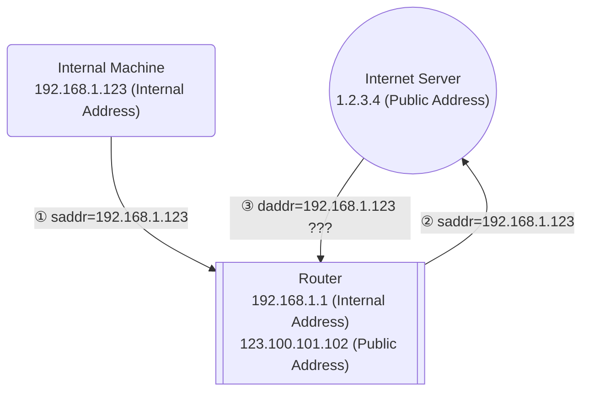

In such a case, you would not receive the packet.

IPv6 uses an extravagant solution since it has an abundant address space: don't use private addresses at all; all addresses are public, and all are unique, so I can find the device directly through the address.

But for IPv4, the allocation of private addresses was precisely because there weren't enough public addresses. How can you give everyone a public address? That's just not possible. So, NAT had to be used to solve the problem of returning the data.

NAT, which stands for “Network Address Translation,” basically does what it says: it's a technology that converts public and private addresses back and forth.

Reviewing the previous four steps, since the server's operation in step three cannot be changed, and the use of saddr as the reply's daddr is necessary, the only solution is to modify the saddr beforehand.

And the router's NAT is precisely doing the SNAT replacement with the public address in step two. This way, the server can fill in the correct daddr for the reply, as shown below:

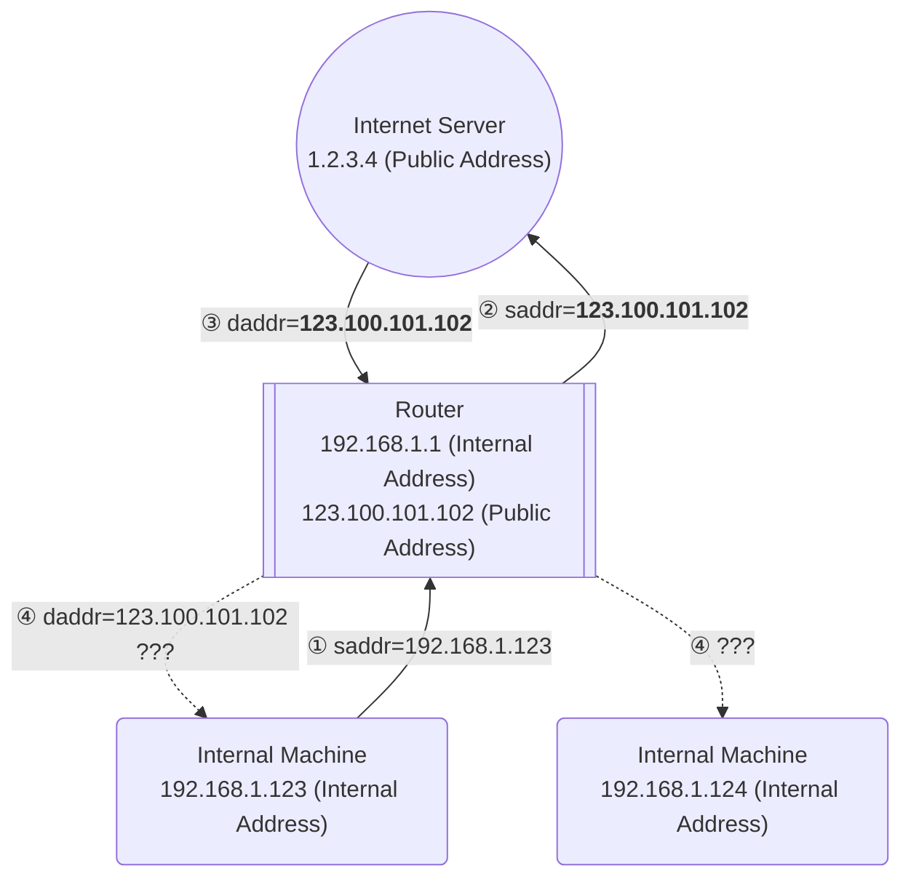

This introduces a new problem: when the packets are returned, the daddr becomes a fixed public address. So if there is another machine in the internal network, how should the reply be routed to which machine?

Luckily, aside from the IP address, there is plenty of other information in the header that can be used, such as the port. The router can bind its outgoing request port to the internal network IP of the sent packet. This way, when the packet returns from the same port, the router can query the internal network IP address at the time of sending and correctly forward it back to that machine.

If you separate the steps of sending requests and collecting replies, we call the former SNAT, or Source Network Address Translation; and the latter, DNAT, or Destination Network Address Translation. These names match the actual processes: SNAT modifies the source address, while DNAT modifies (judges) the destination address.

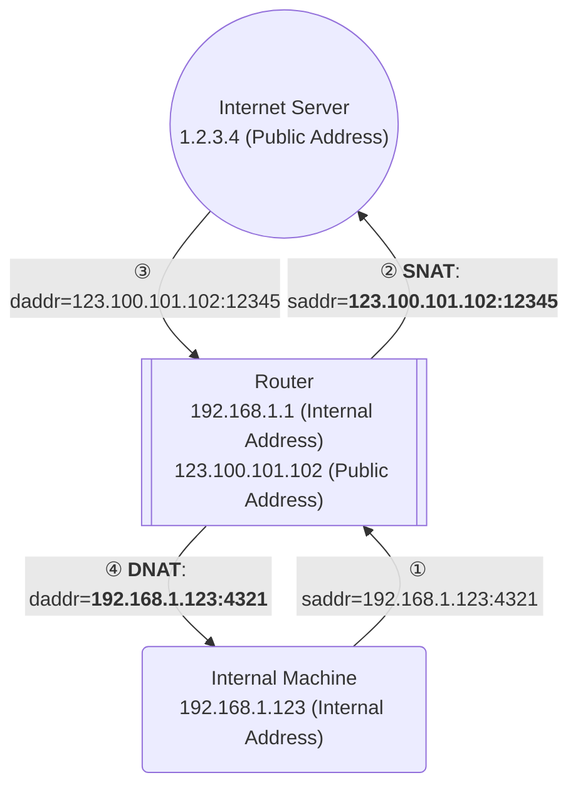

However, for simplicity, SNAT we usually mention actually refers to the entire process of first performing SNAT and then doing DNAT.

In contrast, DNAT refers to firstly performing DNAT and then SNAT – which is when an external address requests through the public network, and your router forwards the request to an internal network machine. Those configuring routers must have seen this function, whose name is “port forwarding”. But this function is not related to this article, so we won't elaborate further.

## Persistently Seeking the Truth

To continue from where we left off, the current situation is that wired networks and IPv6 are unaffected, and only under wireless networking with IPv4 protocol transmission are issues arising. Moreover, the way to solve the problem is to do a NAT on the bypass router again.

To this end, my judgment is that there is a high probability that there is a problem with the NAT function of the main router. This is because the IPv6 network does not need a purely internal address, as all addresses are routable public addresses, so IPv6, which does not require NAT, is unaffected. Since network connections were normal before the bypass router was added, it's reasonable to believe that the change in network structure caused some issues with NAT.

With keywords like NAT, wireless network, and bypass router in hand, I started a new round of searches.

Fortune favors the prepared mind, and finally, in the article [About the problem of the main router's WiFi not being able to access the Internet after setting up a bypass router](https://cloud.tencent.com/developer/article/2036952), I found answers to all the questions. As the last part of this extra-long article, please allow me some time to reinterpret these answers and analyses for you.

### Networking Bridges and iptables

The article provided a key piece of information: for the Redmi AX5 router, there is a virtual bridge between the wired ports and wireless ports, and a setting of a certain kernel variable results in the traffic on the virtual bridge being processed by iptables.

To avoid making this article too long-winded, let's not go into more detail on the concept of a network bridge. You can simply think of it as something that connects different ports of a router together to allow for data transfer, like building a bridge.

For data transmission between different wired ports, the router itself can directly transfer data through internal switch chips. At this point, the router's operating system kernel does not see these data.

However, for the data between wired and wireless ports, because the underlying protocols are different, the CPU must be used for some data conversion. At this time, the router's software kernel will handle these data.

Usually, the kernel just does a simple data format conversion and forwards the data to the corresponding port. Coincidentally, the Redmi AX5 router may enable a `sysctl` configuration under certain specific states:

```ini
net.bridge.bridge-nf-call-iptables = 1
```

And the meaning of this configuration is to make all the data passing through the bridge across the ports go through the iptables firewall.

As we all know (and it's fine if you don't), iptables/netfilter is a firewall with state mechanisms. Its state machine mechanism causes that if it is judged to be part of the same stream of data packets, after the first pass through the nat table for NAT transformation, regardless of the result of the transformation, subsequent packets will use the same transformation scheme.

As for how to determine the same stream, we don't need a detailed explanation. But obviously, if a packet goes through iptables unchanged twice, it will definitely be judged as the same stream.

And if the first pass of the packet is judged by the NAT rule to not require transformation, then when it passes the second time, it will not be judged again and will be sent out without transformation.

### The Coincidences Brought by Network Structure

Now that we have the above information, let's review the network structure mentioned in the NAT section (simplified by omitting the port details):

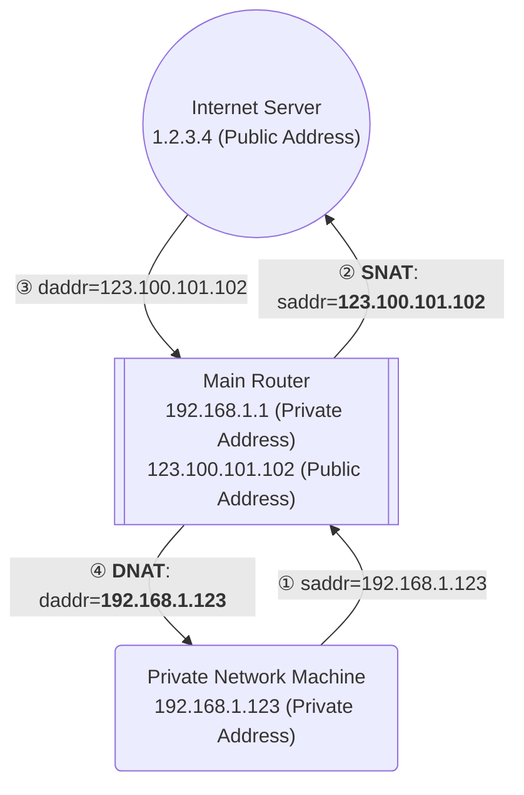

If we add a bypass router into this network structure, then the initial steps of data transmission will change to this:

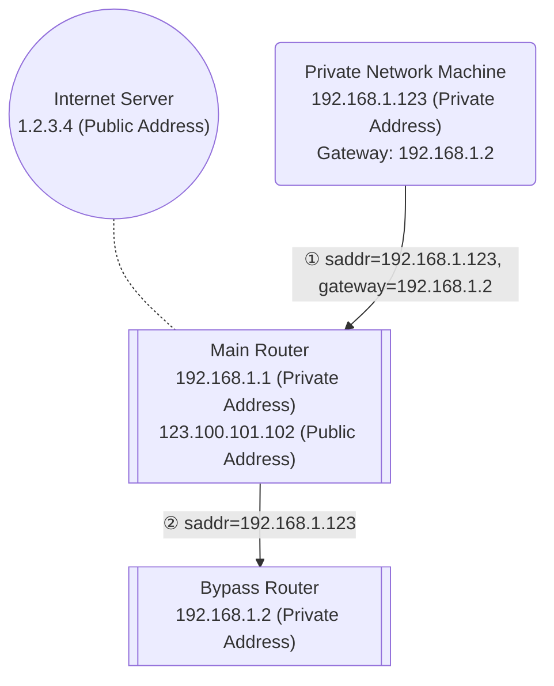

As we can see, because the gateway of the private network machine is set to the bypass router, the packets first pass through the main router and then are forwarded to the bypass router. At this point, given that the bypass router's IP is also a private address, the main router decides that NAT is not necessary.

If the private network machine and bypass router are connected to the main router through wired connections, then this packet will not be processed by the iptables of the main router, and there would be no issues. However, when the private network machine is connected to the main router via a wireless network (including Mesh connections), that's where the problem arises: iptables processes this packet. Although it correctly forwards it to the bypass router, it also remembers one thing—this packet does not need NAT.

Let's continue a few more steps, and the problem will become apparent:

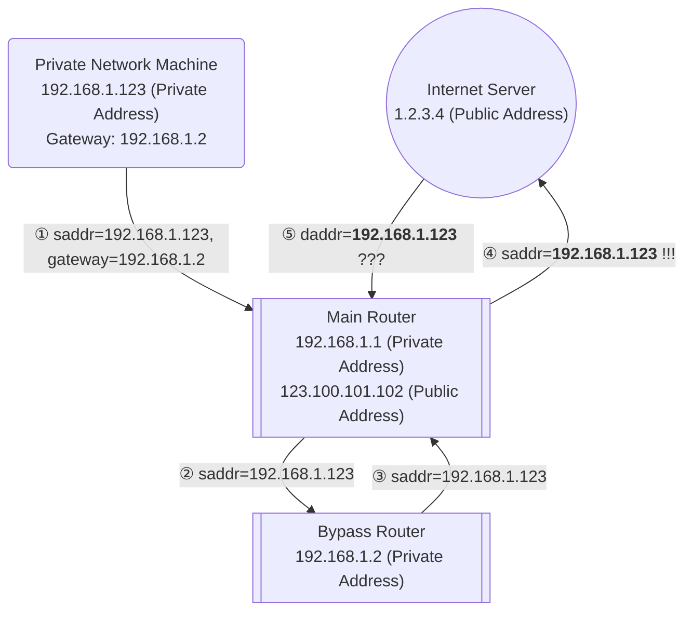

Because the bypass router is the gateway for the main router, after processing the packet, it will send the packet back to the main router. Normally, the main router should perform a NAT transformation when it detects that the packet is bound for the internet. However, because of the state mechanism, the main router thinks that this packet is part of an earlier stream and does not require transformation—so the main router does not modify the saddr and sends this packet to the internet (as shown in step four `!!!` above).

What follows is exactly like the scenario without NAT described in the NAT section: after receiving the packet, the server sends out a response packet with the saddr as the daddr. However, because the daddr is a private address, the server on the internet is perplexed and doesn't know where to send the packet, so it can only discard it (as in step five `???` above). Meanwhile, neither the router nor the private network machine will ever receive this response.

### It's DHCP Again!

Is the router really so unintelligent that it cannot handle such scenarios? Of course not. In fact, as long as we prevent traffic on the bridge from being processed by iptables, the NAT results won't be cached, and the problem described earlier will be solved.

In the article above, the author also analyzed how the Redmi AX5 router handles this situation.

In summary, Xiaomi routers actually perform some checks. If at least one of the IP configuration items in the DHCP's DNS or gateway is not the router's own IP, it will use sysctl to disable the feature that processes bridge traffic with iptables.

Here, DHCP might seem abrupt, but upon closer consideration, it's quite logical: the feature in question is clearly designed to optimize NAT performance, reducing NAT judgment; however, in the presence of a side gateway (let's temporarily refrain from using the term "side router," as the gateway is indeed needed here), this feature would obviously cause problems. The two DHCP configurations direct some network traffic to an IP outside of the router, indicating that there's likely another side gateway in the network, and traffic to reach this side gateway would be forwarded by the router.

So, Xiaomi's router cleverly avoids this issue: as long as the DHCP service is normally activated and the default gateway is correctly configured, all traffic can be correctly NAT-ed.

Even if there is some reason that prevents us from activating the DHCP service or adjusting this setting on the Xiaomi router, there is still a final solution: SSH into the router and directly modify the script that handles the corresponding logic. Although it might affect stability, it at least solves the problem.

The phenomenon now observed on Linksys routers is strangely consistent with that on Redmi AX5. While I haven't actually captured packets, it's almost certain that this is the issue encountered here.

Since Xiaomi routers have this logic, it might be reasonable to believe that Linksys routers could also be configured similarly.

Is that so?

### Seems... Not Possible?

By now, you might have almost forgotten the previous content, so let me remind you: at the very beginning of the article, I introduced one of the major issues with Linksys routers: The DHCP server can't set the default gateway!

This problem prevents me from enabling the DHCP function on the main router in the network environment I configured; enabling it would make it impossible to automatically set the default gateway to the bypass router. Consequently, this function had to be enabled on the bypass router instead.

Previously, this issue might have seemed minor, at most causing the network restructuring to be a bit more cumbersome. But now, it has become a very critical problem, directly causing us to lose the approach to properly configure NAT through DHCP.

In other words, whether or not Linksys routers have the above logic, DHCP cannot be turned on now, so there's no way to verify or resolve the issue.

Moreover, the ultimate solution for the Redmi AX5—directly SSH into the router and modify the code—is also not applicable here. As mentioned before, perhaps for stability considerations, Linksys routers do not even open the SSH port and do not expose any relevant settings in their interface.

It seems that this road has reached a dead end, but reverting briefly, we realize that we seemed to have solved the problem by modifying iptables settings on the bypass router. So what was the solution at that time, and what are the side effects?

### How Bypass Router NAT Solves the Problem

As was explained earlier, the iptables command on the bypass router:

```shell
iptables -t nat -I POSTROUTING -j MASQUERADE
```

is essentially an SNAT rule. `nat` and `POSTROUTING` involve the implementation of iptables tables and chains, but we can simply understand it as a filter for the time being; `-j MASQUERADE` essentially performs the same function as `-j SNAT`, which is to apply SNAT to the packet. The difference is that `-j SNAT` requires specifying an address manually, while `-j MASQUERADE` automatically uses the network card's address for the transformation.

After setting this rule, all packets will have their saddr changed from the IP of the private network machine to that of the bypass router. The main router will no longer regard this modified packet as part of the earlier packet stream but as a new packet, thus performing NAT on it once more, which circumvents the issue of not performing NAT for the packet.

When the server sends back the response packet, since the main router recorded that the original packet came from the bypass router, the response packet is also forwarded to the bypass router. The iptables on the bypass router, having set up the `MASQUERADE` rule, will record a correlation like the main router and will yet again forward the response packet, which came from the main router, to the private network machine that initially sent out the request. Hence, a complete path is formed, and the private network machine can receive the correct packet.

At this point, the data flow is probably like this:

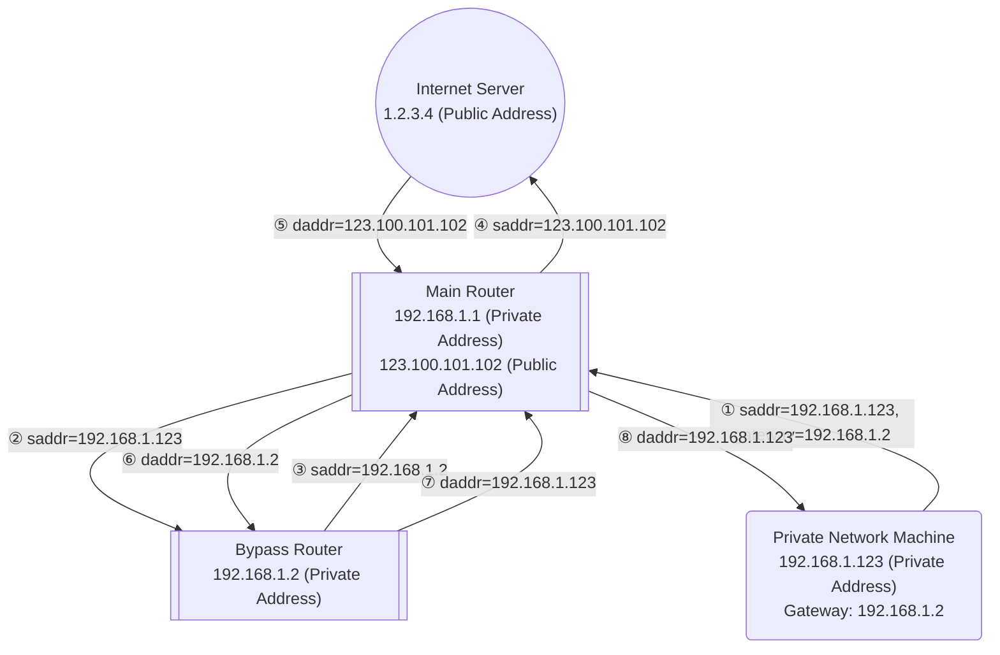

This is probably the most complex diagram in the article; I hope you can understand it. However, it's also okay if you don't. In short, the outgoing packet has traveled from the private network machine to the main router to the bypass router to the main router and finally to the server; the response packet then makes its way back through the whole route in reverse.

In this solution, the bypass router finally assumes a veritable role: it completes the NAT transformation between the main router and the private network machine. Apart from being in the same private network and all traffic passing through the main router, it functions almost like a secondary router under the main router.

### Side Effects of Bypass Router NAT

The problem is solved, but this is not the best solution.

As mentioned earlier, the response packets actually make a full round-trip journey.

For traffic that is routed through proxy software, since it is akin to the bypass router issuing a new request, it won't be affected by whether SNAT is applied or not, and will always go through this complete route. However, for ordinary non-proxy traffic, we would prefer the return journey to go directly from the main router to the private network machine, instead of passing through the bypass router again, which introduces unnecessary overhead with two additional packet forwards.

The original plan that prohibits bridge packets from passing through iptables would have achieved this. But given Linksys's overly conservative features, it appears we might be out of options to implement this plan.

After verifying all the above content, I still chose to return the product. I was thinking of directly switching to a Xiaomi router, but after some thought, I ordered several Netgear routers, planning to take this opportunity to try out routers from different brands and step into more pitfalls.

After all, for those who like to tinker, it's the experience of overcoming these challenges that brings the most fun to life.

:::danger[But please heed my warning]

Don't mess with networking; it can lead to unhappiness.

:::
