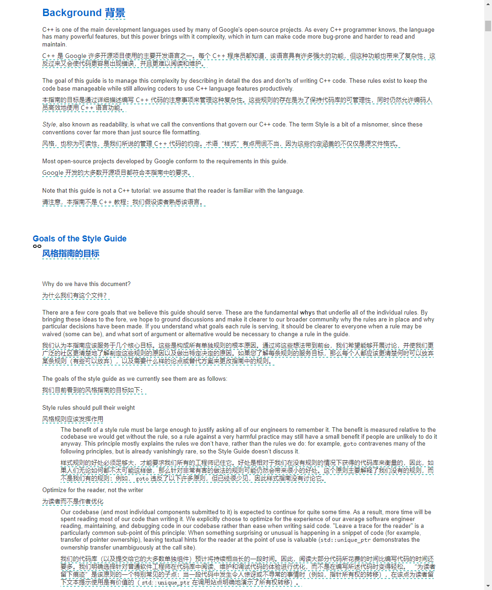
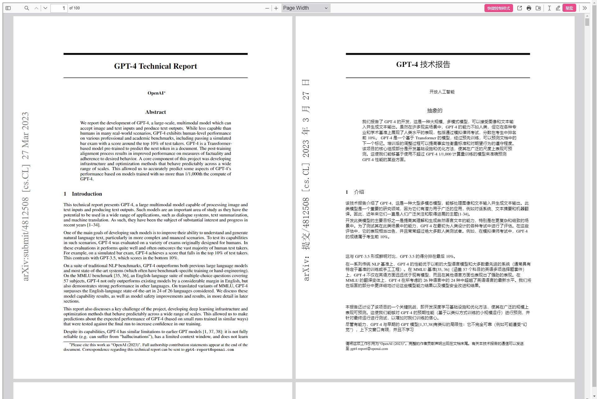
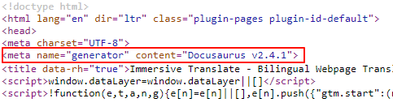

:::info[Translation Tool]

This article was translated by ChatGPT automatically, with minor manual corrections.

:::

Recently, I haven't been feeling great, so I've decided to write about some simpler topics.

Here, I recommend a browser extension: Immersive Translate. It satisfies almost all of my expectations for a translation plugin, except for the lack of OCR functionality and the inability to translate some special PDF documents. It meets nearly all the main needs in work and life, and the way it retains the original text in translations is far superior. In addition, it can flexibly integrate various translation interfaces (the feature of integration itself is free!), making it the most useful browser extension I've encountered so far, bar none.

Its official website is [here](https://immersivetranslate.com/), and you can go check it out for yourself.

As for how much I recommend this plugin, it might be evident from the signature on my work Slack:

<!--truncate-->

:::note[About delaying posts]

I haven't updated for more than a week, not because I've lost interest after three minutes, nor because I have nothing to write about, but rather because I've been truly exhausted over the past week.

I'm not sure if it's due to physical reasons or if I'm just overworked, but I've been experiencing persistent chest pain for the past few weeks, accompanied by radiating pain in my left shoulder and excessive night sweats. At times, the symptoms are severe enough to wake me up in the middle of the night, and my sleep quality is poor. After conducting a 24-hour ECG, I intended to see a doctor over the weekend as I was too busy during the week. However, after the last meeting before clocking out on Thursday, I suddenly couldn't move and slumped in my chair—I couldn't delay any longer and took an urgent leave on Friday morning to seek medical treatment.

The good news is that the 24-hour ECG didn't show anything abnormal; the bad news is that the doctor couldn't guarantee there were no issues, so they also ordered a coronary artery calcium CT scan.

After continuing to work overtime on Friday afternoon until late, I finally got a chance to breathe. I didn't feel recovered at all on Saturday and only now am I feeling a bit better to casually write something simple.

In this state, not to mention writing blog posts, I couldn't even complete my regular household chores. On one hand, I hope there's nothing wrong with my body, but on the other, I sort of hope that some minor issue is found so that I may get some more rest…

:::

## Translation that Retains the Original Text

The most important feature of this plugin is the web page translation mode that retains the original text.

Without further ado, let's look at a translation example. The web page is from [Google C++ Style Guide](https://google.github.io/styleguide/cppguide.html), and the translation interface used is Google Translate.

You can see that compared to the method that directly replaces the webpage content, this translation approach allows us to more effectively compare the translation with the original text. This is particularly useful when translating technical documents to prevent certain words from being inaccurately translated into non-technical contexts, such as the words string and thread.

Even for everyday translations, when the translation interface isn't 100% reliable, this also allows us to understand parts of the translation that heavily reflect the "translation style" by quickly referencing the original text.

A simple inspection with F12 shows that this plugin inserts translations by adding the `` inline tag in each block. There are also some subtle techniques, such as not inserting ` ` inside `` for shorter `<h>` tags, but adding a ` ` at the start of `` for longer paragraphs to achieve line breaks. In the screenshot, "Background 背景" and the subsequent text represent these two cases.

## Support for a Variety of Translation Interfaces

Another strength of this plugin is its support for almost all translation interfaces you can think of, including the paid interfaces of DeepL and OpenAI. Of course, while the integration itself is free, you still have to pay for the interface—though there are better strategies, which I will mention later.

To date, what I consider the best full-text translation interface is undoubtedly ChatGPT. Those who have read my previous posts know that my blog uses ChatGPT to complete [i18n](/blog/adding-i18n-for-a-docusaurus-site/) translation. If you haven't read about it, no worries; you can try switching languages in the top right corner right now.

In most cases, the translation results from ChatGPT are comparable to human translation—at least better than my own. Moreover, I've found that in the Chinese version of my previous blog posts where I made typos, ChatGPT was able to help me correct them during the translation.

As for support of the OpenAI API, Immersive Translate maximizes openness, offering not just basic model selections, but also custom prompts, switching between different third-party services (such as Azure which directly offers the ChatGPT API or Moonshot that simulates the ChatGPT interface), and various configuration options including rate limit adjustments.

Of course, if you always use ChatGPT for translation, aside from the cost being potentially overwhelming, the translation speed is limited by the frequency of API calls and speed of returns, which may not be entirely satisfactory. Therefore, my personal practice is to use Google Translate for everyday purposes and switch to the ChatGPT interface for particularly tough pieces of text. Since the plugin is well optimized, it only translates text near the current webpage's display position, so there's no need to worry about translating a long document entirely.

Perhaps the only pity is that when I tried using Moonshot's interface for translation, the actual number of requests exceeded the limit of one per second, inevitably triggering rate limiting and failing to complete the translation, so I couldn't take advantage of that free quota.

## Local Document Translation Feature

In addition to translating web pages, this plugin also provides excellent local document translation capabilities.

You can see the supported translation methods from the plugin menu:

Here, e-book and subtitle file translation are not commonly used, and there are too many alternatives to HTML/txt translation. Therefore, PDF translation is the feature I use most frequently.

Let's demonstrate the translation effect with an example. The original document is from [OpenAI's paper about GPT-4](https://cdn.openai.com/papers/gpt-4.pdf):

You can see that whether it's regular paper text or sidebar arXiv information, the plugin manages to translate correctly. In fact, I've previously used it to translate some PDF slides from Intel/AMD about CPU introductions, and the results were quite impressive. Unfortunately, I don't have those documents on my home computer to show here.

One potentially tricky aspect about this feature is the way it opens files—it's located in the little button cluster in the top right, looking more like a "share" button than an "open" to the left of the "print" button. Many people I've recommended this plugin to have asked me how to open local PDF files. However, the instructions in the document guide at the bottom do mention this the first time this functionality is opened, so it seems everyone has simply been too careless.

Moreover, this plugin might be unable to handle some special PDFs or even some DVI files. I reported this issue via email, and the response was that indeed, they are not supported. Common symptoms of these files include copying content only to get a string of gibberish... While I've used LaTeX for a while, I'm not too knowledgeable about these output formats, so it probably is quite difficult to support.

## Sustainable Profit Model

For outstanding open-source plugins like this, I usually have two somewhat conflicting concerns: one is whether the author can afford to maintain it without sufficient income, and the other is whether the author might gradually make key features of the plugin proprietary for the sake of income.

Fortunately, the Immersive Translate plugin has defined a profitable model that seems quite favorable. For users who haven't purchased ChatGPT and DeepL interfaces themselves, they can directly use the plugin server's backend to call ChatGPT or DeepL for translation by buying its membership. The membership fee for the plugin is roughly equivalent to purchasing a DeepL Pro membership, while ChatGPT is pay-as-you-go, making it hard to compare.

The plugin itself handles a large volume of translation requests, many of which are repetitive. The plugin server caches these requests to reduce the actual calls made to the interfaces, thereby earning a profit margin.

As we know, purchasing DeepL and ChatGPT memberships in China is not straightforward. For those who indeed have needs, purchasing the plugin's membership can save a lot of trouble, and it's a win-win situation.

I've always liked tools that create [Pareto improvements](https://en.wikipedia.org/wiki/Pareto_efficiency).

## Easter Egg

Beyond the main features introduced above, this plugin comes with a wealth of configuration options, many of which can improve the translation experience according to user needs. It's very much worth trying.

A little Easter egg is that the [homepage](https://immersivetranslate.com/) of this software, like SQYBI.com, is built with Docusaurus. The evidence lies in the website's meta information.

