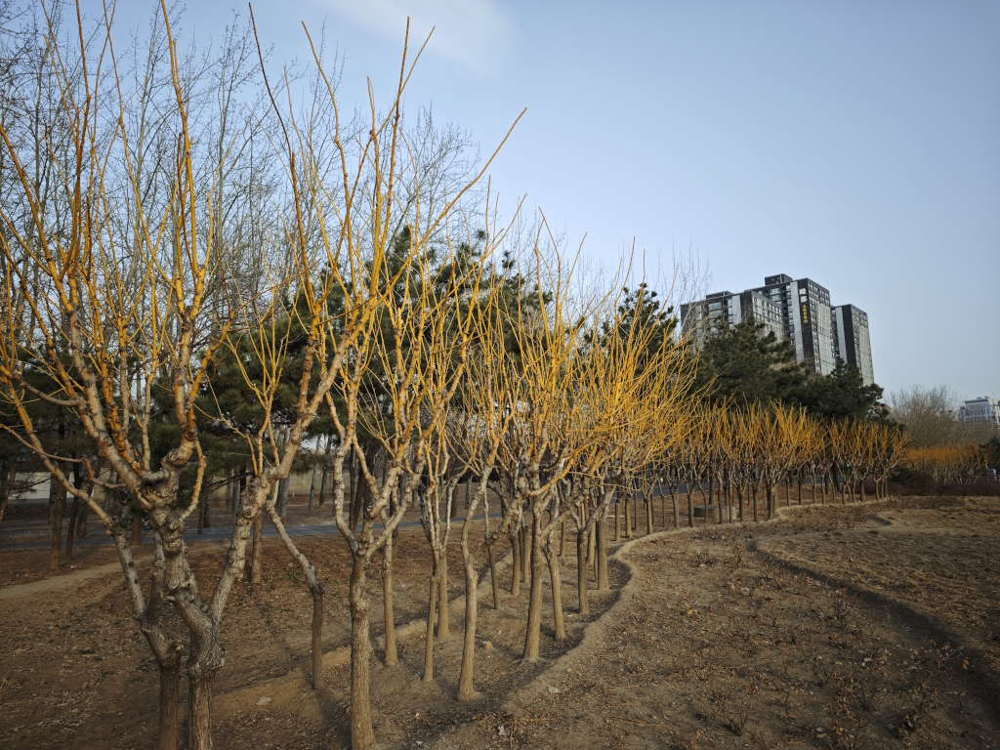
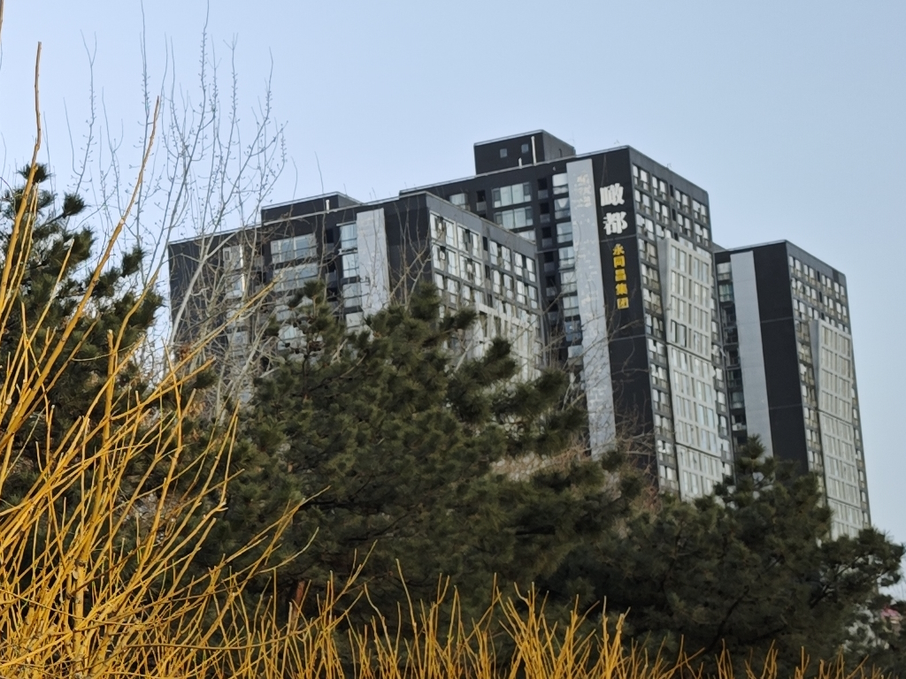

> (This article was translated by ChatGPT automatically.)

> To view other articles in the series, please use the tag to jump to the article directory page: [#from-taking-pictures-to-photography](/blog/tags/from-taking-pictures-to-photography/).

In this article, we continue to introduce a few remaining basic camera parameters from the last article.

<!--truncate-->

## Other Basic Parameters of Digital Cameras

### Focal Length

Even readers with little knowledge about photography have probably heard terms like "wide angle" and "telephoto"—after all, with smartphones, especially high-end ones, increasingly resembling professional photography equipment, these terms are also increasingly appearing in our daily lives.

As a basic piece of knowledge, the focal length primarily affects the size of the subject in the frame at the same shooting distance. Generally speaking, the longer the focal length, the larger the value, meaning closer to the "telephoto" end, the larger the subject appears in the frame; conversely, the shorter the focal length, the smaller the value, meaning closer to the "wide-angle" end, the smaller the subject appears, and less content is encompassed in the frame.

For example, a photo near the wide-angle end might look like this:

The same photo, if taken with the telephoto end aimed at the building behind, may look like this (here, for demonstration, cropping is used to indicate the effect, not actual telephoto shooting, but the effect is similar):

This comparison should be enough for everyone to understand the difference between wide-angle and telephoto.

As for light, generally, with a constant aperture, there is no correlation between lens focal length and the amount of light entering. That is, lenses with different focal lengths let in almost the same amount of light under the same aperture.

If you're just using a camera, remembering this conclusion is sufficient. If you're curious why this is the case: because the f-number actually equals the ratio of focal length to the pupil diameter. That is, in the definition of the f-number, the impact of focal length on the amount of light has already been eliminated. For more on the principle, you can refer to: [The Relation between Lens Focal Length, Aperture, and Light Entering](https://zhuanlan.zhihu.com/p/38354785).

### Ambient Light Intensity

You might wonder why ambient light intensity is listed as one of the camera parameters when it clearly has nothing to do with the camera itself.

A more accurate term here might be "ambient light intensity measured by the camera." On one hand, this relates to the ability of the camera's sensor to receive light, such as the design of the sensor pixels, the size of the sensor, the filter on the sensor, and the coatings on the lens, which can lead to different cameras receiving different amounts of light under the same lighting conditions; on the other hand, it relates to how the camera calculates the intensity of light, that is, the metering mode—after all, the camera can only know how much light each pixel receives, but the overall intensity of light in the frame is not necessarily the average value of these pixels.

Of course, the simplest metering mode is to take an average of all pixels—this is generally known as average metering. Some more specialized metering modes, such as spot metering and center-weighted metering, are more heavily influenced by the light intensity at the manually specified focus point or the center of the frame.

Fortunately, the default metering modes for modern cameras (such as "multi-segment metering" or "evaluative metering") are fairly complex and can give a relatively accurate ambient light brightness by applying certain algorithms to partition the image and then calculate the weighted average, which is sufficient for most scenarios. As beginners, there's no need to delve into specific metering principles, just be aware that in certain special cases, you may need to change the metering mode to get a more accurate measurement of ambient light intensity—for instance, when photographing a candle flickering against a pure black background, perhaps choosing the candle for spot metering is a better approach.

Beyond metering, it's important to understand that the ambient light is one of the key factors determining the quality of photos! Apart from special scenes like a photo studio, most of the time, flash and fill light can only assist, while finding the right direction, intensity, and color of ambient light makes it easy to take good photos.

Therefore, even when you're not carrying professional photography equipment in daily life, observe the light and shadow of objects around you and judge which are "good looking." Doing so will gradually increase your sensitivity to light, which is very helpful for improving photography skills.

### Exposure Compensation

We've mentioned ambient light intensity, but not how the camera uses it.

When I first encountered digital cameras, one of the most puzzling functions was "exposure compensation." It’s actually not a "compensation" at all, but rather a feature that achieves a specified screen brightness in automatic or semi-automatic modes by adjusting certain parameters (such as shutter, aperture, ISO, etc.).

So, a more appropriate name might be "expected screen brightness" (in automatic mode) or "current screen brightness" (in manual mode)—that is, the brightness measured by the metering mode mentioned in the previous section. Of course, to ensure compatibility with most photography equipment, I won't coin a new term here, and in subsequent articles, I will continue to properly use the term "exposure compensation."

Exposure compensation is typically expressed in EV (exposure value). When the compensation is set to 0 EV, it means that the current light intensity is positioned between the brightest white and the darkest black (but this does not mean that 50% of the light is received, rather it is about 18%, which will be explained in detail in the section on tonality).

Remember the "stops" mentioned in the previous article? Every time the exposure compensation value is increased by +1, it means that the light intensity has increased by one stop. This could be a doubling of the shutter time, a doubling of the ISO, or a reduction of the f-number to 1/1.4 (refer back to the calculation of f-number stops in the article: [From Taking Pictures to Photography (01): Basic Parameters of the Camera](/blog/from-taking-pictures-to-photography-01/#struggling-with-calculation-let-stops-help)). Conversely, if the exposure compensation value is -1, it means that the light intensity has decreased by one stop. In other words, a change of 1 EV means that the overall brightness of the photo also changes to either twice or half the previous value.

Because a change of 2 stops can be too dramatic, the minimum increment for camera EV is typically 1/3. Each increase of 1/3 EV makes the light intensity approximately $2^{1/3} \approx 1.26$ times the original. And after increasing by three 1/3 EVs, which is 1 EV, the light intensity naturally becomes $1.26^3 \approx 2$ times greater. Of course, you don't even need to remember this; knowing that adjusting EV can change the brightness is enough.

However, it needs to be stressed again: cameras adapt to the EV by adjusting parameters in automatic modes.

For example, in a certain scene, using the camera's aperture priority mode with the aperture fixed at f/2.8, ISO set manually to ISO 100. At this point, the only adjustable parameter is shutter speed. Suppose at -1 EV the shutter speed is 1/100s, but now you feel the brightness is too low and you need +2 EV exposure compensation to change the screen brightness to 1 EV—no problem. The camera will achieve the effect of 1 EV by slowing down your shutter speed 4 times ($2^2 = 4$), making the new shutter speed 1/25s.

But this is not without cost. Since the shutter is too slow, if the camera is not on a tripod or your hand isn't steady, you will find the picture is blurred. In this case, a better approach would be not to rely solely on the adjustment of exposure compensation, but to manually increase the ISO to ensure a fast enough shutter speed. While higher ISO may bring more noise, remember that this noise can be removed to a certain extent in post-processing. And even if it can't, "capturing" is always more important than "capturing well." Photos with more noise may not look as clean, but a blurred photo is fundamentally unusable.

In summary, once you understand the law of reciprocity, I recommend all beginners to use manual mode with a fixed ISO as much as possible in early stages of learning photography, rather than aperture priority and shutter priority modes, or even full auto mode. In such modes, adjustment of exposure compensation is ineffective (because there are no parameters that can be adjusted automatically). However, the camera will output the current metering result in terms of EV, which can serve as a reference for the screen brightness.

This may take up more of your time adjusting camera parameters in the early stages, and you might even miss some decisive moments. But I believe it's worth it, as you will learn very quickly about the effect of each parameter in different scenarios. When you are clear about which parameters can be adjusted and which cannot in different scenes, you can then use the other modes mentioned above to achieve quicker shots. I will also introduce the application scenarios of these modes in detail in subsequent articles.

### Sensor Size

Generally speaking, as a photography newbie, you probably only have one camera, and it's very likely a full-frame or APS-C crop sensor camera.

I recommend waiting until you have both full-frame and crop sensor cameras before delving into the functions of sensor size. Here, I will just list some of the basic knowledge about sensor size:

- Sensor size can simply be understood as a crop of a larger sensor size. For example, the APS-C size is a crop of about $(1/1.5)^2$ or $(1/1.6)^2$ of the area of a full-frame sensor (where 1.5 / 1.6 is the ratio of the diagonal lengths; different coefficients exist because APS-C sensors from different manufacturers may vary slightly in size).
- From the "focal length" example in the above text, it can be seen that cropping is basically equivalent to changing the focal length.
  - Cropping an image frame and cropping sensor reception is not much different, so full-frame cameras can typically simulate crop sensor cameras by cropping part of the sensor's frame.
  - However, the focal length obtained through cropping is different from the native focal length; cropping can only affect the size of the objects in the frame, but cannot affect the depth of field and perspective already captured in the frame. What depth of field and distortion are will be introduced in later articles.
- Due to some historical reasons, lens parameters such as focal length are defined based on full-frame cameras. For ease of understanding, crop sensor cameras will mark two focal length parameters on their lenses: actual focal length and equivalent focal length. The equivalent focal length indicates "after the crop sensor camera crops, the size of the object is equivalent to the size of the object shot by a lens with what focal length on a full-frame camera," while the focal length parameter indicates the lens's own focal length.
  - Equivalent focal length only affects the size of objects in the final image.
  - Focal length affects the actual bokeh effect and perspective; the detailed content of bokeh and perspective will be introduced later.

## Summary

In this article, you have learned:

- The closer the focal length is to the telephoto end, the greater the value, the longer the focal length, the larger the object appears in the frame, and the less content the frame contains, which is usually referred to as "shooting far."
- The closer the focal length is to the wide-angle end, the smaller the value, the shorter the focal length, the smaller the object appears in the frame, and the more content the frame contains, which is often referred to as "shooting wide."
- Ambient light is a very important factor in photography that directly affects the good or bad of the photo.
- Cameras can measure ambient light intensity through metering, and the default metering modes of modern cameras can already adapt to most scenes.
- Exposure compensation is not a kind of "compensation," but adjusting automatically configured parameters to achieve the effect of enhancing the camera's brightness.
- Every +1 EV of exposure compensation means that the screen brightness becomes twice as much as before, also equivalent to doubling one of the parameters (but the camera may adjust multiple parameters to achieve the same effect).
- Adjusting exposure compensation comes with costs, such as a too slow shutter speed resulting in a blurred image; beginners are recommended to use full manual mode, including manual ISO, in the early stages, where exposure compensation is ineffective, but can refer to the EV value measured by the camera to judge screen brightness.
- In the lens parameters of crop sensor cameras, the equivalent focal length only affects the size of objects in the frame, while the focal length affects bokeh and perspective effects; because of certain historical reasons, these sizes and effects are all compared based on full-frame cameras.

In the next article, you will learn:

- How focal length and aperture affect depth of field
- How focal length affects perspective and distortion
- How focal length affects stability when shooting handheld
- Native sensitivity and dual native sensitivity
