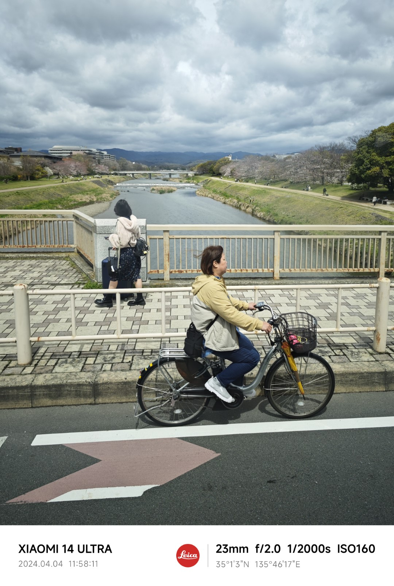
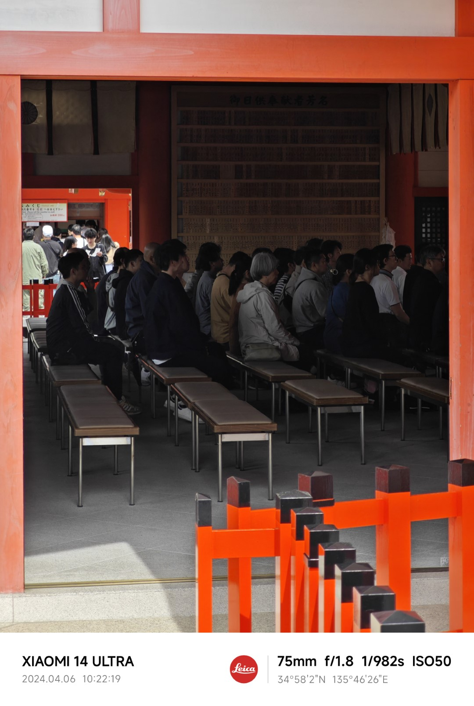
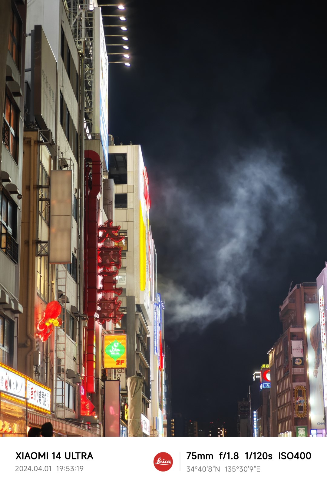
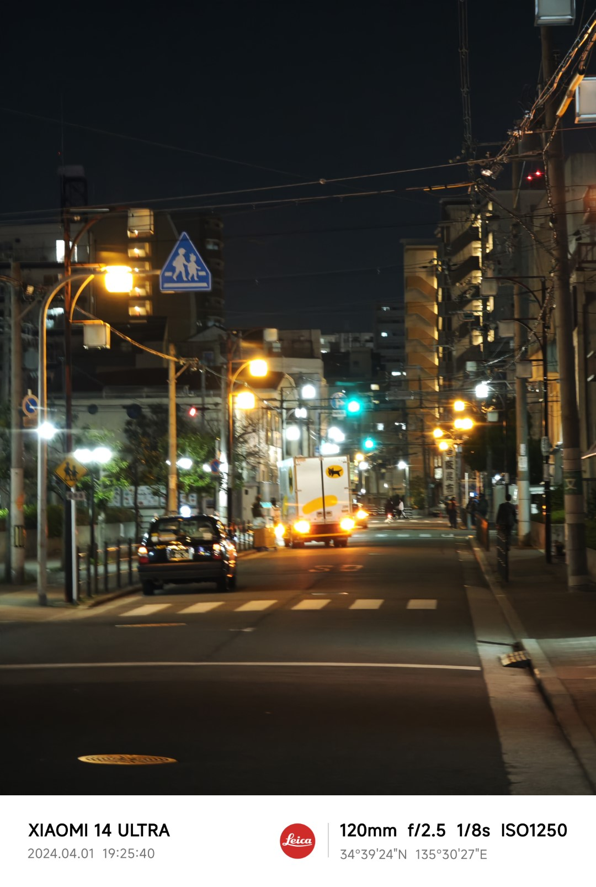

:::info[Translation Tool]

This article was translated by ChatGPT automatically, with minor manual corrections.

:::

Over a month ago, I got my hands on the Xiaomi 14 Ultra (along with its photography handle kit), replacing the Xiaomi 12 Pro I had been using.

On one hand, my previous phone was somewhat lacking in performance — severe frame drops with certain games, especially worsened when using WeChat's video call in the background, made it clear that it was time for an upgrade.

On the other hand, the photography-focused direction of the previous Xiaomi 13 Ultra models did impress me. However, I noticed some design flaws and chose not to purchase it. At the latest release event, it was apparent that the previous issues, especially the balance of the device, had improved significantly in the 14 Ultra.

Moreover, I have increasingly realized that not every moment of a trip is suitable for carrying a camera. Given the maturity of mobile photography, it serves well as a casual alternative to a standard camera. This sparked a stronger need in me for a phone with superior image quality.

All these reasons combined led me to purchase the Xiaomi 14 Ultra at its launch. Coincidentally, some recent changes at work gave me nearly two weeks off, which I used to visit Japan and thoroughly test the pros and cons of this phone.

Overall, this smartphone has many advantages. It aligns with various reviews, whether in glowing or regular articles. From its large aperture and sensor size that enhances low-light performance to the great one-click photo quality achieved through Leica color tuning, and the various video optimizations, anyone who has used this phone would likely agree.

However, the upcoming sections will focus more on some of the phone’s minor drawbacks. This does not mean it isn't an excellent phone, but its specialized focus makes it less suitable for everyone or perhaps even the majority of users. If you are its target audience, these drawbacks might be minor; if not, any one of these issues could be a dealbreaker.

The right fit is the best fit.

<!--truncate-->

## Choosing Within the Xiaomi 14 Series

First off, choosing Xiaomi over brands like OPPO/vivo, which also focus on flagship photography, was largely due to my long history with Xiaomi devices—a switch in brand could mean a painful data transfer process.

After a few years of switching data and apps between an iPhone and back, I continued using Xiaomi, primarily due to how well its product philosophy aligns with my needs: it may not always shine, but its weaknesses are minimal.

Thus, this discussion isn't about choosing between brands but rather about why I chose the 14 Ultra over the 14 or 14 Pro within Xiaomi’s latest offerings.

### Xiaomi 14, a Flagship Compact Phone

Starting with the Xiaomi 14, this device makes a bold statement in the niche market of compact phones. Despite its small size, it manages to rival the 14 Pro in terms of features and design—I was almost tempted to purchase it right away before the 14 Ultra launched. Ultimately, I waited.

A friend who joined me on the trip uses the Xiaomi 14 as his main device. Although its main camera doesn't boast a one-inch sensor like the 14 Ultra, its performance in low light was surprisingly adequate. The difference in image quality between the telephoto capabilities of the JN1 sensor in the 14 and the IMX858 in the 14 Ultra was barely noticeable, at least on a smartphone screen.

The only real downside to the Xiaomi 14 (and 14 Pro) in travel photography might be the lack of a 100mm+ telephoto lens. However, for social media purposes, a 75mm equivalent 3x zoom, further cropped, is more than sufficient for most situations.

If there’s no pressing need to use your phone as a primary camera, then the Xiaomi 14 is my highest recommendation for everyday use.

### Xiaomi 14 Pro, Is the Larger Screen an Advantage?

Regarding the Xiaomi 14 Pro, a kinder description would emphasize that it shares nearly identical specs with the 14, catering to those who prefer larger screens. Less kindly, it could be said that it offers little over the 14 in terms of distinguishing features.

Frankly, I prefer compact phones, so it's a matter of personal preference.

### Xiaomi 14 Ultra, Differentiation and General Utility

The 14 Ultra sets itself apart from the 14 Pro by offering distinct features. For one, its larger aperture and one-inch primary sensor provide a psychological boost, making you feel like your photos have improved, even if the actual shooting experience isn't drastically different in most scenarios. Furthermore, the added 5x telephoto lens is perfect for travel, offering focal lengths for common shots and a sense of compression, while the slightly wider angle lens… I admit I'm not adept at using it, but every millimeter has its purpose, and perhaps someone can appreciate its minimal distortion and utilize it effectively.

A significant improvement over the 13 Ultra is the redesign of the previously top-heavy balance. Although I didn't buy the 13 Ultra, I've handled it enough at Xiaomi stores to know it was impractical for everyday use as a phone. The 14 Ultra, however, has addressed this with a more balanced design, making the huge camera module less of an issue, though the phone’s overall weight and the ease with which the lenses get smudged remain drawbacks.

Despite these problems, I wouldn’t recommend buying this phone just to use it solely as a phone. But given the improvements from the 13 Ultra, it’s now at least usable.

If there’s one particularly frustrating shortcoming, it might be the stabilizing system in the lens module. While it's normal for there to be some movement, the extent of it in the 14 Ultra was unnerving; I’ve never encountered a phone or camera with such audible jostling before.

Exaggeratedly, if you used your phone in a quiet study area, I suspect the sounds from the stabilization system might get you kicked out.

### How to Choose Between the Three Models

In conclusion, choosing between these three models comes down to:

1. Confirm whether you are a photography enthusiast who needs a phone to replace a camera in certain scenarios, rather than just wanting to use a phone to capture some moments in life. If your purpose is to use the phone as a replacement for a camera, then you might consider the 14 Ultra; but if not, then I think there's not much significance in purchasing the 14 Ultra.
2. If you prefer compact phones, the 14 should be your first choice. What reason would a compact lover have not to choose it?
3. If you aren’t fond of small screens but also don’t rely on your phone as a primary camera, consider the 14 Pro.

## Experience with the Photography Handle

The photography handle really catches the eye. However, in practice, I found it less useful than expected.

### Major Advantage of the Photography Handle

The main benefit is the satisfaction of using the adjustment dial and joystick. My configuration uses the dial for EV adjustments and the joystick for zoom control between fixed focal lengths (0.5x, 1x, 2x, 3.2x, 5x), rather than smooth scaling, which suits my shooting style. Generally, I recommend using zoom lenses in this fixed manner when starting out with photography to quickly learn the visual scope, compression, and spacing of different focal lengths, laying a solid foundation for eventual use of prime lenses.

However, this usability is partly because Xiaomi’s camera interface doesn’t offer a comfortable way to adjust EV or focal length. Particularly with the Leica color tuning in this generation, accurate EV adjustment is crucial while shooting, and having to manually drag an EV slider far from the shutter button is less than ideal.

### Shutter Button is Less Effective Than Touch Control

The handle’s shutter button was a disappointment.

It has a long travel and requires significant pressure. Given that the left hand must not obscure the lens and the handle’s slippery faux leather material, pressing the shutter almost inevitably shifts the phone slightly, often ruining the intended framing.

As a result, I found myself mostly using the touchscreen to activate the shutter, highlighting a significant design flaw in the handle.

### Additional Highlights of the Handle Design

Aside from the dials and buttons, the handle boasts other smart design elements.

It pairs with a special faux leather phone case, which has a cutout on the back to attach securely to the handle. Intriguingly, this cutout aligns perfectly to display the Xiaomi logo on the back of the phone—an amusing detail likely to delight anyone seeing it for the first time.

Moreover, surrounding the camera module on the case’s back, there is a removable metal ring. This ring not only comes in various colors (my white case included both silver and gold rings) but can also be exchanged with an adapter ring for attaching camera filters. While I haven’t used this feature, it fits into the category of "nice to have."

### Consistently Poor Quality Control

Unfortunately, the handle does not escape Xiaomi’s usual issues with quality control.

I purchased the handle along with the phone, so it was part of the first batch, which included several quality control issues. Initially, the removable metal ring was extremely tight and difficult to disassemble. Despite attempting to press the release button firmly, the inherent flexibility of the attached phone case would prevent pressing it all the way down, making it impossible to unlock and remove the ring without taking the case off. I also noticed some online comments complaining about the opposite issue—a ring so loose it could wobble without being touched. Xiaomi really needs to improve here.

The second major issue is one many have mentioned—the charging logic of the handle, which prioritizes charging the phone to the extent that if the phone's battery is under 80%, the handle will continue charging it until its own battery is depleted. This oversight means the handle could lose power unexpectedly while still in use.

Fortunately, there has been a firmware update that might have addressed this, but due to the tight schedule of my trip, I did not have the opportunity to test the fix firsthand.

Thirdly, the connection issues—a frequent user complaint—were also part of my experience. Unexpected disconnections could only be resolved by reconnecting the device, sometimes necessitating multiple attempts. Given the handle's design includes a physical latch (which makes the frequent disconnections even more baffling), dealing with these issues was quite cumbersome.

The most critical problem, however, was that the handle cannot charge after a week of non-use. This fault became apparent right before my departure when neither the handle nor the phone would charge when connected. As a result, I had to hastily arrange for Xiaomi service and leave the handle behind, not managing even to gather all accessories for the return due to the rush.

### Exceptional After-Sales Service

Though the issue was frustrating, Xiaomi's responsiveness in replacing the handle was impeccable—they quickly sent a new set.

This experience, though mixed, showed at least that the replacement unit did not suffer connection failures. But with no opportunity yet to test this handle's endurance or stability again, that evaluation will have to wait until my next trip.

### The Ultimate Third-Party Accessory

You may have seen [some videos](https://www.bilibili.com/video/BV19Z421h7rA/) suggesting that the Xiaomi 14 Ultra's photography case perfectly fits the lids from SilverEar and Wahaha eight-treasure porridges.

Having tried this myself, it's not only the SilverEar lids that fit; Wahaha's do too, matching the black and white options of the photography kit.

After some time, this perfect fit proved much more satisfying than the handle's flawed metal ring, making it perhaps the best third-party accessory for the Xiaomi 14 Ultra!

## Photography Experience

Now, let’s dive into the photography experience with the Xiaomi 14 Ultra.

After over a month of use, I’ve settled into a routine: use the default camera mode, select the proper focal length, compose the shot, adjust the EV slightly, and occasionally pick a focus point based on the situation.

### Overly Complex Pro Mode and Overly Simplistic Default Mode

Considering the limited editing scope with JPEGs, I initially tried using the Pro mode to shoot and save UltraRAW photos. However, even with the photography handle, there simply aren't enough dials and joysticks on a phone to conveniently adjust all settings needed in Pro mode (akin to a camera's manual mode), making it overly complex for mobile use.

Moreover, after comparing my own editing results with the out-of-the-camera Leica color tuning by processing an UltraRAW image through Lightroom, I found the results nearly identical. This either speaks to my editing skills or demonstrates how closely Leica’s tuning aligns with my preferences, solidifying my choice to stick with simple JPEGs from the default mode most of the time. This approach also allows me to focus more on framing rather than settings, capturing many decent spontaneous shots.

Below is a photo I captured on the bus using the default mode.

However, relying mainly on EV adjustments does underscore its critical role in achieving the desired photo effects, particularly in balancing highlights and shadows according to the scene's dynamic range. Thankfully, the simplicity of handling just one parameter makes the learning curve much more manageable.

Still, I hope Xiaomi might consider adding live histograms and zebra patterning to the default mode in future updates. When shooting under bright conditions, distinguishing between over and underexposed areas on a phone's screen can be challenging.

### Issues with Leica Color Tuning

The Leica color palette, which elevates contrast while moderating highlights and reducing the saturation of most colors except for reds and oranges, is not without flaws.

In high-contrast scenes, the shadows are often too dark, almost appearing black on the phone's display, although this is less apparent when viewing the images on a larger screen. Additionally, scenes with bright red elements can exacerbate this issue, potentially leading to overpowering dark areas.

Naturally, backlit scenes can produce similar effects. Still, maintaining both highlights and shadows in backlit photography is rarely straightforward, often requiring HDR techniques even with traditional cameras; when using a phone, triggering HDR can be tricky if the primary subjects occupy a smaller portion of the frame.

Below is an example where bright reds led to overwhelming shadow areas:

### The Main Camera vs. Telephoto: Dealing with Distortion and Aperture

Throughout the two-week trial period, I found myself using the primary 1x camera less, opting more for the 3.2x telephoto lens. The cropped 2x from the main sensor and 5x telephoto lens were sufficient in most other scenarios, with the 0.5x wide-angle lens seeing hardly any use.

This may stem from personal shooting preferences, as I typically favored the 70mm end of a 24-70mm lens, occasionally using 35mm, seldom reaching for 24mm. However, there appear to be limitations with both the 1x main and wide-angle lenses.

Firstly, distortion was severe even for the main lens; for the wide-angle, it was intolerable, to the point where I couldn't even locate a sample image for demonstration. It’s unclear whether this issue affects all smartphone wide-angle lenses due to hardware constraints, still diminishing its usability greatly.

Secondly, because the 3.2x telephoto lens has an adequately large aperture and the performance of the IMX858 sensor is sufficient for most scenarios, even in low light, the large sensor of the main camera often feels redundant. Under enough light, the telephoto lens does surprisingly well on its own, as seen in the following image:

By contrast, the 5x telephoto lens underperforms in low light, as evidenced by a shot it took at a slow 1/8s shutter speed, which caused blur throughout the image. If the 3.2x lens had similar light intake, nighttime photography would depend heavily on the main camera. This distinctly advantageous aperture setting in the 3.2x lens is one of the few significant improvements of the 14 Ultra over its siblings.

### Slow Shutter Speeds

Back to the photo above. If you look closely at the watermark parameters, you'll notice that the photo reveals a recurring problem with the Xiaomi 14 Ultra: it's unclear if it's due to the poor performance at high sensitivity, but when the ISO reaches around 1000, the phone's algorithm would rather extend the exposure time than increase the sensitivity further.

Those with some photography experience know that, when shooting handheld, it's better to decrease the shutter speed to a safe range and then increase the ISO, rather than reducing ISO to decrease noise and extending the shutter speed. After all, capturing the moment is always more important than capturing it perfectly, and a blurred image is utterly unusable, equivalent to not having taken the photo at all. (If you're unaware, you might want to follow my series of articles [From Taking Pictures to Photography](/blog/tags/from-taking-pictures-to-photography/). It's still being serialized, and these points will be discussed later.)

If I have the chance in the future, I might try the professional mode to test the performance in low light at high sensitivity, to see if this is just a mistake in camera parameter strategy, or if there is indeed a necessary reason behind it.

## Other Aspects of Daily Use

Beyond the photographic capabilities, I've noted other experiences over this time.

Well-known issues such as the stabilizer’s noise have been mentioned earlier, so I won’t elaborate further here.

### Drop Tests in Real Life

Phones are bound to undergo some rough handling during travels. Whether due to misplacing it in a pocket or bumping into someone while raising my hand, my phone endured several falls from chest to waist height during my trip.

As most drop tests show (and with the cushioning of both a case and the original screen protector), the screen and camera survived unscathed in these instances. Remembering how easily the screens of the Xiaomi 10 series shattered, which featured curved screens, reinforces my preference for flat or slightly curved screens.

Regrettably, these falls did lead to some minor damage—scratches and bubbles on the screen protector and a small crack in the clear case. It seems I might soon need a fresh screen protector and case, though fortunately, this isn't part of any sponsorship deal :P

### Persistent Quality Control Issues

Aside from the handle, I encountered minor potential quality control issues with the phone itself.

The tactile feedback from the Xiaomi 14 Ultra’s volume and power buttons was initially satisfactory, with a clear clickiness. However, on my second day in Japan, the power button unexpectedly lost this crisp feedback, turning mushy even though I hadn’t dropped the phone yet.

This problem reminded me of an issue with a Flydigi game controller, where the START button lost its responsiveness. I suspect a misaligned internal component might cause this, though it’s not something easily fixable.

Luckily, just before leaving Japan, the button’s clickiness returned as mysteriously as it had left. While the button did intermittently feel slightly off afterward, as if wobbling slightly from left to right, it was still functional. Such minor annoyances make seeking repairs seem hardly worthwhile, yet leaving them be is equally frustrating.

### Issues with Post-Processing Photos

Since my photography is primarily using the standard mode for JPEG output, importing them into Lightroom for post-processing seems less necessary. Moreover, Xiaomi's gallery app also provides sufficiently good editing features, which basically meet the needs of most post-editing requirements.

However, during use, I've encountered some uncomfortable aspects in the software interaction design.

The foremost issue is that after editing a photo, a new file is saved with the editing time as the file name. Although it seems that the gallery is sorted by shooting time, so the edited photo still appears next to the original, copying them to a NAS or computer hard drive makes it difficult to distinguish which photo was edited from which based on the file name. Moreover, the edited photos do not have a special filename, appearing just like directly shot photos, which is really bizarre.

Next is another issue related to saving after editing. Typically, when editing a **watermarked** photo taken directly, Xiaomi's gallery app automatically removes the watermark part, displays the photo itself for editing on the interface, and re-adds the watermark after editing based on settings. However, if you wish to edit this **edited** photo with a watermark again, you will find that the watermark has also become part of the photo to be edited, and all functions such as cropping, adjusting brightness, and changing colors will also affect the watermark. At this point, you can only manually crop out the watermark part or re-edit the original photo to resolve this, but either method is troublesome.

Following that is another watermark-related issue. Simply put, the font and spacing of the watermark generated at the time of shooting and after secondary editing are not entirely consistent. I don't know how to explain this issue...

Lastly, I also encountered inaccurate positioning a few times by chance. Among the series of photos I took in Kyoto, Kobe, and other regions, there were a few photos with their location tagged as Tokyo — however, my trip was to Kansai, Japan, and I never visited Tokyo.

These issues, big and small, seem not so critical, and I'm not sure when Xiaomi will fix them in a system update. I hope these problems can truly be resolved one day.

## Miscellaneous Experiences

Besides the photography-related experiences mentioned above, there are some experiences that don't fit into any category and are not directly related to photography, so I'll just write them at the end of the article.

### Wireless Charging Stand

I bought this phone offline at a Xiaomi store, so I got a coupon worth several hundred yuan, which could be used to purchase any Xiaomi product in the store.

After some thought, I decided to buy the new wireless fast charging stand that was launched alongside the phone.

I must say, this stand did surprise me. I've always had the habit of using [Beancount](https://github.com/beancount/beancount) for accounting on my computer. Previously, I used MIUI+ to cast the screen to my computer for reconciliation. However, occasional high latency, many scenarios where the input method could not be summoned, and some scenarios requiring fingerprint recognition and prohibiting screen casting (especially financial software) still brought a lot of inconveniences, forcing me to frequently pick up my phone.

But with this stand, combined with the new system's eye-tracking feature, I can almost keep the phone screen automatically lit up by simply looking at the phone during my accounting process. Also, the angle of the stand is quite suitable for typing some simple text or performing some simple clicking and scrolling operations without taking the phone off.

However, considering the limited scenarios and the price of the wireless charging stand itself, I do not recommend anyone to purchase it without specific needs and without a discount.

### MIUI+

Since MIUI+ was mentioned earlier, let's also talk about the experience with MIUI+ on the Xiaomi 14 Ultra.

Xiaomi's reluctance to open MIUI+ to PC systems outside of Xiaomi notebooks has always been a criticized issue. Fortunately, there are still some ways to get the MIUI+ installation package, so I've been using its screen casting feature.

However, after switching from the 12 Pro to the 14 Ultra, the previous MIUI+ suddenly became unusable, with a prompt on the phone saying "The current computer application version is too low." This situation continued until my trip to Japan, and I was helpless about it.

Fortunately, after returning from the trip, I found that the MIUI+ app had pushed a new version update on my computer. After upgrading to the new version, although the aforementioned error still occurred during QR code scanning, the phone could successfully pop up the connection prompt, and all functions could be used normally after confirming the connection.

The only remaining issue is that if you choose to connect to an online phone from the MIUI+ on the computer side, the phone cannot pop up the prompt normally. That is to say, each connection requires re-scanning the QR code on the computer with the phone. But these are minor issues, being able to use it is better than anything.

I hope that one day, Xiaomi can make this useful multi-platform interconnection feature public and extend it to all brands of Windows PCs.
