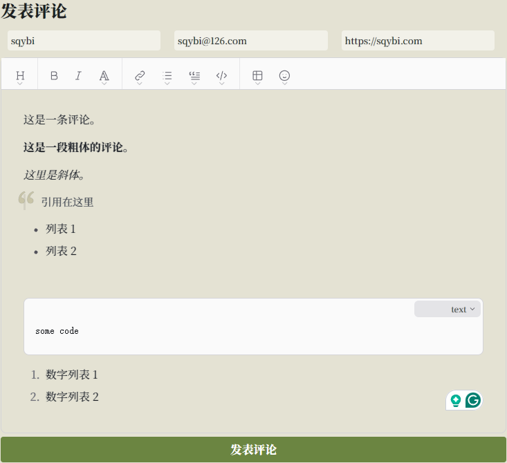
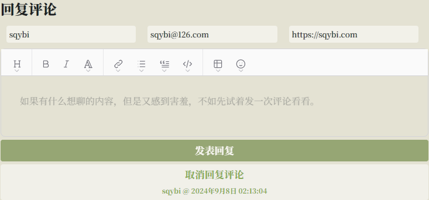
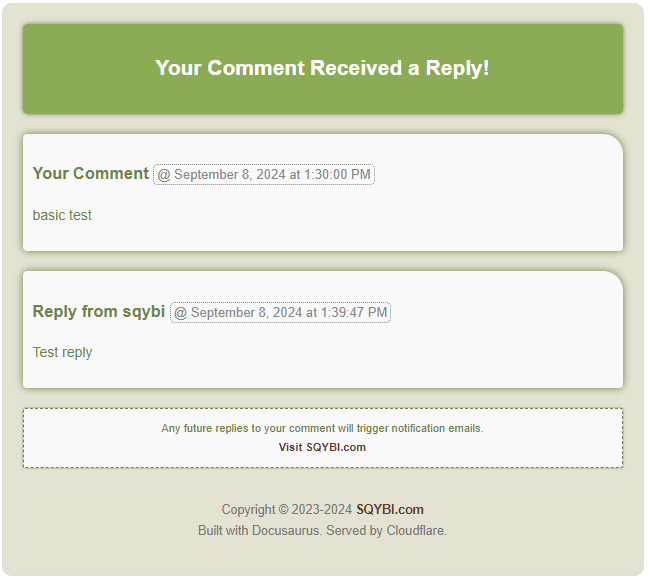

:::info[Translation Tool]

This article was translated by ChatGPT automatically, with minor manual corrections.

:::

Since the last time SQYBI.com went offline, I've attempted multiple times to handwrite a blog system myself.

This might seem simple, but it's actually quite challenging. In [SQYBI.com: Relaunching After a Decade](/blog/sqybi-com-relaunching-after-a-decade/), I mentioned a few details. Back then, although frameworks like Django provided a foundation, and I (painfully) completed the basic functionality, the frontend frameworks at that time were too rudimentary. Besides CSS issues, writing dynamic updates based on AJAX was also very cumbersome.

Fortunately, over the past decade, many new frameworks, languages, and service providers have emerged. Thanks to Node.js, React, Docusaurus, Cloudflare, ChatGPT, Brevo, GitHub, wysimark, Giscus, and possibly other infrastructures I haven't mentioned, I was able to quickly build the current version of this website.

After relaunching the blog, I had been using Giscus as the comment system. However, I noticed that over time, nobody was leaving comments anymore.

Giscus is based on GitHub, and as is well known, GitHub is inaccessible in China. Combined with some previous configuration issues, Giscus couldn't be displayed on some mobile devices even when using a VPN.

Though I don’t know exactly how much this affected people's willingness to comment, I decided to replace it with a self-developed comment system. After all, I can't simply assume all visitors have a VPN. Additionally, this gave me a chance to pick up where I left off on my blog system, at least completing a substantial functionality once and for all.

Another reason might be that after recently redecorating the website, Giscus's frontend seemed a bit out of place. Although adjusting CSS might achieve coherence, the workload would be significant. As it turns out, even developing my own system, most of the time was spent adjusting CSS.

A bit of self-praise, this counts as deeply customizing Docusaurus. I wonder if anyone else uses Docusaurus to build a blog and has done so much secondary development. If so, I'd like to check out their site.

<!--truncate-->

:::tip[Give it a try]

Since the new comment system is online, why not leave a comment here and give it a try?

:::

## A Simple Introduction to the New Comment System

First, let's briefly introduce the main features and highlight the design of this new comment system.

### Comment Posting Area

The most basic functionality, of course, is posting comments.



#### Color Scheme

I've specially adjusted all colors of the comment box to be similar to the new theme of the blog while removing all existing borders. Additionally, I also adjusted the font to unify it with the global style.

#### Text Editor

The text editor is a [WYSIWYG](https://en.wikipedia.org/wiki/WYSIWYG) editor, which converts to Markdown syntax in the backend. Initially, I planned to use a simple textbox, but since the goal of design is to reduce the difficulty of posting comments, it's unrealistic to require everyone to learn Markdown. Thanks to [mundimark's summary](https://github.com/mundimark/awesome-markdown-editors), I found this simple and useful editor from that list.

There are still minor issues, though. For example, the blockquote in the editor conflicts with my custom CSS styles, as shown by the overlapping vertical line under the large quote mark in the picture. It's not a difficult fix, so I'll get around to it when I have time.

#### Post Comment Button

The logic for the post comment button also took me some time to handle. Currently, the situation is roughly as follows:

- If the comment content is empty, the button is disabled.
- If the commenter's nickname is empty, the button is also disabled.
- When the button is enabled and clicked, a sending animation appears.
- In case of a failed send, the button becomes re-enabled without clearing any content, waiting for a resend.
- Upon successful submission, the editing area content is cleared while retaining commenter information, and the button becomes disabled without animation, awaiting the next comment.
- When the nickname is empty, a red circle appears around the input box, indicating it's mandatory.


Thanks to React, all this logic (and much more below) became easy to write. Otherwise, I might really lack the energy and motivation to hand-code such a system.

#### Nested Comments

For already posted comments, there appears a "Reply to this comment" button on the right. The interaction detail of this feature will be discussed below in the comments area section. Briefly, clicking this button changes the post comment area title to "Reply to comment," the button to "Post Reply," and adds a "Cancel Reply" button.



I think the UI here is well-designed. The current issue is that although timestamps are added, it's still difficult to determine which comment you're replying to. My wife once replied to the wrong comment during testing. I might have to highlight the corresponding comment or paste the replied comment's content below in the future.

Clicking "Cancel Reply" reverts everything to the initial state, but rest assured, the input comment content won't be lost.

:::warning[Beware of Losing Data!]

One minor issue is that refreshing the page still loses the comment content. This will be fixed in future versions.

:::

#### Commenter Information

Each commenter can input three pieces of information: a mandatory nickname, and optional email and website.

As with most comment systems, if you enter a website, a link will appear on your comment name pointing to that site. If you enter an email, your avatar will be the one set on [Gravatar](https://gravatar.com/) (provided you're registered; if not, you can register to see it!). Additionally, you'll receive email notifications when you post a comment or receive a reply.

**I strongly recommend everyone fill in their email when commenting because being able to receive emails when someone comments on you is quite crucial.**

There’s also a small but very important feature in this area: Once you've entered your information (name, email, website), it will be stored in the browser and auto-filled next time. Unless you change browsers or clear your history, you typically don't need to re-enter this information.

Without this feature, each empty nickname field would significantly reduce the interest in commenting.

Lastly, if no email is entered or the entered email lacks a Gravatar avatar, the fallback logic is:

1. If an email without a Gravatar avatar is entered, an avatar will be generated based on the email. This will update to the Gravatar avatar once registered.
2. If no email is entered, an avatar based on the nickname will be generated, ensuring consistency throughout the site for that nickname.

This way, even those unwilling to enter their email will have consistent, recognizable avatars in the comment section.

### Email System

Before introducing the comment section, I want to highlight perhaps the most useful feature implemented this time: the email system.

Simply put, if you fill in your email, you will receive two types of emails:

- An email after posting a comment.
- An email notification when someone replies to your comment (of course, they'll also receive an email about their own comment).

This part of the logic is not complex, but I was stuck for a long time by Cloudflare Worker’s email sending logic that ultimately didn't meet the needs.

After much research, I discovered [Brevo](https://www.brevo.com/), which provides HTTP interfaces with high daily limits for free, solving my urgent needs.

I also took care in designing the email's color scheme and CSS, hoping recipients find them aesthetically pleasing.



Due to time constraints, currently, all email content except comments is in English. I plan to add i18n support for emails later. For more on i18n, see [Adding i18n for a Docusaurus Site: The Right Way to Open LLM](https://sqybi.com/blog/adding-i18n-for-a-docusaurus-site/). Technically, it’s doable, but the changes needed are significant.

**Once again, I strongly recommend filling in your email when commenting because being able to receive emails when someone comments on you is quite crucial.**

### Comment List Area

Above the comment posting area is the comment list area.

The comment list looks roughly like this. If there are many comments on this article, you can scroll down to see them.


A few key points are visible:

- Comments can be nested.
- There's a reply button on the right side of each comment.
- The reply button disappears when the comment nesting reaches a certain depth.

There are also some details not visible in the image. First, the reply button darkens when the mouse hovers over the respective comment’s area (not just the button), indicating it can be replied to. I think this interaction helps increase the willingness to reply, but it's just a hypothesis.

Limiting the nesting level of replies also has its reasons, mainly considering that too deep nesting affects interface display. However, during the test, I found that I forgot to consider mobile devices; the last few layers still overflow out of bounds. Changing the nesting limit now would be problematic, so I might consider reducing avatar size and indentation on mobile devices to display more content.

Additionally, when first loading the page and refreshing the comment content after posting new comments, there’s a small loading animation. The technological advancements in recent years are quite useful. This animation (and most animations visible on the webpage) is purely implemented using CSS, without requiring uploading GIF images. However, one unresolved issue is that the animation finishes slightly before the loading completes. This is because I haven’t found an event in React that triggers after a specific DOM element is rendered. So, for the comment area, if the rendering is slow, it looks like the loading animation ends first.

The purpose of adding this animation is to avoid readers thinking the comment area is "stuck," the same reason for the animation when posting comments. Using animation to mitigate lag has long been an industry-wide panacea.

### Individual Comments

Taking a closer look at each comment’s content, it consists of the following parts:

- User avatar.
- User nickname, with a clickable link if the user filled in a website.
- Comment posting time.
- Comment content.

The avatar is provided by Gravatar, as previously mentioned. The rest of the display, including the layout, has been meticulously adjusted.

The comment content is presented in HTML format. The entire comment system’s sending and receiving processes are implemented on Cloudflare Worker. During the comment submission process, the Worker converts Markdown to HTML and stores it in the database, which is then displayed during comment retrieval.

Additionally, when the mouse hovers over the comment area, there’s a subtle glow effect. This is purely because I thought it looked good and added it casually. It’s not too prominent to avoid being too flashy, and I’m quite satisfied with it.

### Dark Mode Adaptation

Besides the basic functionalities mentioned above, I also completed a full dark mode adaptation for the entire comment system.

Initially, I considered reusing some variables, but eventually gave up. If you look at my source code, you’ll find it’s essentially patchwork: wherever something doesn't work, I add `[data-theme="dark"]`.

Speaking of industry developments, the iteration of CSS selectors has played a significant role in multi-color, multi-platform, and multi-language adaptability in various frameworks. Without attribute selectors, implementing these features would be much more complex.

### i18n Adaptation

Finally, as a site that supports i18n (reminder: for those unfamiliar, see [Adding i18n for a Docusaurus Site: The Right Way to Open LLM](https://sqybi.com/blog/adding-i18n-for-a-docusaurus-site/)), this comment functionality also includes i18n adaptation. You can switch the language from the dropdown in the top right corner and see the effect by switching to English.

During this process, I discovered a new trick I hadn’t known before. Previously, I only used Docusaurus's `<Translate>` to configure multiple languages. Recently, I discovered an accompanying `translate()` function can be used for component attributes that can’t utilize DOM elements. Some previous pages may have missed translations due to this, and I’ll fill them in later if found.

One remaining minor issue is that the tooltips of the editor component itself are only in English. Unfortunately, I can't change this, so let's just make do.

## Behind the Technology Choices

After discussing the design from a product manager's perspective, let's talk technical. Here are the various component choices.

### Backend Services

Since Docusaurus is a pure frontend framework, implementing a comment system inevitably requires a backend service.

Those familiar with me can probably guess from the start that I used Cloudflare Worker to build this service. Let’s go into more detail about the choices.

The code for this service is open-sourced and available at [sqybi/blog-comment-service](https://github.com/sqybi/blog-comment-service/). The code is yet to be refactored and is squeezed into one file, so it might be a bit challenging to read.

#### Database

This comment service uses Cloudflare D1 as the backend database.

Compared to KV databases, SQL is more suitable for storing comments, which are entirely structured data.

#### Email Sending

Firstly, I used Cloudflare Worker Queue to separate the email sending step from the comment sending, avoiding cases where email service issues cause comments to fail to send.

Note that I initially thought Cloudflare's Queue was like Kafka. However, I later found out it's a high-latency queue primarily for allowing Worker to return quickly, executing time-consuming tasks in another Worker process. The Queue also offers batch and retry features for handling requests in bulk.

Next, the service for sending emails is Brevo. As introduced earlier, it's a very user-friendly email sending service, and it's free for individuals with low sending volumes, without requiring a credit card. The API and management interface of the service itself are well-done, highly recommended. Reportedly, Brevo’s former name was Sendinblue, for anyone who’s used it before.

In discovering Cloudflare couldn’t handle email sending, my first attempt was AWS's email service. Unfortunately, AWS requires phone verification, but I couldn't receive their calls, likely due to recent scams leading to unified blocking. Nevertheless, this turned out to be a blessing in disguise. From my understanding, AWS's services would cost more and come with more restrictions.

#### CORS

Modern browser security updates necessitate handling CORS for any cross-domain API calls.

Thankfully, handling CORS is not difficult. Simply include the `Origin` header in the request, and on the receiving end, determine whether to allow cross-origin and include the `Access-Control-Allow-Origin` header for allowed scenarios.

Additionally, as browsers usually send an `OPTIONS` request to cache CORS information in advance, handling such requests involves adding the `Access-Control-Allow-Origin` header.

#### Cloudflare Wrangler

Before this development of the Cloudflare Worker, I’d accumulated some experience, so I organized the local configuration, making it easier to use Wrangler for debugging and deployment.

The overall configuration scheme is:

- Maintain a template `wrangler.toml`.
- Locally add two `.gitignore` files for the prod/staging environments’ config, keeping all differing configurations (Cloudflare services, various tokens, service names) separate.
- Use Wrangler command line’s `-c` parameter to load different files, distinguishing between environments.
- Use Wrangler commands to generate the `worker-configuration.d.ts` file, also added to `.gitignore`, avoiding inadvertently uploading environment variable values to GitHub.

Thus, most development operations can be done with the following commands:

```bash
npx wrangler types -c wranger-${env}.toml
npx wrangler dev -c wranger-${env}.toml
npx wrangler deploy -c wranger-${env}.toml
npx wrangler tail -c wranger-${env}.toml
```

### Frontend Implementation

Since the frontend is developing a Docusaurus Component, it's essentially React development, lacking the backend’s plentiful details.

#### Using ChatGPT for Development Assistance

As before, due to the need to write a lot of CSS during development, I still let ChatGPT help generate CSS and handle some initial designs.

In using ChatGPT, I typically follow these guidelines:

- Break down tasks as much as possible: For instance, if I want to implement a cool feature, I consider breaking the feature down and handing it piecewise to ChatGPT. For example, first build the basic HTML structure, then construct the relationships between elements, have ChatGPT generate basic CSS, then modify color schemes and other details before letting ChatGPT help with parts I find hard, such as animations.
- Don’t overly trust LLM: Avoid asking ChatGPT to rewrite existing code entirely or implement complete features (requesting to "generate a website" isn’t feasible as developers can’t fully describe the demand details). A more efficient way is to describe the minimal feature in words, learn how the generated code is implemented, then integrate it into your project, which also helps spot bugs in ChatGPT's output.
- Help identify errors: For complex errors, throwing the entire error message into ChatGPT for translation proves to be quite efficient. My main job involves writing a lot of C++ code, and letting ChatGPT assist in deciphering gcc/clang error messages significantly boosts efficiency.
- LLM's responses for niche libraries can be less accurate: For example, questions about more widely-used software like Python's syntax are likely accurate, but questions about specific tools like Docusaurus or Cloudflare Worker may need validation via search engines or self-written code.
- Use multiple LLMs simultaneously: Besides ChatGPT, I also use free LLM services like [Kimi](https://kimi.moonshot.cn/) and [Doubao](https://www.doubao.com/chat/) concurrently. Many domestic services now support online searches, providing higher accuracy for newer technologies. Comparing results from multiple services can also be beneficial. Both mentioned services have developers who were my former colleagues, and they work quite well — a small shoutout to them.

#### CSS Pitfalls

Encountering many issues during implementation, most were resolved. One unresolved issue is the inability to include local images in the site's CSS when configuring `custom.css` for the Docusaurus site theme. Though only specifying the path, it gets parsed as a Javascript object, causing the final static site's CSS to have `[Object object]` paths that can't be read.

I tend to think this is a design issue with Docusaurus. A possible but untested solution is using a full path with the domain (if anyone tests it, feel free to leave a comment). However, this solution seems too hacky, and I hope Docusaurus fixes this sooner.

Another issue encountered: importing stylesheets via `import styles from './index.module.css'` in JS files sometimes resulted in certain CSS `@keyframes` animations not being loaded.

However, when re-implementing the post-comment animation, `@keyframes` worked. Perhaps there was an error in the original code, but since it’s deleted, it may remain a mystery.

#### Using dotenv to Load Local Configs

Cloudflare can directly integrate Docusaurus deployment, with the entire build process occurring in the cloud by merely uploading code to GitHub.

In this process, Cloudflare can configure some build-time environment variables. Docusaurus allows loading these into `siteConfig` via `process.env` in `docusaurus.config.js`, then calling where needed as below:
