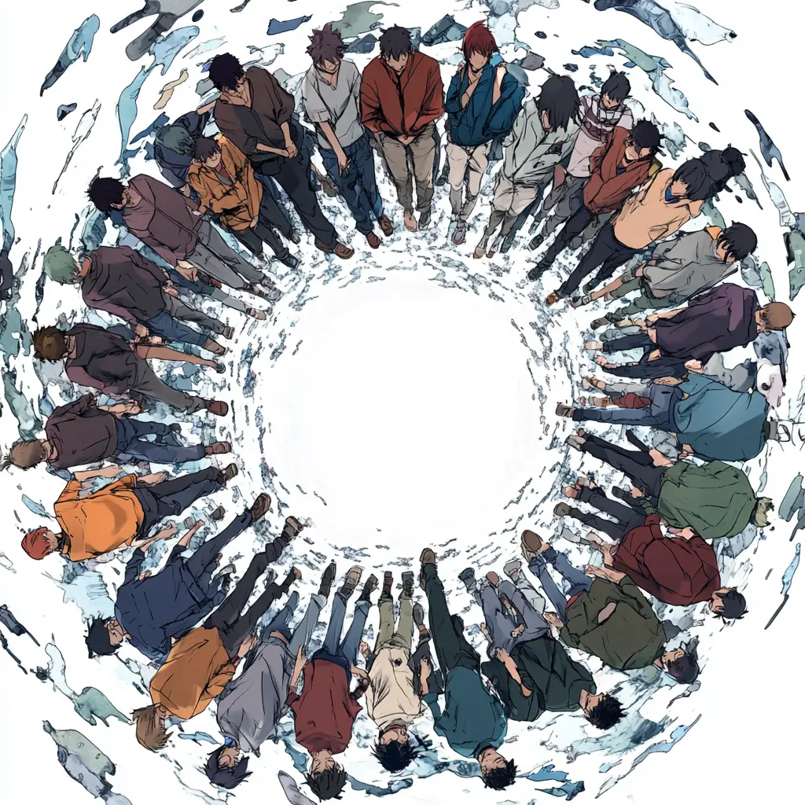
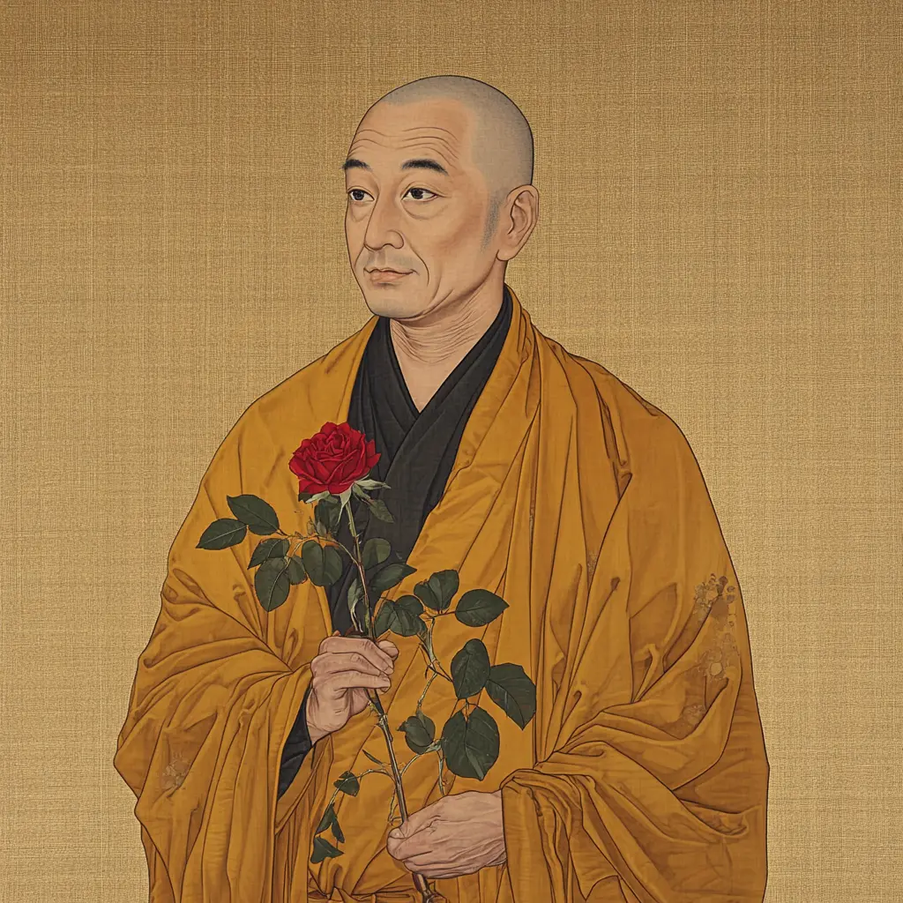

:::info[Translation Tool]

This article was translated by ChatGPT automatically, with minor manual corrections.

:::

On this day last year, also November 20th, I rebuilt my blog and published the article [SQYBI.com: Relaunching After a Decade](/blog/sqybi-com-relaunching-after-a-decade/).

Over the past year, I have indeed been diligent with this blog: a total of 17 articles were published (one of which was just for padding), including four articles from two series updates. Although there were periods of inactivity lasting two or three months, from a self-evaluation perspective, I still believe there has been consistent output on this blog—which is somewhat satisfying to me.

Exploring two separate paths, let's discuss each aspect. Objectively, the number of articles produced is fairly satisfactory; however, starting from the second half of the year, the time and motivation for writing have gradually diminished. Thanks to creating this [All Articles](/archive/) page during spare time, one can quickly see that June-August and October-November were major inactive periods. If it weren't for an unexpected burst of productivity at the beginning of September, it would almost equate to a major gap starting in June lasting nearly half a year.

So, let's start by talking about these two inactive periods.

<!-- truncate -->

## Beneath the Fig Leaf, No Silver Bullet

Reviewing this period, not only did the blog experience a gap. Some habits and hobbies cultivated earlier, such as daily exercise and photography editing, also faced interruptions. Reflecting further, it seems that since June, I haven't devoted much time to personal interests, at most slightly (really just slightly) modifying a newly purchased electric scooter.

Honestly, in my current job, there's no individual or system compellingly demanding that I shift all my focus and spare time to work. In simpler terms, it's rather a work-life-balance type of job, at least the Chinese version of work-life balance, with most of the time allowing regular clock-out hours.

Yet even so, after dedicating a large amount of mental effort at work each day, I still experience a mild sense of exhaustion upon returning home. This feeling is like: knowing that exercise releases dopamine, yet not wanting to get up; knowing how joyful it is to attain a flow state by fully immersing oneself in a hobby, yet not wanting to open Lightroom to start editing photos.

This is actually a very frightening matter.

In my younger days, my naive understanding was that tasks such as physical exercise or cultivating a hobby were assignments, mandatory tasks to accomplish. But the first time I personally felt that certain things resemble a primitive desire of humanity at a genetic level rather than just "tasks", I thought I need to "persist" no more.

> I do not believe that a healthy body, due to physical reasons, would make a soul excellent. On the contrary, I believe the opposite might be true: an excellent soul, because of its own reasons, would make a body as strong as possible.
> — Plato, "The Republic"

**"In that case, if I couldn't persist before, it means I wasn't following my inner heart and hadn't experienced these primitive desires. Now that I've personally experienced such desires, surely I can keep doing these things continuously."** That was roughly my thought back then.

Those of us who systematically studied software engineering must have read "No Silver Bullet," which essentially argues that there isn't a "silver bullet" solution to all "monsters," namely, software engineering problems. "No Silver Bullet" is an English idiom, more accurately translated as "no panacea" / 没有灵丹妙药 in Chinese ([from Wikipedia](https://zh.wikipedia.org/wiki/%E9%8A%80%E8%89%B2%E5%AD%90%E5%BD%88)).

The bolded idea above treats "primitive desire" as a "silver bullet," or a fig leaf covering deeper inner thoughts, hoping it can solve all problems.

Now, this fig leaf is slowly being lifted: Even though I have understood and experienced dedicating wholeheartedly to something and gaining joy without thinking of it as a to-do list item, my energy doesn't allow me to be ready for it at any moment. Perhaps my innate energy isn't sufficient to support extra engagement after a slightly over 8-hour high-intensity mental work day.

Underneath the fig leaf lies nothing, and the imagined silver bullet is nowhere to be found.

Is the fear of the non-existent silver bullet truly unavoidable? If work isn't a complete means of self-pursuit, what ways do I have to fulfill the ultimate life goal of self-discovery without the time?

Let's set aside this matter for now and talk about other topics before truly unveiling the fig leaf, serving as a small summary of my thoughts over the past year.

## Not Quite A Second-Dimensional!

Although I haven't conducted an actual social survey, I always believe everyone experiences a similar period of confusion: after the golden period of youthful curiosity about the world and igniting a desire to explore new knowledge, typically starting from a nine-to-five job, the fresh excitement we can access suddenly decreases exponentially.

Before this, it seemed that every day brought new insights into a corner of the world; yet suddenly one day, we realized it's been a while since we felt a spontaneous impulse to seek freshness.

As individuals, there are inherent differences in experiencing this sense of life value. For example, I mentioned the [“Hedgehog and Fox”](https://en.wikipedia.org/wiki/The_Hedgehog_and_the_Fox) classification in my [website's self-introduction page](/about/), where those inclined towards the "hedgehog" type might encounter this bottleneck later than fox-type people like me. Meanwhile, many "fox" type people around me delay this moment by expanding social circles and continually pursuing new excitement.

However, avoiding this period of confusion altogether is statistically negligible. This relates to a philosophical topic that philosophers have circled around since ancient times: the self.

In immature phases of mind, individuals often hope to showcase the self through superficial "uniqueness." Whether it be the flashy hairstyles and flared pants of the '70s and '80s, the non-mainstream style of the '90s, or contemporary second-dimensional and traditional styles of the '00s, it fundamentally represents a phase marked by the desire to exhibit the self using the most straightforward means to prove: I am different from others.

Yet, this quest for uniqueness appears contradictory. On one hand, everyone wishes to be unlike any other person in the world. On the other hand, everyone desires a group that acknowledges and understands their interests—a group naturally filled with like-minded individuals.

An individual's anchoring of the self comes from others' acknowledgment of uniqueness, and once someone acknowledges this uniqueness, it implies that the uniqueness is no longer unique. When described in words, this contradiction is purely paradoxical.

Fortunately, our cunning brains instinctively modify the definition of uniqueness, avoiding this problem by accepting that "being similar to a small number of people is also unique." In this way, one by one "small circles" naturally form—the internet's presence has at least brought these "small circles" to the forefront.

Thus, it's understandable why some small circles, especially those of teenagers in small communities, design various "rules" for exclusivity: if anyone could easily declare themselves part of the group, then the group's uniqueness would cease to exist.

Ten years ago, these rules manifested as "Not knowing XXX means you are not truly second-dimensional." Nowadays, the manifestation is a set of dozens of "group rules." As an outdated meme goes, this is "Yi Zhong Xun Huan" (a pun in Chinese meaning "cycle of perseverance").

Though the brain cleverly avoids the problem above, the logic of the world remains cruel. Problems always persist unless we face them directly.

Whether forming exclusionary circles or deeming oneself different through a hierarchical structure, it all boils down to constructing definitions for self-identity. One might want to be a unique second-dimensional person, but simply having watched anime and manga isn't unique enough, so the definition narrows to those who've watched A. Naturally, A has already been seen by oneself. And if too many people have seen A, the definition is further limited to those who've watched B, C... and so forth, endlessly stackable.

As rational adults, standing from a third-party perspective, it's easy to see the folly in this: stacking is endless. If everyone interprets a matter differently, then this matter's definition practically doesn't exist.

But does this matter truly lack the value for discussion and reflection, as instinctively judged by many on the internet, dismissing it as "all who engage in XXX are X's" and nothing more?

## The Time of the Rose

Let's shift our thinking approach. Perhaps a passage from "The Little Prince" is familiar to nearly everyone:

> "It's the time you spent on your rose that makes your rose so important."

Although many might find such universally known sentences as banal due to lacking "uniqueness," a surprising fact is that we rarely see attempts to refute this. In the modern era, where anything can be criticized, this is indeed rare.

In fact, time is fundamental in creating uniqueness. In imagination often resides a "perfect craftsman," dedicating their whole life to a single pursuit without giving up. If such a character were in a novel, would they not appear unique? Absolutely not.

The exclusionary behaviors of these youth clubs we joined mimic the accumulation of time to create uniqueness. If I define XXX as qualifying for second-dimensional, it implies I need time to do XXX; otherwise, I exclude myself from the circle. The more defined XXXs, the more I've done, naturally leading to more time invested in the circle—similar to what the "perfect craftsman" does.

However, the reality is that most people don't have lofty ambitions of devoting a lifetime to one thing, and the shorter the lived experience, the less time available for any matter. The primal pursuit of self-uniqueness during youth nudges young people to express themselves through such clumsily mimicked means. This awkward mimicry may be a way through which our genes, evolving over time, facilitate rapid learning while understanding the world.

Objectively speaking, I at least understand these behaviors, for it's intrinsically as akin to anyone's first attempt at walking but falling down. A normal person facing a toddler stumbling across their path doesn't necessarily harbor ill will, and might even offer a helping hand. If not for the internet's unrestrained and exaggerated portrayal of such behaviors, matters would perhaps be simpler.

After all, even mentally mature adults can't completely avoid pursuing self-uniqueness:

> Without wearing this attire, how would the world know that my connections with the mortal world have ended, and the golden seas have dried up?

## Coincidences in Philosophy

In my youth, as someone exposed to STEM education early on, I always sneered at history and philosophy: history is nothing but rote memorization, philosophy just moaning without pain, what's the point?

However, over time, I gradually realized that history and philosophy are indispensable parts of human societal development. Every question one pursues or contemplates in life has traces in history or has been pondered deeply by philosophers. Making assertions without understanding these disciplines is undoubtedly presumptuous. As it's said, thinking without learning is negligent.

Regarding the ultimate topic of life—the self—philosophers naturally have their perspectives. I consider myself insufficiently informed to deeply explore, but whether it's early philosophers like Plato and Socrates' initial understanding of the self, separating it from human traits into divine aspects, or Descartes' thought on the existence of the self, or Hegel and Sartre's view of self arising from processes of practice, they all represent the deepest understandings of the question in their respective eras.

I lean towards Nietzsche's concept of "self-transcendence," possibly due to education rooted in Marxist materialism and the value of human subjectivity received since childhood. I can't accurately describe this concept, which roughly means that seeking self revolves around transcending oneself, aiming for "Übermensch" a state of spiritual transcendence. The frequently discussed phrase on my blog's homepage might more accurately convey this idea:

> Change is a part of life and takes part in finding us who we are.

Indeed, as philosophy develops, whether Nietzsche's perspective, or Hegel's and Sartre's, they invariably point to this: the process of anchoring oneself is related to introspection, exploration of self, and recognition of others—a process of practice consuming life's only irrecoverable resource: time.

**It's an intriguing coincidence: both revered philosophers and shunned inward-gazing small circles essentially explore the same thing—how to pursue self through consuming time.**

The reason behind such a coincidence, I believe, is because what defines self has been explored over and over by generations of philosophers, resonating with one of the most fundamental aspects of humanity. While spending time exploring self, one eventually completes their pursuit of self.

## A Bouquet-Like Self

Embarrassingly, I've recently read a novel that was popular a few years ago, titled "We Made a Beautiful Bouquet" (some may know it from its film adaptation). A friend wrote a compelling article titled ["We Made a Beautiful Bouquet and Uniqueness"](https://blog.hoppinglife.com/2023/11/%e8%8a%b1%e6%9d%9f%e8%88%ac%e7%9a%84%e6%81%8b%e7%88%b1%e5%92%8c%e7%8b%ac%e7%89%b9%e6%80%a7) discussing this work, which I revisited after reading the novel.

The direction of that article aligns closely with the theme of this piece, which is one reason I decided to make it the topic for this anniversary article. Here, I'd also like to quote two sentences from it:

> If experiences and preferences inevitably overlap, then uniqueness may be guaranteed by time and space after all. 
> …… 
> A more optimistic explanation is that uniqueness isn't about the label itself, but the self beneath the label.

If you happen to have read this novel or watched its film adaptation, allow me to discuss this work further.

In "We Made a Beautiful Bouquet," the encounter between the male and female protagonists resembles the ideal scenario within previously discussed "small circles": a circle of only two, whose preferences are so aligned they can exclude others while mutually acknowledging each other's personas—a perfect state seen only within fantasy works.

Yet, even such self-aware individuals, as time progresses and societal limitations arise, gradually diverge. The male lead starts blending into larger circles due to losing consistent financial support, gradually losing his distinctive self; on the other hand, the female lead continues resisting the world to maintain her uniqueness by reducing monetary and societal status demands.

The journey these two characters take inevitably occurs while seeking the self. No two individuals are entirely the same, and finding someone extremely similar in past experiences is, in itself, miraculous. But miracles remain as miracles, and eventually, miracles end.

Nonetheless, those of us raised with dialectical philosophy eventually realize: Since no two persons are perfectly identical, there similarly are no two who are completely different.

Once this is understood, reflecting upon past periods, our lives seem less distressing. As luck would have it, during the process of completing this article, the company organized a team-building dinner, during which we participated in a well-known party game that offered me a different perspective to review my individuality.

The game is called Never ever, alternatively known as Never have I ever.

## Never, and Ever

The objective of this game is simple. Setting aside rules for rewards and penalties unrelated to the article, it roughly entails:

Each person, in turn, states something they believe only they have done among those present. If anyone else has done it, you lose the round; otherwise, you win the round.

With nearly 30 people at our gathering, everyone initially thought winning one's round would be challenging—surely someone among so many has had a similar experience.

But once we really went through a round, only around five or six people lost the game, and in most cases, mutual experiences led to unanimous "wows" from the crowd—exclamations of "originally you too..."

At the start, I also racked my brain to come up with unique experiences. However, once I thought of the first experience, ideas seemed to flood in, revealing countless moments when I was sure others likely hadn't experienced what I had.

Casually jotting down each thought on my phone led me to realize, after the game concluded, how many unique experiences I possessed compared to the dozens of people gathered. Astonishingly, many among them had similarly undergone multiple traditionally "unique" experiences.

Following this realization, a sense of enlightenment emerged: it turns out, my time spent in life—often seeming largely meaningless—had already transformed me into such a unique person.

The game does boast an interesting quirk. Every game includes those trying to "cleverly take advantage" (without negative connotation), and within this game, the clever participants surely spot one loophole: as long as adjectives are numerous enough, any experience becomes unique.

Conversely, the fewer adjectives, the more certain it becomes that others have experienced it too. An extreme, "spherical chicken in a vacuum" example is "I've done something"—who hasn't done something?

The game might be as such, and so might our comprehension of self-uniqueness. If desired, I can share experiences with anyone; conversely, I can outline an experience differing from everyone else.

The uniqueness of self derives from the adjectives we subjectively apply to our self. So-called selflessness or uniqueness results from societal mainstream opinions fixating on this "adjective" post-application. But adjectives merely describe—they have no bearing on an individual's true self.

Red apples, green apples, rotten apples, fresh apples, or even the apples of Eden—all ultimately remain apples.

## No Shame Beneath the Fig Leaf

At last, we can revisit the initial issue. Why is it so terrifying to discover that my energy doesn't suffice to dedicate time beyond an 8-hour workday for hobbies?

Through previous discussions, the answer begins to emerge. What I fear is simply that, without adequate time, I am unable to construct a distinct self. Losing one's self implies endless confusion, a loss of life's meaning and direction.

Fortunately, knowing the problem means it's no longer unsolvable. On one hand, once illuminated, I can naturally adjust myself to ensure I do not end up completely time-starved. On the other hand, as previously mentioned, the time available for constructing one's unique self isn't as limited as imagined.

Time is fair to all.

Ultimately, people continue pursuing the self—seeking uniqueness is merely an inevitable part of the self-pursuit journey. Those primal desires, while failing as the silver bullet for shaping uniqueness, become pointless if they dominate the pursuit, flipping objectives.

When we uncover the fig leaf, realizing we've veered in pursuit of uniqueness briefly, it's not something shameful. Only once aware of the non-existent silver bullet will people focus on the real problem.

Moreover, shaping the self lies eternally in the unique time invested during one's pursuit of self. Constant reflection and exploration pave the path for uncovering oneself, striding further on the journey of self-discovery.

> Ich bin ein Wanderer und ein Bergsteiger, sagte er zu seinem Herzen, ich liebe die Ebenen nicht und es scheint, ich kann nicht lange still sitzen. 
> I am a wanderer and a mountain climber, he said to his heart, I do not love the plains, and it seems I cannot sit still for long.  
> Und was mir nun auch noch als Schicksal und Erlebniss komme, - ein Wandern wird darin sein und ein Bergsteigen: man erlebt endlich nur noch sich selber. 
> Whatever fate and experience may come to me, - wandering and mountaineering will be a part: for ultimately one only experiences oneself.  
> Die Zeit ist abgeflossen, wo mir noch Zufälle begegnen durften; und was könnte jetzt noch zu mir fallen, was nicht schon mein Eigen wäre! 
> The time has passed when I could encounter coincidences; and what could now fall to me that was not already my own!  
> Es kehrt nur zurück, es kommt mir endlich heim - mein eigen Selbst, und was von ihm lange in der Fremde war und zerstreut unter alle Dinge und Zufälle. 
> My "I"—it merely returns to me, and along with it, all parts scattered among things and coincidences, finally come home.  
> — Nietzsche, "Thus Spoke Zarathustra"
