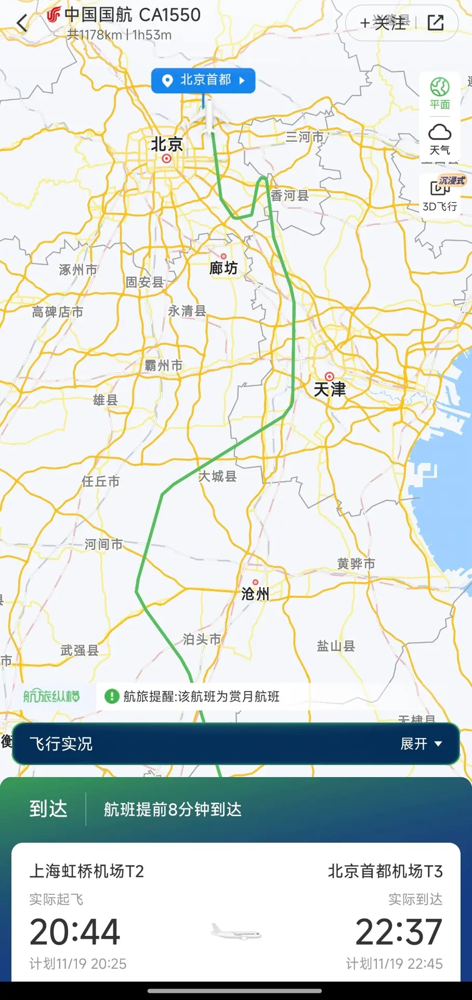
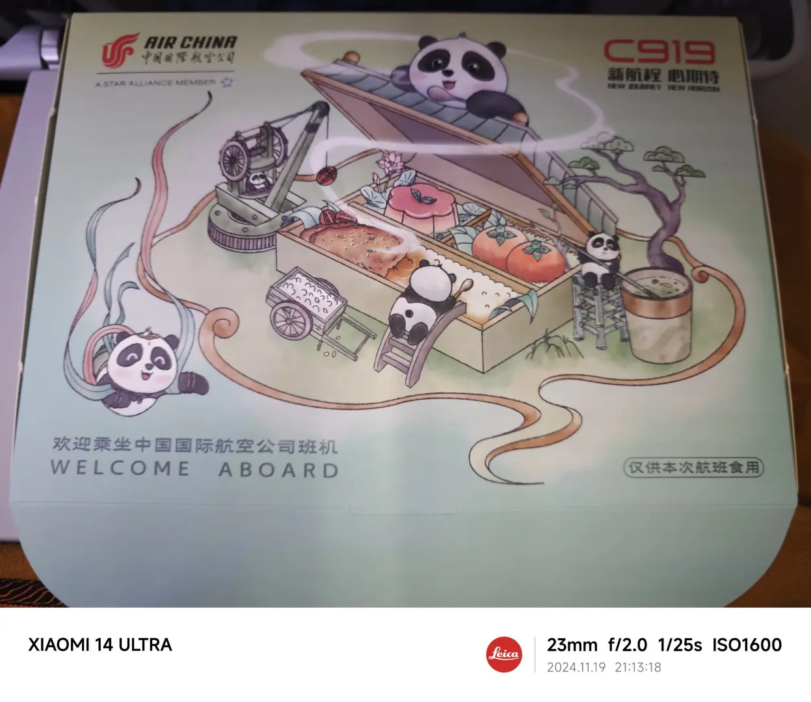
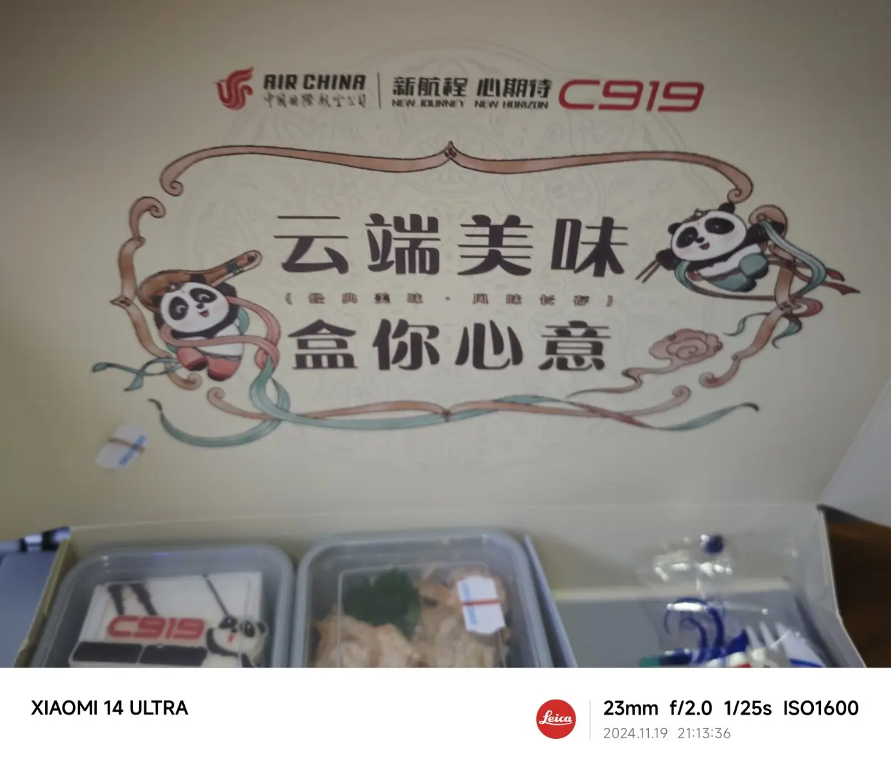
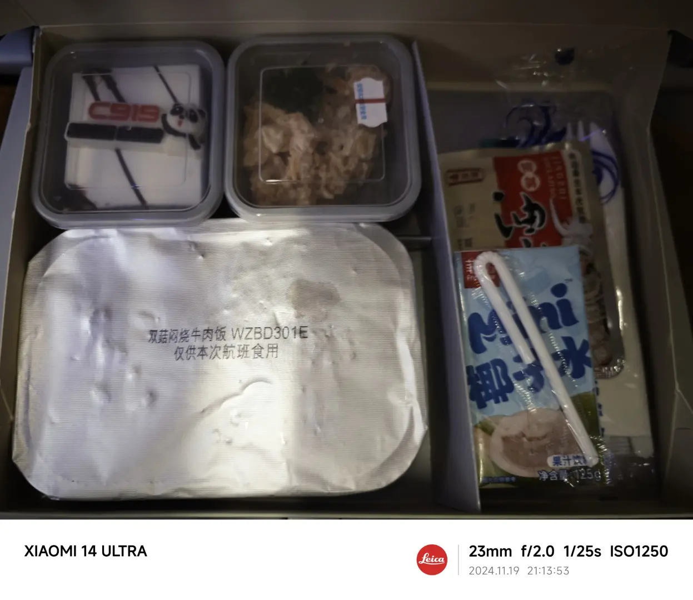
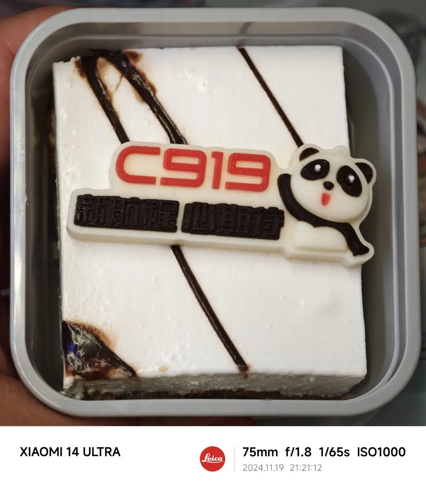
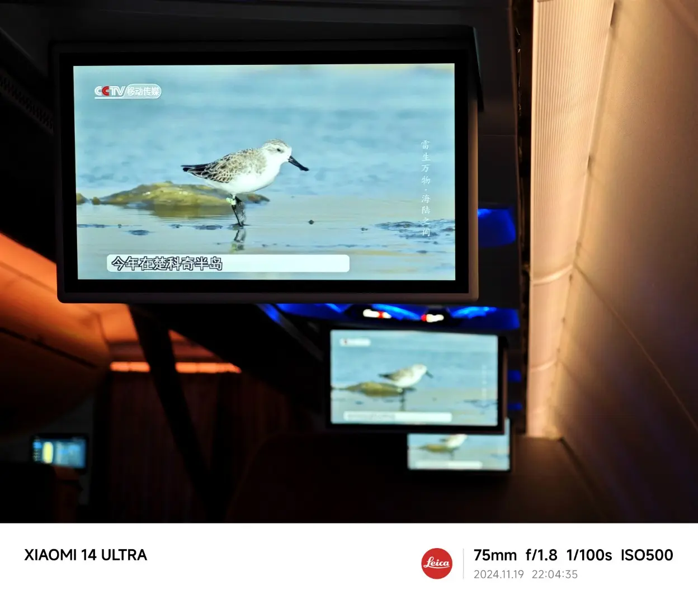
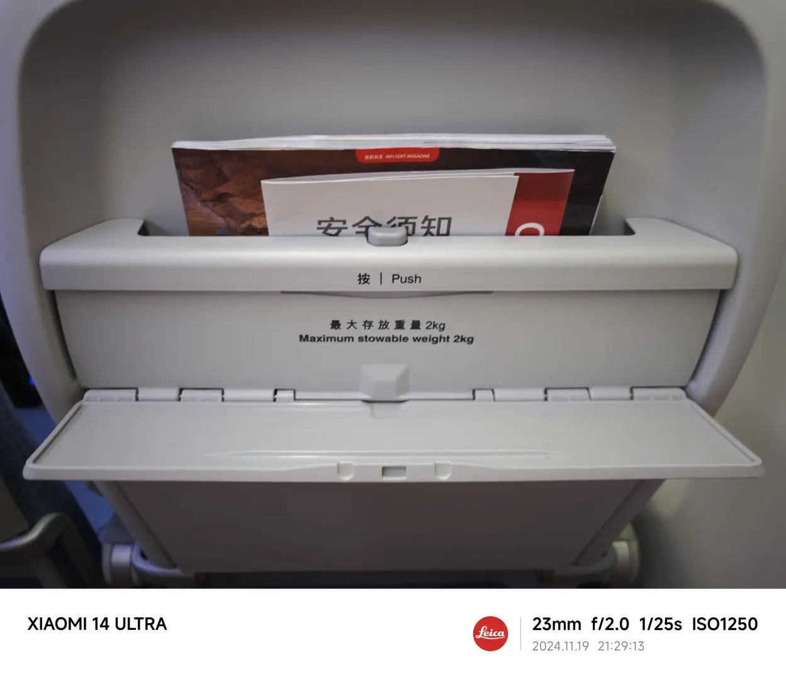
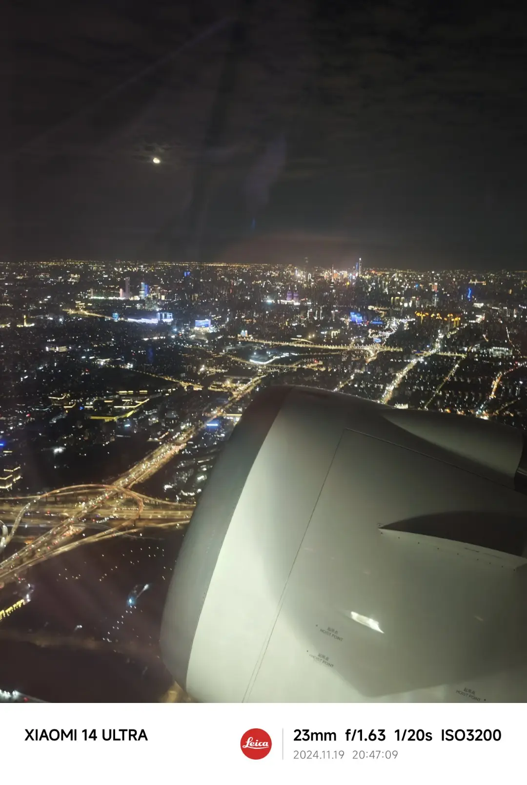
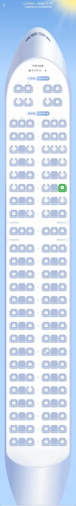
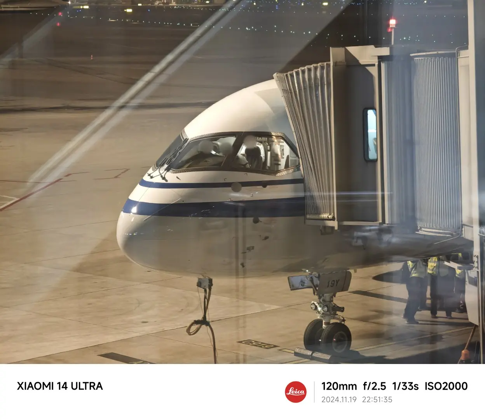

:::info[Translation Tool]

This article was translated by ChatGPT automatically, with minor manual corrections.

:::

Last week, returning from a business trip to Shanghai back to Beijing, I again chose Air China for the return flight. Just before check-in, I noticed on the Air Travel Mini Program that the aircraft model was listed as 919/100B. It took me a moment to realize that this is actually the C919!

I'm not an aviation enthusiast and not very familiar with all the intricacies of airplanes. However, even for someone like me, the C919 is widely known, being one of China's major achievements in the field of mechanical engineering and high-tech last year.

In fact, China's large passenger aircraft project started earlier than most people, including myself, would think: proposed in 2001, demonstrated in 2003, and officially launched in 2007—even before the Beijing Olympics began, and Commercial Aircraft Corporation of China, Ltd. (COMAC) was formally established only in 2008.

Yet, it wasn't until May 28, 2023, that the C919 made its first commercial flight. In the year following, only China Eastern Airlines operated routes using the C919. Air China's first C919 flight is already a recent event from September 10th this year.

The B-919Y model I flew on this time is Air China’s second C919 aircraft. If I'm not mistaken, its maiden flight was on November 14th—just 5 days before I flew on this plane on November 19th, less than a week apart! This was really a random occurrence as I didn't even notice the aircraft model when purchasing the ticket (maybe even if I had noticed then, it might not have been the C919, since it hadn't been officially in use yet).

Since I was so lucky, I just had to document it a little.

<!-- truncate -->

## Special Treatment for the “Favorite Son”

I don't know when it started, but it's been a long time since a Beijing-Shanghai commute flight allowed boarding via a boarding bridge—maybe some flights claimed “boarding bridge” but at least one between boarding and disembarking usually required a lengthy metro transfer, just like using a shuttle bus.

Due to various weather reasons, delays between Beijing and Shanghai have become commonplace. Occasionally landing at 1 a.m. and having to wake up early for work the next day really makes one’s head explode.

However, the biggest experience with the C919 is that indeed the “favorite son” is special: not only were takeoff and landing via boarding bridges, but the landing bridge was the closest to the baggage carousel, with a walk to the carousel area estimated at less than 50m; and although the previous flight arrived slightly late, boarding could commence as soon as the plane was tidied up, with take-off following promptly. No wonder many people mentioned that no matter the aircraft, now all must give way to the C919.

Though ultimately we circled near Tianjin once, the plane took less than 2 hours to land smoothly, and the speed was maximized.

The crew seemed quite excited too. When boarding, I asked if it was a new aircraft, and the stewardess proudly introduced: yes, it started flying just last Thursday! The crew did not exhibit the usual exhaustion one sees with other flights, and the in-flight service and meals gave me a nostalgic feeling reminiscent of flying a decade ago.

## Isn't This Meal Ready!

Speaking of meals, I must mention the C919's inflight meal.

For comparison, this business trip from Beijing to Shanghai was on the C1589 flight, which departed around the same time as the C919. Let’s look at the inflight meal on that flight: a small packet of snacks, a bottle of mineral water, and that’s it. Yes, for a flight that took off at 8:30, there was no full meal! Luckily, the company reimbursed for dinner at the airport, though the food at lounges in Capital Airport isn’t very tasty.

Meanwhile, the flight number for this C919 was CA1550, with a departure just 5 minutes earlier, and the special C919 meal box looked like this:

The food inside included:

The main course, beef rice, roughly matched the level of inflight meals from ten years ago. Although not exceptionally tasty, it certainly wasn’t as unpalatable as some current flight meals. Despite having already had a meal (because I didn’t expect a full meal!), I still ate half of it.

The side dishes and desserts were exceptionally delicious.

The most ordinary item was the oil chili sauce on the right, which seemed inferior compared to yellow pepper dishes on flights to Changsha before, especially since it tastes somewhat greasy when not eaten hot.

The cold appetizer salad in the two small boxes, particularly the right one, featured tuna without any fishiness, likely made with quality canned products.

The remaining box was a special C919 dessert, which I took a close-up photo of:

It was simply a small cake with an Air China C919 chocolate label. I didn’t eat the chocolate, but the cake was truly delicious—it's been years since I had such a good dessert on a plane. It seems airlines really are focusing on cost-effective service; after all, this shows they can indeed make a decent inflight meal!

Upon learning it was a C919 flight, my first thought was to upgrade and experience it if possible. Unfortunately, as I noticed rather late, the only eight business class seats had already sold out. Fortunately, after watching some videos later, it seems that the spacious economy class of the C919 is the highlight, while the limited business class seats may not be that comfortable. I’ll look for another opportunity next time.

## Adequate Cabin Facilities

If I boarded the plane without knowing it was a C919, my first reaction would be: the legroom is generous!

Although I had heard about the spaciousness of the C919 economy class from videos, actually sitting in it revealed that the legroom is exceptionally comfortable. Being quite large myself, seating in many narrow-body aircraft can be a struggle, and maintaining one position can quickly fatigue. The space in the C919 ensured I could change my leg positions freely throughout the flight, adding to the comfort.

However, it seems there are similar problems with the seats in the economy class as in business class: hardness. Although leg comfort is guaranteed, both the backside and back slightly tingled after a flight of just under 2 hours, which is rare for flights between Beijing and Shanghai.

Aside from the seats, the multimedia screen in the cabin is a nice touch. Though there’s no personal entertainment system, just a public screen, its resolution is quite clear—probably an advantage of new aircraft:

Unfortunately, the screen size is somewhat small, but the high resolution makes even a small screen easy on the eyes. After all, it’s still an early domestic aircraft, understandable if the hardware doesn’t fully keep up.

However, compared to such dispensable devices as multimedia screens, some other hardware indeed proved a bit bothersome.

Without a multimedia screen, the space behind the seat isn't wasted: the C919 features a small panel designed for placing electronic devices like phones and tablets.

This panel isn’t a tray, as the tray opens separately below it. I tried it, and it’s just right for holding a phone. However, as there are no upper and lower limit devices, I was somewhat anxious about the phone potentially flying off during turbulence.

## Ongoing Hum

The most unbearable part of the flight was probably the noise from the aircraft.

Possibly due to stronger engines, the noise on this aircraft was significantly higher than other narrow-body planes I have flown. Because the Beijing-Shanghai route is relatively short, and headphones typically aren’t allowed during takeoff and landing, I’ve recently stopped bringing noise-canceling headphones on business trips. This time, however, the constant droning did somewhat exceed my comfort threshold.

Checking the Air Travel Mini Program for the decibel level in flight mode, it hovered steadily around 85 dB. Other planes usually vary between 81-85, making me question this measurement's accuracy.

Worse than the noise is that the entire fuselage seemed to vibrate in concert with the engine. Especially before takeoff, the vibration could be felt throughout the body. Fortunately, this issue lessened somewhat once reaching cruising altitude.

If I want to fly the C919 again due to the “favorite son” treatment and meals, should another instance arise when I choose not to, the noise would be a significant deterrent.

## Occupied? Unoccupied?

From the moment of queuing to board, it was apparent the aircraft was not at full capacity. The seating chart displayed in the Air Travel Mini Program was particularly peculiar:

Many seats, including those in business class, appeared locked. I also checked Air China's check-in interface, where those seats were similarly locked and unselectable.

However, after observing post-boarding, these seats did seem to mostly be occupied. Yet, how these passengers checked in remains a mystery—perhaps they hold special retained tickets?

Nonetheless, even considering all these passengers, the plane still felt quite empty, especially given the usual busy traffic between Beijing and Shanghai. With nearly no passengers in the middle two columns, one wonders whether there are safety considerations or if the thoughtful treatment of using boarding bridges also gave everyone a great first impression of flying in comfort.

Nevertheless, it's safe to assume that their own airplane will receive ample domestic support.

I look forward to the day when, like the automotive industry where I gained several years of experience, China's own production of aircraft dominates the civilian aviation market.

Finally, I end with a photo of the nose of the plane I took upon disembarking. I lightly blurred it to protect the privacy of the three captains who were inadvertently photographed.
