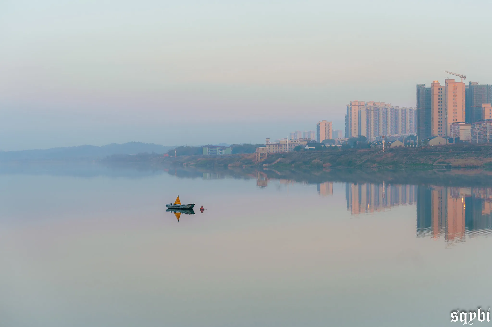
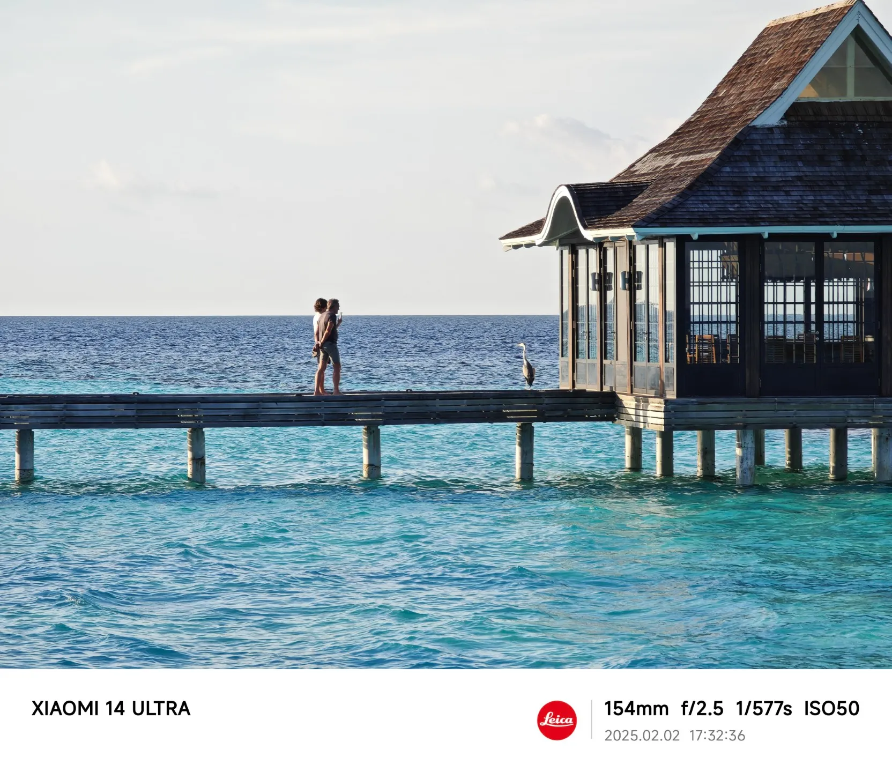
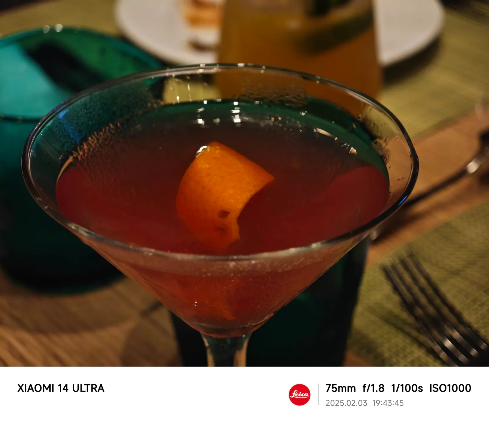
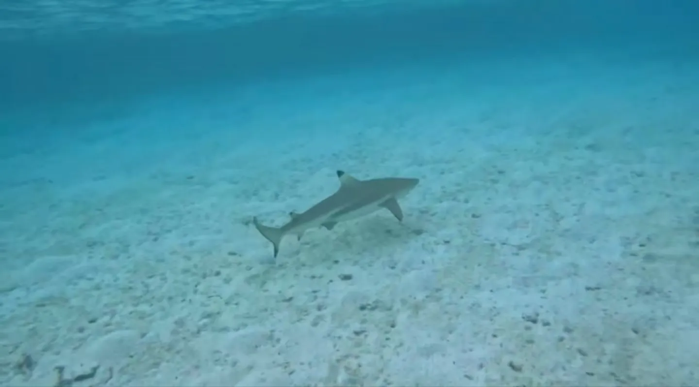
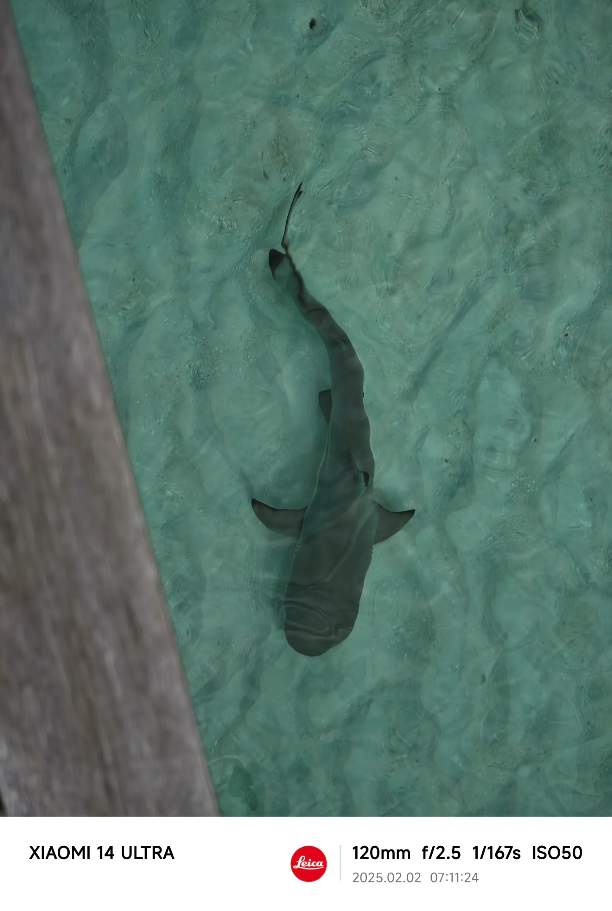
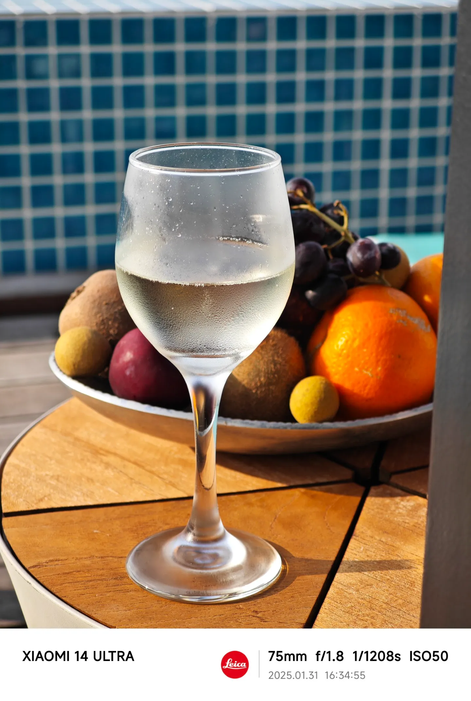
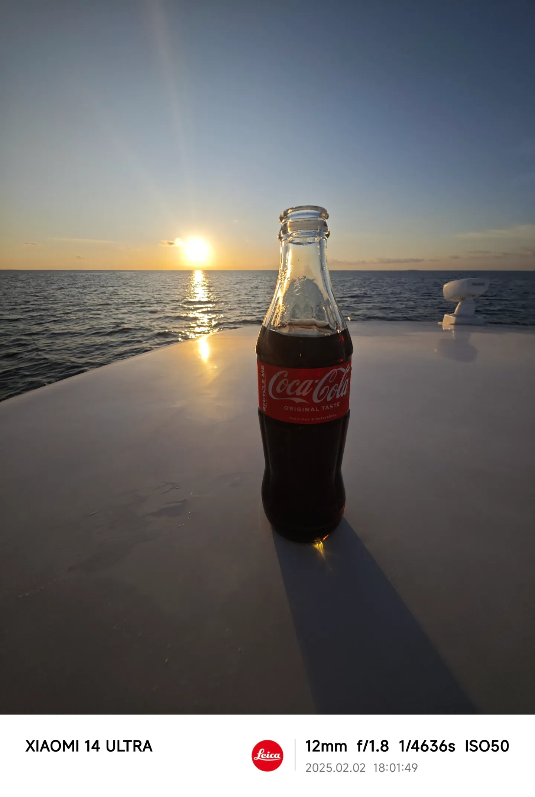
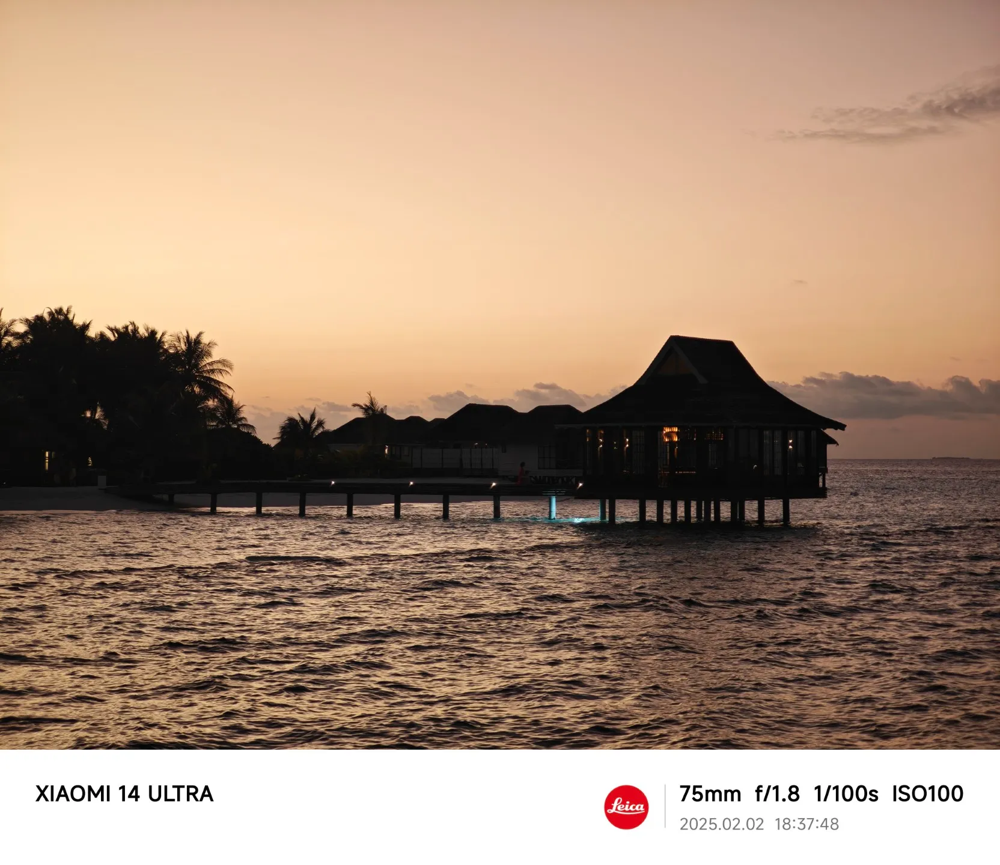
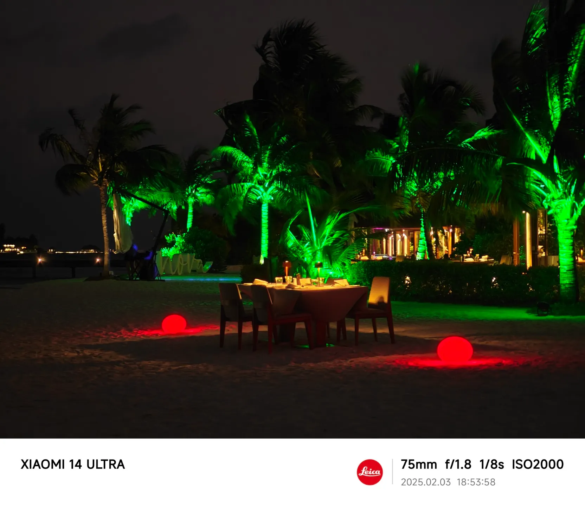

:::info[Translation Tool]

This article was translated by ChatGPT automatically, with minor manual corrections.

:::

In recent years, just before the Chinese New Year, the most important thing for me is not scrambling for a ticket home, but planning my travel itinerary.

As a Tianjin native working in Beijing, thanks to the short distance and convenient inter-city trains, going home has become something that can be done anytime. Consequently, spending the longest vacation of the year lying at home instead of traveling would be quite a waste.

Moreover, since there aren't many relatives back home and my parents don't insist on me coming home for the New Year, the Spring Festival has turned into a purely leisure holiday: last year, I went to Hunan, and the year before, to Harbin.

This year, one of my friends happened to want to take a trip during the Spring Festival as well, so the four of us from two families discussed and decided to go abroad for a major vacation. Initially, we thought of going to New Zealand, but after checking, we found out it's quite expensive now—the amount we wanted to enjoy would cost tens of thousands per person. We jokingly said the price was enough for a trip to the Maldives, and eventually, the four of us said, "Why not just go to the Maldives then?"

Thanks to our impulsive decision back then, there are now a few more rejuvenated workers in this world.

<!-- truncate -->

Here are a couple of photos from my travels during the Spring Festival in previous years. The experiences in Hunan (we visited Changsha and Hengyang) and Harbin were quite nice too! However, it seems there's a recent surge in people visiting northeast China, and we happened to avoid the crowds in the past two years.

## Choosing an Island

### Setting the Basic Guidelines

With so many islands in Maldives, it was impractical to choose all of them.

Our island selection strategy was: set basic guidelines -> preliminary selection -> gather detailed information -> final selection -> consult travel agencies for quotes -> rank them -> and then see which one we can book based on the order. Since we booked quite late (close to the end of December), many desired islands were already fully booked. Despite not being our first choice, the experience at Nova Maldives was still nearly perfect—it truly lived up to the Maldives' reputation. When choosing an island, don't worry too much as you generally get what you pay for in Maldives.

This time, our basic guidelines for choosing an island were: fewer children + decent snorkeling + good scenery + sufficient food, and of course, setting a rough budget beyond these guidelines.

During the preliminary selection, we used Maldives Laboratory, a tool everyone has heard of if they've ever chosen an island in Maldives. Although some information might be outdated, it provides a general direction and helps eliminate some unsuitable islands.

In gathering detailed information, Xiaohongshu (Little Red Book) was invaluable. Regardless of domestic or international travel, the information and authenticity on Xiaohongshu are unparalleled. Of course, during this process, we also referred to international sites like Booking.com, which allow booking Maldivian islands directly without an agency, offering numerous real reviews from people around the world.

### Snorkeling and Scenery Can Coexist

First, on snorkeling and scenery, some say these two are mutually exclusive: the key factors for snorkeling are low waves and lots of fish. Low waves imply there needs to be a breakwater on the island, and fish thrive in places like seagrass, both of which can mar the scenery.

However, from personal experience, I find that statement somewhat extreme. Based on my own experiences, the saying can be modified to: a top-notch on-site snorkeling experience and photoshoot-quality scenery are mutually exclusive.

Obviously, most people don't need top-notch snorkeling (many islands offer snorkeling trips), and their photos are more for sharing on social media than professional monetization.

Taking this visit to Nova as an example, there was plenty of marine life in the snorkeling areas. From the water villas, one could see many fish, and even more in the snorkeling spot nearby. Even as someone who didn't know how to swim before visiting the Maldives, I could manage to follow different kinds of sharks in the sea.

Meanwhile, this island had no seagrass but lots of reefs, which also attract schools of fish, as well as sea stars, sea anemones, sea cucumbers, and sea urchins. Notably, the island was thoughtfully designed: the breakwater is masked by reefs of a proper height—submerged during high tide. Though this affects the waves, beginners can still safely snorkel as long as they avoid entering during poor lighting or high waves. Safety first for beginners: secure a rope, be mindful of the current direction, wear fins, and conserve energy.

For a snorkeling enthusiast focused solely on snorkeling, they likely wouldn't care about the aesthetics above water—after all, the photos and videos are captured underwater by GoPro or Action cameras. Perhaps only first-time novices like us would fuss over these things when selecting an island.

### Minimizing Children

An important aspect of our island selection was choosing places with fewer children to avoid noise and ensure safety as newbie snorkelers (though many kids are more adept than us, children aren't as good as adults at avoiding people and danger).

Generally, there are two selection strategies to achieve this.

The first is choosing "adult islands," labeled with XX+. For instance, Hurawalhi, initially our top choice, is a 15+ island where guests under 15 are not allowed. Age restrictions vary by island; for example, Finolhu Villas is 10+, and You & Me Island (obviously a honeymoon island from the name) is 16+. This is the most direct selection method.

Additionally, one can see if the island has child-friendly facilities. Some islands have kids' clubs, clearly aimed at guests with children. Avoiding such islands can help choose places with fewer children, although if you need a child-friendly island, these may be options—provided your child's English is good enough since everything's in English: parents, other kids, even the kids' club's programming.

### People Prioritize Food

Chinese people might be among the pickiest about food when choosing a Maldivian island.

On one hand, people are already discerning about food; on the other, most food on Maldivian islands is for Western tastes. So those accustomed to Chinese cuisine may find it challenging to adjust.

Fortunately, our group adapts well to Western food, so we didn't stress too much over this. It turns out that Nova provided a wide variety of and good-quality food for an all-inclusive (AI) buffet, assuming you aren't strictly tied to Chinese cuisine.

Since this is mentioned here, for those without island selection experience, I'll explain what AI means: AI here isn't artificial intelligence or Adobe Illustrator, but a shorthand for all-inclusive.

There's possibly a local tourism board regulating this, as Maldivian resort islands offer standardized packages typically including BB / HB / FB / AI.

BB / HB / FB differ mainly by meals included: BB covers breakfast only, HB includes breakfast and one main meal (usually lunch), and FB covers three meals. Dining is often restricted to specific restaurants, mainly buffets, although some allow ordering limited dishes or set menus at non-buffet restaurants.

AI expands FB with additional drinks or services. For instance, our AI included unlimited drinks (both alcoholic and non-alcoholic, and quite sufficient) and various excursions such as free photo sessions.

Interestingly, we discovered on the island that this package is exclusive to Chinese agents. For overseas agents, their package includes non-buffet dining options but lacks the excursions and photography activities. After trying another restaurant's meal on the island, it's clear that these Chinese agents have a good eye. Instead of nodding off over an unappetizing Western meal, these activities were more appealing. However, the package still included a floating breakfast and a beach dinner, both quite to our taste.

By the way, there's occasionally a package called RO, which means room only. It's the simplest package—other than accommodation, everything else costs extra.

## Preparation

### Snorkeling Gear

Since we didn't have previous snorkeling experience, we had to prepare the whole set of snorkeling gear from scratch.

Though the island reportedly offers rental, using your own mouthpiece and mask is more hygienic and safe. Additionally, to avoid being unable to snorkel due to unavailability, we decided to prepare all the gear ourselves except for fins and life jackets.

For snorkeling beginners, essential gear includes a mask + mouthpiece + snorkel + rash guard + diving gloves. We chose a dry snorkel with the mouthpiece, which proved very useful. While some say dry snorkels are dangerous, with sufficient practice before entering the water (mainly practicing how to flip over), I believe a dry snorkel is safer for beginners. Rash guards and gloves are necessary; during the three to four days, they helped me avoid numerous cuts and scrapes. Saltwater is highly corrosive, easily causing infections, so entering the water with wounds is problematic. Additionally, rash guards offer better and easier protection than sunscreen or sunblock.

For safety, we also purchased safety ropes and survival whistles. Though unused, having a whistle is reassuring (there's one on the hotel life vests, but it’s uncertain beforehand). Safety ropes are recommended when staying in water villas with direct access to the sea and are helpful for beginners in their first few immersions—mainly for reassurance. However, if entering from a snorkeling hub with others around, a safety rope might impede others, making it unsuitable.

Optional gear includes waterproof phone cases, dry bags, and diving socks. We never needed waterproof phone cases, as snorkeling leaves little time for phones. Dry bags are waterproof backpacks—I never actually threw it into the sea (again, snorkeling leaves little use for its contents), but whether boarding a boat or transporting items to the beach, as well as packing damp clothes when leaving, it served as a great tool for separating wet from dry items.

Diving socks are subjective: after several uses, I stopped wearing them since the rented fins fit snugly and provided sufficient protection on their own. However, my friend loved wearing them, even using them as shoes for going out. As beginners, wearing fins is crucial when heading out to sea—it's easy to be swept away by currents otherwise—so if only using it for submersed activities, it might not be necessary to buy them.

### Photography Equipment

Action cameras seem essential for snorkeling.

But as a beginner who couldn't swim before, I have a different opinion to offer.

We rented two GoPros for the trip but in four days on the island, I never used them. Partly it was because I only started to comfortably maneuver in the water and follow fish by the third afternoon. Before that, I couldn't film much with a GoPro, and it was hard to focus due to nervousness on my first dive. Moreover, my friend, an experienced swimmer but new to snorkeling, lost a GoPro on the first day.

Considering our experiences, if you're unsure about your snorkeling skills and your companions have underwater filming equipment, you might consider not bringing a second camera. It turns out beginners' videos and photos aren't great anyway, so you could just borrow others' footage and snapshots!

Furthermore, most islands prohibit flying drones due to privacy concerns, so there's usually no need to bring one. Drones could capture neighbors' pools, showers, or bathtubs, which isn't appropriate.

Some islands have private sandbars or uninhabited islets where flying might be allowed. Whether it's worth bringing a drone for one flight is something to consider.

### Other Odds and Ends

Insect Repellent: while islands perform mosquito control, rooms often still have bugs, and outdoor open spaces can have quite a few. But as it turns out, mosquitoes bite whoever tastes good, regardless of how much repellent is used—it's better than nothing.

U.S. Dollars: each person should bring around a hundred dollars, breaking it into one and five-dollar bills at Malé Airport or on the island. It's completely sufficient for four days.

Plug Adapters: this might vary between islands; for instance, Nova doesn't require them (outlets accommodate various plug types), but it may be safer to bring one.

Clothing: there's some day-night temperature difference, with days being hot and sunny, and nights relatively comfortable, possibly slightly cool. Since physical sun protection is best, I recommend a combination of a light short-sleeved top + thin long pants + sun-protective clothing + sunhat. A couple of nicer outfits for photos are enough, and after taking photos, switch back to sun-protective gear promptly. As a result of lounging around and not applying sunscreen for a few hours during snorkeling on the last two days, my face became at least two shades darker upon returning home.

## On the Island

### Daily Activities

After all this, one might ask: what can you actually do on a Maldivian island?

As everyone enjoys different activities, I can only share our experience from our time there. Thankfully, our itinerary was quite comprehensive, allowing us to try various forms of entertainment. I'll list a timeline here for reference.

We typically slept around 10-11 PM local time, waking up at 6-7 AM the next day.

After a quick wash, we would head straight for breakfast. On days without scheduled activities, we usually relaxed or snorkeled by our water villa after breakfast. Morning and early afternoon are excellent times for snorkeling: usually calm, with plenty of fish, and the sun isn't too intense yet.

Mornings passed quickly, and after another hearty meal, we usually relaxed until around 3-4 PM. There are many ways to relax: soaking in the pool and showering, lounging on a chair with the sea breeze, or just cooling down in an air-conditioned room for an afternoon nap, as this is the hottest time of the day outside.

Around 4 PM, we considered snorkeling again, often choosing to enter from the pier's snorkeling spot. We chose this time as mornings feel short and it takes effort to go there and back, including changing and showering—staying at the villa fits better.

Dinner starts late, especially at non-buffet restaurants which usually require reservations. By the time we're done, it might be 9-10 PM or even later. After a shower and some rest, it's bedtime, and soon, another day begins!

With such a schedule, it might seem like not much happens—mostly lounging or snorkeling. However, whether lounging or snorkeling, both are immensely enjoyable—a pure kind of joy from being immersed in nature, sweeping away the hustle and bustle.

For modern people, lounging in the sea breeze might just be the rarest form of joy.

### Excursions

Besides the complimentary sunset cruise, we also signed up for deep diving and a trip to chase manta rays.

Needless to say, anyone who has experienced deep diving would likely be captivated, though on this island, deep diving didn't involve a boat trip, only going to the edge of the reef near the shore, which felt somewhat insufficient.

Manta ray chasing (manta, a fish somewhat resembling a ray) itself is intriguing—local guides steer the boat to where mantas are often found. Once sighted, you can dive right in and snorkel alongside them. Our concern was whether beginners could safely snorkel in the open sea, but luck wasn't on our side this time. Two hours passed without spotting a manta. At one point, the guide seemed to detect them, urging everyone to jump in, but soon after, they were retrieving a black plastic bag—truly a lesson against littering at sea.

Returning to the sunset cruise, it's a complimentary activity often filled with Chinese tourists. It's simply a boat ride out at sea towards the sunset and back after it sets. But this simple act of sailing, chatting, sipping drinks, and watching the sunset hits you where it counts.

People today have been caged by concrete and steel for far, far too long.

## Relaxing Stressed Nerves

When choosing an island, a condition that wasn't initially a goal gradually became a selection criterion: the island's quality of service.

However, before actually arriving, we didn’t have specific expectations regarding good or bad service on a Maldivian island. We only roughly guessed that for islands in this price range, there wouldn't be one-on-one butler service, and we filtered out islands marked by reviews as prejudiced against Asians.

Perhaps it was pure luck, but the service experience on Nova was exceptionally satisfying. Not in terms of pampering attention to detail, but a "carefree" vibe.

At the start, when selecting islands, we noticed Nova Maldives had scarce information on Chinese platforms. On-site, we noticed too—hardly any Chinese were present. Many who looked like they might be Chinese were speaking Cantonese or possibly from Singapore, with few speaking Mandarin. Until the last day, we only bumped into two folks from Suzhou, finally striking up a chat in Chinese with other guests.

Perhaps because of this, the island's service was imbued with a Western sense of ease. A Chinese manager at the front desk on the first day told us this: the island doesn't provide one-on-one butler service, but if there's an issue, someone will always be there to help if asked. Possibly because we offered a gratuity, she generously added us on WeChat and assisted with various requests.

After four full days, you start noticing that although no one hounds you arranging everything, if you voice any concern, someone is bound to step up and address it. Staff around the island casually greet you, nothing more. Activities might feature add-ons, but someone always explicates pricing beforehand, praising voluntary choices—no upsold add-ons, still a great experience.

This notion of "voluntary choice" isn't about "clear pricing" but freedom—feeling joy without needing extras. The digital age often sparks business models that exploit human weaknesses with traps masquerading as voluntary spend—a dull-cut version to incentivize spending for a "valuable" feeling.

Yet, people aren't naive; no one truly loves this model—it's simply forced acceptance, a grudging compromise, a give-and-take transaction. But mutual concessions breed calculations, breed intrigue, breed tension in an already stressed life, unwinding only after long halls of hopelessness and endless demands.

When you uncover such a natural business rhythm on a Maldivian island, when expenditures secure what was intended—not as-well-knapp options grudgingly granted—the mental relaxation is ineffable.

Similarly, tipping was handled post-service; if someone went above and beyond, one might tip; for routine service, none was needed. The personnel remained unbothered, delivering the service expected.

One night's dinner featured a complimentary service best-described as a beach dinner setting. Simply, a table on the sand, a regular entree + soup + main + dessert lineup. Our server, a vibrant individual from the West, struck up conversations all through, leaving us all quite merry. After the last course, a fire juggling act commenced down the beach, and we left a tip on the table before dashing off to watch it.

Returning to the room past the sand-set tables, we spotted the server clearing plates, whistling a tune—likely buoyed by the unanticipated tip. It mirrored our delight from those sun-drenched days, discovering something new and wonderful—

Joyful like carefree children.
